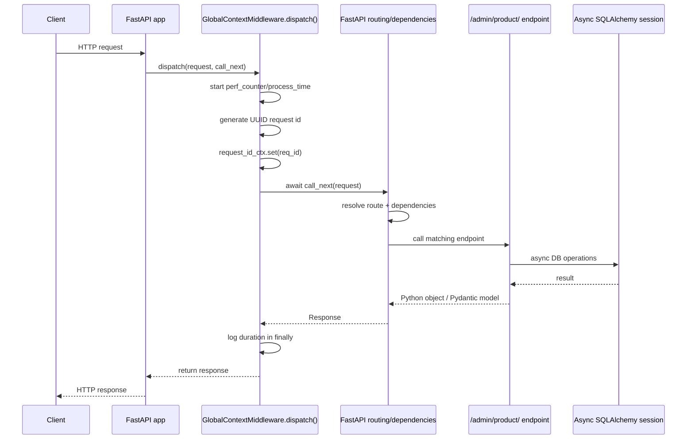
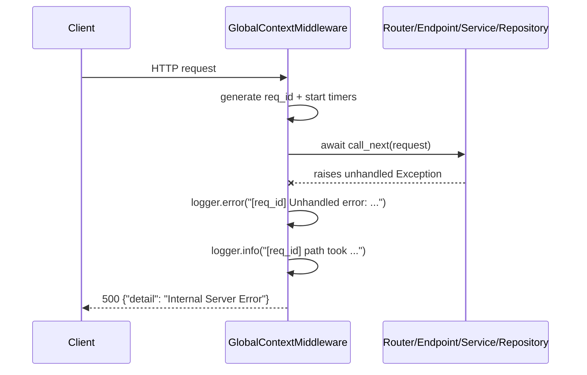
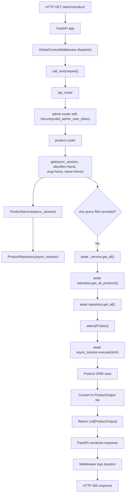
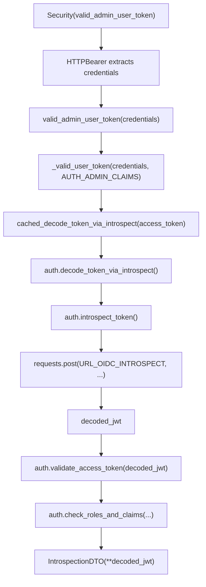
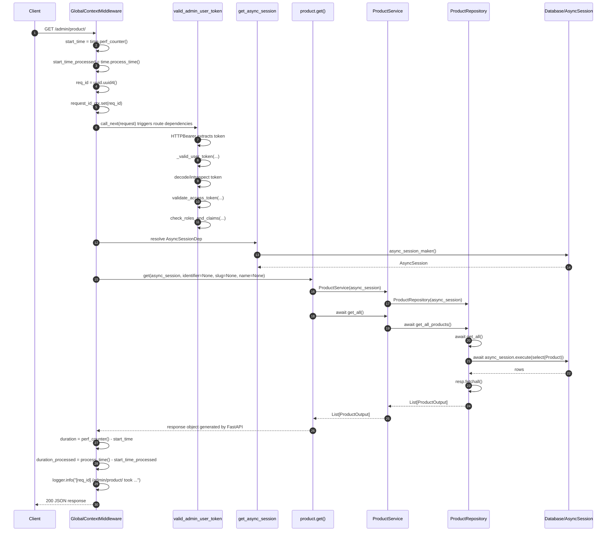
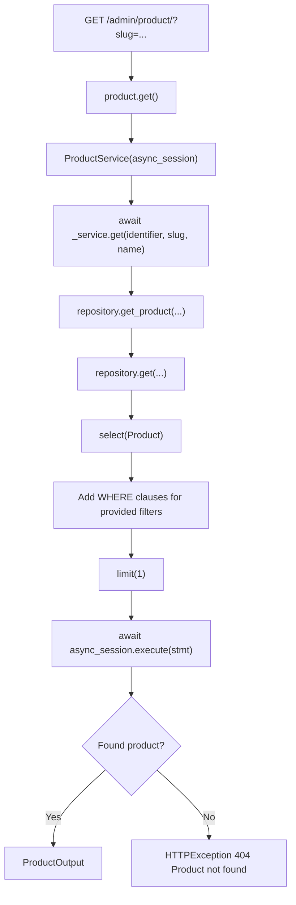
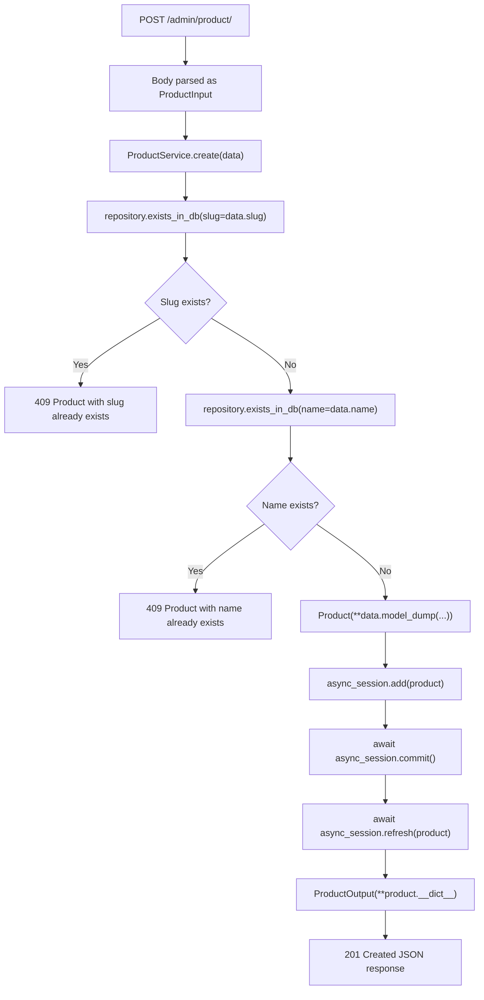
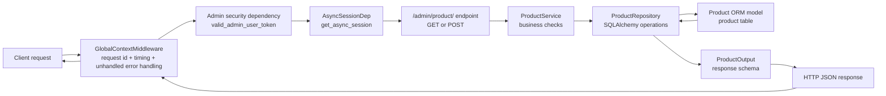

# GlobalContextMiddleware and `/admin/product/` Request Trace

This document explains the `GlobalContextMiddleware` in the t2v backend service, how `async def` functions are used, and how a request to `/admin/product/` flows through the backend.

The analysis is based on the visible code in the backend service. It intentionally avoids fabricating runtime values or behavior that is not present in the code.

---

## 1. Where `GlobalContextMiddleware` is registered

File: `text_to_visualization_api/main.py`

```python
app.include_router(api_router)
app.add_middleware(GlobalContextMiddleware)
```

The FastAPI app:

1. Creates the `FastAPI(...)` application.
2. Includes all API routers through `api_router`.
3. Adds `GlobalContextMiddleware`.

The middleware class itself is defined in:

```text
text_to_visualization_api/utils/middleware.py
```

---

## 2. What `GlobalContextMiddleware` does

File: `text_to_visualization_api/utils/middleware.py`

```python
class GlobalContextMiddleware(BaseHTTPMiddleware):
    async def dispatch(self, request: Request, call_next: RequestResponseEndpoint) -> Response:
```

This middleware runs around each incoming HTTP request.

### Step-by-step behavior

The middleware starts by recording two timers:

```python
start_time = time.perf_counter()
start_time_processed = time.process_time()
```

| Timer | Meaning |
|---|---|
| `time.perf_counter()` | Wall-clock elapsed time. Includes waiting time, I/O time, DB wait time, etc. |
| `time.process_time()` | CPU processing time used by the current process. Does not include time spent sleeping or waiting for I/O. |

Then it generates a request ID:

```python
req_id = str(uuid.uuid4())
request_id_ctx.set(req_id)
```

The request ID is stored in a `ContextVar`:

```python
request_id_ctx = ContextVar("request_id")
```

A `ContextVar` is Python context-local storage. In async applications, multiple requests may be handled concurrently in the same process. A `ContextVar` allows each request/task to keep its own value without mixing it with another request.

Important note: in the inspected code, no other usage of `request_id_ctx` was found. So from the visible code, the generated request ID is used for logging inside this middleware, but there is no verified evidence that it is used elsewhere.

The middleware then calls the rest of the request pipeline:

```python
try:
    response = await call_next(request)
except Exception as e:
    logger.error("[%s] Unhandled error: %s", req_id, str(e))
    return JSONResponse(status_code=500, content={"detail": "Internal Server Error"})
finally:
    duration = time.perf_counter() - start_time
    duration_processed = time.process_time() - start_time_processed
    logger.info("[%s] %s took %.3fs (processed: %.3fs)", req_id, request.url.path, duration, duration_processed)
return response
```

This means:

1. It passes the request to the next layer using `await call_next(request)`.
2. If an unhandled exception escapes, it logs the error.
3. It returns a generic HTTP `500` response:

```json
{
  "detail": "Internal Server Error"
}
```

4. Whether the request succeeds or fails, it logs request duration in the `finally` block.
5. If no unhandled exception happened, it returns the response generated by the endpoint/FastAPI.

---

## 3. Middleware sequence diagram



Unhandled error path:



---

## 4. What `async def` means

In Python:

```python
async def some_function():
    ...
```

defines an asynchronous function, also called a coroutine function.

Calling an `async def` function does not immediately run it like a normal function. It creates a coroutine object. That coroutine must be awaited by an event loop or another async function.

Example:

```python
result = await some_function()
```

The keyword `await` means:

> Pause this coroutine here until the awaited operation completes, and let the event loop run other work in the meantime.

This is useful for web APIs because a request often waits for I/O, such as:

- database queries,
- network calls,
- file operations,
- other services.

While one request is waiting, the server can work on another request.

---

## 5. `async def` usage in this backend

### Application lifespan

File: `text_to_visualization_api/main.py`

```python
@asynccontextmanager
async def lifespan(app: FastAPI):
```

This runs startup logic:

```python
await create_db_and_tables(engine)
...
await document_store_service.startup()
await add_initial_products(session, settings.AUTH_AUD)
```

So startup itself performs async work.

### Middleware

File: `text_to_visualization_api/utils/middleware.py`

```python
async def dispatch(self, request: Request, call_next: RequestResponseEndpoint) -> Response:
```

The middleware must be async because it awaits:

```python
response = await call_next(request)
```

That means it waits for the rest of the request handling pipeline to finish.

### Database session dependency

File: `text_to_visualization_api/core/database.py`

```python
async def get_async_session() -> AsyncGenerator[AsyncSession, None]:
    async with async_session_maker() as session:
        yield session
```

This provides an async SQLAlchemy session to endpoints.

### `/admin/product/` endpoints

File: `text_to_visualization_api/api/routes/admin/product.py`

```python
@router.get("/")
async def get(...):
```

```python
@router.post("/", status_code=status.HTTP_201_CREATED)
async def create(...):
```

These are async because they call async service methods:

```python
return await _service.get_all()
```

or:

```python
return await _service.create(data=body)
```

### Product service

File: `text_to_visualization_api/service/product.py`

```python
async def create(self, data: ProductInput) -> ProductOutput:
```

```python
async def get_all(self) -> List[ProductOutput]:
```

These methods await repository/database operations.

### Product repository

File: `text_to_visualization_api/repository/product.py`

```python
async def get_all(self) -> List[Product]:
```

```python
resp = await self.async_session.execute(stmt)
```

```python
await self.async_session.commit()
```

```python
await self.async_session.refresh(product)
```

These are asynchronous database operations.

---

## 6. Router path for `/admin/product/`

The route is built through multiple router inclusions.

### Main app

File: `text_to_visualization_api/main.py`

```python
app.include_router(api_router)
```

### API router

File: `text_to_visualization_api/api/main.py`

```python
api_router.include_router(admin.router, dependencies=[Security(valid_admin_user_token)])
```

This means the admin router has a security dependency:

```python
valid_admin_user_token
```

### Admin router

File: `text_to_visualization_api/api/routes/admin/main.py`

```python
router = APIRouter(prefix="/admin")
router.include_router(product.router, tags=["admin/products"])
```

This adds the `/admin` prefix.

### Product router

File: `text_to_visualization_api/api/routes/admin/product.py`

```python
router = APIRouter(prefix="/product")
```

This adds the `/product` prefix.

Therefore:

```text
/admin + /product + /
```

becomes:

```text
/admin/product/
```

---

## 7. Methods available on `/admin/product/`

File: `text_to_visualization_api/api/routes/admin/product.py`

There are two handlers on the exact path `/admin/product/`:

```python
@router.post("/", status_code=status.HTTP_201_CREATED)
async def create(...)
```

and:

```python
@router.get("/")
async def get(...)
```

So the same path behaves differently depending on HTTP method:

| HTTP method | Path | Function | Purpose |
|---|---|---|---|
| `GET` | `/admin/product/` | `get()` | Get all products, or get one product if query params are provided |
| `POST` | `/admin/product/` | `create()` | Create/register a new product |

There are also ID-based routes:

| HTTP method | Path | Function |
|---|---|---|
| `GET` | `/admin/product/{product_id}` | `get_via_id()` |
| `PUT` | `/admin/product/{product_id}` | `update_via_id()` |
| `DELETE` | `/admin/product/{product_id}` | `delete_via_id()` |

---

## 8. End-to-end trace: `GET /admin/product/`

Assume the incoming request is:

```http
GET /admin/product/
Authorization: Bearer <token>
```

The code requires authentication through `valid_admin_user_token`, but the actual token value and resulting user depend on runtime configuration and the auth server.

### 8.1 High-level flow



### 8.2 First custom backend code encountered

Within this repository's code, for an actual request, the first custom code encountered is the middleware dispatch method:

File: `text_to_visualization_api/utils/middleware.py`

```python
async def dispatch(self, request: Request, call_next: RequestResponseEndpoint) -> Response:
```

Then:

```python
start_time = time.perf_counter()
start_time_processed = time.process_time()
```

Then:

```python
req_id = str(uuid.uuid4())
request_id_ctx.set(req_id)
```

Then control moves to the rest of the FastAPI request pipeline:

```python
response = await call_next(request)
```

### 8.3 Authentication dependency

The admin router is included with this dependency:

File: `text_to_visualization_api/api/main.py`

```python
api_router.include_router(admin.router, dependencies=[Security(valid_admin_user_token)])
```

The dependency is:

File: `text_to_visualization_api/auth/dependencies.py`

```python
def valid_admin_user_token(
    credentials: Annotated[HTTPAuthorizationCredentials, Security(security)],
) -> IntrospectionDTO:
    return _valid_user_token(credentials=credentials, accept_claims=settings.AUTH_ADMIN_CLAIMS)
```

This uses:

```python
security = HTTPBearer()
```

So the request is expected to provide an HTTP Bearer token.

Then `_valid_user_token()` does the following visible steps:

```python
token = credentials.credentials
decoded_jwt = cached_decode_token_via_introspect(access_token=token)
auth.validate_access_token(decoded_jwt)
auth.check_roles_and_claims(
    decoded_jwt=decoded_jwt,
    app_alias=settings.AUTH_APP_ALIAS,
    accept_claims=accept_claims,
)
return IntrospectionDTO(**decoded_jwt)
```

Flow:



From `auth.py`, validation includes visible checks for:

- token active flag,
- issuer,
- expiration,
- audience overlap with `settings.AUTH_AUD`,
- required app claims.

If these fail, the code raises `HTTPException(status_code=401)` in multiple places.

### 8.4 Database session dependency

The endpoint requires:

File: `text_to_visualization_api/api/routes/admin/product.py`

```python
async_session: AsyncSessionDep
```

`AsyncSessionDep` is defined in:

File: `text_to_visualization_api/api/dependencies.py`

```python
AsyncSessionDep = Annotated[AsyncSession, Depends(get_async_session)]
```

And `get_async_session()` is:

File: `text_to_visualization_api/core/database.py`

```python
async def get_async_session() -> AsyncGenerator[AsyncSession, None]:
    async with async_session_maker() as session:
        yield session
```

So FastAPI provides an async SQLAlchemy session to the endpoint.

### 8.5 Endpoint handler

File: `text_to_visualization_api/api/routes/admin/product.py`

```python
@router.get("/")
async def get(
    async_session: AsyncSessionDep,
    identifier: Annotated[Optional[int], Query(title="Identifier of the product")] = None,
    slug: Annotated[Optional[str], Query(title="The slug of the product")] = None,
    name: Annotated[Optional[str], Query(title="Name of the product")] = None,
) -> List[ProductOutput]:
```

For plain:

```http
GET /admin/product/
```

the query parameters are all `None`:

```python
identifier = None
slug = None
name = None
```

Then:

```python
_service = ProductService(async_session=async_session)
```

This creates a service object.

Inside `ProductService.__init__()`:

File: `text_to_visualization_api/service/product.py`

```python
self.repository = ProductRepository(async_session)
```

So the service creates a repository with the same async DB session.

Then the endpoint checks:

```python
if identifier is not None or slug is not None or name is not None:
    return [await _service.get(identifier=identifier, slug=slug, name=name)]
return await _service.get_all()
```

For `GET /admin/product/` with no filters, it executes:

```python
return await _service.get_all()
```

### 8.6 Service layer

File: `text_to_visualization_api/service/product.py`

```python
async def get_all(self) -> List[ProductOutput]:
    products = await self.repository.get_all_products()
    self.logger.debug({"action": "get products", "details": {"n_products": len(products)}})
    return products
```

The service:

1. Calls the repository.
2. Logs debug info with the number of products.
3. Returns the list.

### 8.7 Repository layer

File: `text_to_visualization_api/repository/product.py`

```python
async def get_all_products(self) -> List[ProductOutput]:
    products = await self.get_all()
    return [ProductOutput(**product.__dict__) for product in products]
```

This calls:

```python
async def get_all(self) -> List[Product]:
    stmt = select(Product)
    resp = await self.async_session.execute(stmt)
    result = resp.fetchall()
    return [res[0] for res in result]
```

DB flow:

1. Build SQLAlchemy statement:

```python
stmt = select(Product)
```

2. Execute the statement asynchronously:

```python
resp = await self.async_session.execute(stmt)
```

3. Fetch rows:

```python
result = resp.fetchall()
```

4. Extract the `Product` ORM object from each row:

```python
return [res[0] for res in result]
```

5. Convert ORM objects into Pydantic output models:

```python
return [ProductOutput(**product.__dict__) for product in products]
```

### 8.8 Product table/model

File: `text_to_visualization_api/models/product.py`

```python
class Product(Base):
    __tablename__ = "product"
    id: Mapped[int] = mapped_column(Integer, primary_key=True, nullable=False)
    slug: Mapped[str] = mapped_column(String, comment="Slug of the product", nullable=False, unique=True)
    name: Mapped[str] = mapped_column(String, comment="Name of the product", nullable=False)
```

The returned API model is:

File: `text_to_visualization_api/schemas/product.py`

```python
class ProductOutput(BaseModel):
    id: int = Field(description="Unique identifier")
    slug: SlugString = Field(description="product slug")
    name: str = Field(description="Name of the product.")
```

So the visible response shape is a list of objects like:

```json
[
  {
    "id": 1,
    "slug": "some-slug",
    "name": "Some Product"
  }
]
```

The exact values depend on the database contents. The code and tests indicate initial products may exist based on `settings.AUTH_AUD`, but their actual runtime values are not stated here.

### 8.9 Final response for successful `GET /admin/product/`

For success, the route returns:

```python
List[ProductOutput]
```

The test file confirms the expected status:

File: `src/tests/text_to_visualization_api/api/routes/admin/test_product.py`

```python
resp = client.get("/admin/product/")
assert resp.status_code == status.HTTP_200_OK
current_products = resp.json()
```

Successful response:

```http
HTTP/1.1 200 OK
Content-Type: application/json
```

Body shape:

```json
[
  {
    "id": 1,
    "slug": "product-slug",
    "name": "Product Name"
  }
]
```

The values above illustrate the response shape only.

---

## 9. Full sequence diagram for `GET /admin/product/`



---

## 10. Filtered `GET /admin/product/`

The same endpoint supports query parameters:

```python
identifier: Optional[int] = None
slug: Optional[str] = None
name: Optional[str] = None
```

Example paths:

```http
GET /admin/product/?slug=demo-1
GET /admin/product/?identifier=1
GET /admin/product/?name=Demo%20product
```

If any of these are present:

```python
if identifier is not None or slug is not None or name is not None:
    return [await _service.get(identifier=identifier, slug=slug, name=name)]
```

Flow:



The repository filter logic is:

```python
if identifier is not None:
    where_clauses.append(Product.id == identifier)
if slug is not None:
    where_clauses.append(Product.slug == slug)
if name is not None:
    where_clauses.append(Product.name == name)
stmt = stmt.where(*where_clauses).limit(1)
```

If no product is found, the service raises:

```python
raise HTTPException(status_code=status.HTTP_404_NOT_FOUND, detail="Product not found")
```

---

## 11. End-to-end trace: `POST /admin/product/`

Because `/admin/product/` also has a `POST` handler, this is the create flow.

Incoming request shape:

```http
POST /admin/product/
Authorization: Bearer <token>
Content-Type: application/json
```

Body must match `ProductInput`:

```python
class ProductInput(BaseModel):
    slug: SlugString
    name: str
```

The slug uses:

```python
SlugString: TypeAlias = Annotated[str, StringConstraints(pattern=pattern_valid_slug, min_length=1)]
```

### 11.1 POST endpoint function

File: `text_to_visualization_api/api/routes/admin/product.py`

```python
@router.post("/", status_code=status.HTTP_201_CREATED)
async def create(async_session: AsyncSessionDep, body: ProductInput):
    _service = ProductService(async_session=async_session)
    return await _service.create(data=body)
```

So after middleware, authentication, request-body validation, and DB session resolution:

1. FastAPI parses JSON body into `ProductInput`.
2. Endpoint creates `ProductService`.
3. Endpoint awaits `_service.create(data=body)`.

### 11.2 ProductService create flow

File: `text_to_visualization_api/service/product.py`

```python
async def create(self, data: ProductInput) -> ProductOutput:
    if await self.repository.exists_in_db(slug=data.slug):
        raise HTTPException(
            status_code=status.HTTP_409_CONFLICT,
            detail=f"Product with the slug `{data.slug}` already exists",
        )
    if await self.repository.exists_in_db(name=data.name):
        raise HTTPException(
            status_code=status.HTTP_409_CONFLICT,
            detail=f"Product with the name `{data.name}` already exists",
        )

    product = await self.repository.create(data)
    ...
    return product
```

It checks:

1. Does a product already exist with this slug?
2. Does a product already exist with this name?
3. If either exists, return conflict `409`.
4. Otherwise create it.

### 11.3 Repository create flow

File: `text_to_visualization_api/repository/product.py`

```python
async def create(self, data: ProductInput) -> ProductOutput:
    product = Product(**data.model_dump(exclude_none=True))
    self.async_session.add(product)
    await self.async_session.commit()
    await self.async_session.refresh(product)
    return ProductOutput(**product.__dict__)
```

DB flow:



The test confirms:

```python
resp = client.post("/admin/product/", json=body)
assert resp.status_code == status.HTTP_201_CREATED
```

A duplicate create returns:

```python
assert resp.status_code == status.HTTP_409_CONFLICT
```

Invalid slug returns:

```python
assert resp.status_code == status.HTTP_422_UNPROCESSABLE_ENTITY
```

The `422` comes from request validation against the schema constraints.

---

## 12. Response/error outcomes visible from code

### `GET /admin/product/`

Success:

```http
200 OK
```

Body shape:

```json
[
  {
    "id": 1,
    "slug": "some-slug",
    "name": "Some Product"
  }
]
```

If filtered and product not found:

```python
raise HTTPException(status_code=status.HTTP_404_NOT_FOUND, detail="Product not found")
```

Result:

```http
404 Not Found
```

Body typically contains:

```json
{
  "detail": "Product not found"
}
```

### `POST /admin/product/`

Success:

```http
201 Created
```

Body shape:

```json
{
  "id": 1,
  "slug": "some-slug",
  "name": "Some Product"
}
```

Duplicate slug:

```http
409 Conflict
```

Detail:

```python
Product with the slug `{data.slug}` already exists
```

Duplicate name:

```http
409 Conflict
```

Detail:

```python
Product with the name `{data.name}` already exists
```

Invalid body/schema:

The tests show invalid slug returns:

```http
422 Unprocessable Entity
```

### Authentication failure

The admin router requires:

```python
Security(valid_admin_user_token)
```

The auth code raises `HTTPException(status_code=401)` in multiple invalid-token cases.

So authentication-related failure is:

```http
401 Unauthorized
```

The exact `detail` depends on environment and which validation failed. The code uses messages like:

```text
Unauthorized access
Token expired
Wrong audience
Missing roles and claims entry for the `app_alias`
Missing app roles
Missing app claims
```

In production mode, several of these are collapsed to:

```text
Unauthorized access
```

because:

```python
PROD_MODE = settings.ENVIRONMENT not in ("dev", "local")
```

### Unhandled exception

If an exception escapes the downstream request pipeline and reaches `GlobalContextMiddleware`, the middleware returns:

```http
500 Internal Server Error
```

Body:

```json
{
  "detail": "Internal Server Error"
}
```

and logs:

```python
logger.error("[%s] Unhandled error: %s", req_id, str(e))
```

Then it also logs timing in `finally`.

---

## 13. Combined mental model



---

## 14. Short summary

`GlobalContextMiddleware` wraps every request. It:

1. starts timing,
2. creates a UUID request ID,
3. stores it in a `ContextVar`,
4. calls the next FastAPI layer,
5. catches unexpected exceptions and returns `500`,
6. always logs request duration.

`async def` is used because the app performs asynchronous work: request handling, middleware chaining, database sessions, service calls, and SQLAlchemy async queries/commits.

For `/admin/product/`, the actual path is assembled like this:

```text
app
└── api_router
    └── admin.router with prefix /admin and Security(valid_admin_user_token)
        └── product.router with prefix /product
            ├── GET /
            └── POST /
```

So:

```text
/admin/product/
```

supports both:

```text
GET  /admin/product/
POST /admin/product/
```

The `GET` route returns a list of `ProductOutput` objects. The `POST` route validates a `ProductInput`, checks duplicate slug/name, creates a `Product` ORM object, commits it, refreshes it, and returns a `ProductOutput` with HTTP `201 Created`.

