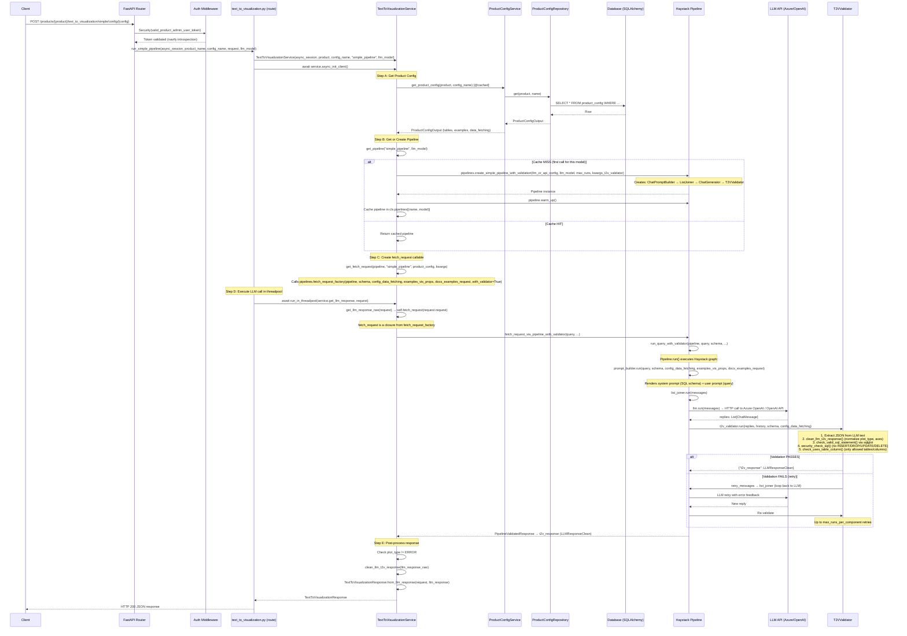

# End-to-End Request Flow Map: `create_simple_pipeline_with_validation`

## Where `create_simple_pipeline_with_validation` is Called

**Single call site in the backend service:**

```
src/text_to_visualization_api/service/text_to_visualization.py  (line 118)
└── TextToVisualizationService.get_pipeline()
```

---

## Complete End-to-End Request Flow

### 1. HTTP Request Entry Point

```
Client → POST /products/{product_name}/text_to_visualization/simple/config/{config_name}
         POST /products/{product_name}/text_to_visualization/simple
         POST /products/{product_name}/text_to_visualization/simple/rse
```

**Files involved:**
- `src/text_to_visualization_api/api/routes/products/text_to_visualization.py`

---

### 2. Flow Diagram (Mermaid)



---

### 3. Layer-by-Layer Breakdown

| Step | Layer | File | Function/Class | Description |
|------|-------|------|----------------|-------------|
| 1 | **Middleware** | `utils/middleware.py` | `GlobalContextMiddleware` | Assigns request UUID, logs latency |
| 2 | **Auth** | `auth/dependencies.py` | `valid_product_admin_user_token` | Introspects navify OIDC token, validates product-level claims |
| 3 | **Route** | `api/routes/products/text_to_visualization.py` | `run_simple_pipeline()` | Receives HTTP request, creates service, delegates |
| 4 | **Service** | `service/text_to_visualization.py` | `TextToVisualizationService.__init__()` | Initializes with product, config, pipeline params |
| 5 | **Service** | `service/text_to_visualization.py` | `async_init_client()` | Orchestrates config fetch + pipeline creation + fetch_request binding |
| 6 | **Service** | `service/product_config.py` | `ProductConfigService.get()` | Fetches config from DB via repository |
| 7 | **Repository** | `repository/` | `ProductConfigRepository` | Async SQLAlchemy CRUD → returns Pydantic schema |
| 8 | **Service** | `service/text_to_visualization.py` | `get_pipeline()` | Creates or retrieves cached Haystack pipeline |
| 9 | **Library** | `lib/.../pipelines/simple_pipeline.py` | `create_simple_pipeline_with_validation()` | **← THE FUNCTION** — builds Pipeline graph |
| 10 | **Library** | `lib/.../pipelines/components/llm_client.py` | `create_chat_generator_from_config()` | Creates Azure/OpenAI chat generator |
| 11 | **Library** | `lib/.../pipelines/components/prompt.py` | `create_chat_prompt_builder()` | Creates Jinja2-based prompt builder |
| 12 | **Library** | `lib/.../pipelines/components/t2v_validator.py` | `T2VValidator` | Validation component with retry loop |
| 13 | **Service** | `service/text_to_visualization.py` | `get_fetch_request()` | Wraps pipeline in a simple `(query) → response` callable |
| 14 | **Library** | `lib/.../pipelines/base.py` | `fetch_request_factory()` | Factory that binds pipeline + config into closure |
| 15 | **Route** | `api/routes/products/text_to_visualization.py` | `run_in_threadpool(service.get_llm_response, request)` | Offloads sync pipeline execution to threadpool |
| 16 | **Service** | `service/text_to_visualization.py` | `get_llm_response()` → `get_llm_response_raw()` | Calls `self.fetch_request(query)` |
| 17 | **Library** | `lib/.../pipelines/base.py` | `fetch_request_via_pipeline_with_validator()` | Runs pipeline, extracts `t2v_response` |
| 18 | **Library** | `lib/.../pipelines/base.py` | `run_query_with_validator()` | Calls `pipeline.run()` with prompt_builder + t2v_validator inputs |
| 19 | **Haystack** | (runtime) | `Pipeline.run()` | Executes DAG: prompt_builder → list_joiner → llm → t2v_validator |
| 20 | **External** | — | Azure OpenAI / OpenAI API | LLM inference (HTTP call) |
| 21 | **Library** | `lib/.../pipelines/components/t2v_validator.py` | `T2VValidator.run()` | Validates JSON, SQL, security; retries on failure |
| 22 | **Service** | `service/text_to_visualization.py` | `get_llm_response()` | Post-processes: `clean_llm_t2v_response()` → `TextToVisualizationResponse` |
| 23 | **Route** | `api/routes/products/text_to_visualization.py` | return | FastAPI serializes response to JSON |

---

### 4. Pipeline Internal Graph (created by `create_simple_pipeline_with_validation`)

```
┌─────────────────────────────────────────────────────────────────────┐
│                    Haystack Pipeline (with validation)               │
│                                                                     │
│  ┌──────────────┐    ┌─────────────┐    ┌─────┐    ┌────────────┐  │
│  │prompt_builder│───▶│ list_joiner │───▶│ llm │───▶│t2v_validator│  │
│  └──────────────┘    └─────────────┘    └─────┘    └────────────┘  │
│                            ▲                             │           │
│                            │         retry_messages      │           │
│                            └─────────────────────────────┘           │
│                                                                     │
│  Also: list_joiner.values → t2v_validator.history                   │
│         llm.replies → t2v_validator.replies                         │
└─────────────────────────────────────────────────────────────────────┘
```

**Components:**
- **`prompt_builder`** (`ChatPromptBuilder`): Renders Jinja2 templates with `query`, `schema`, `config_data_fetching`, `examples_vis_props`, `docs_examples_request`
- **`list_joiner`** (`ListJoiner[List[ChatMessage]]`): Merges prompt messages + retry messages from validator
- **`llm`** (`AzureOpenAIChatGenerator` or `OpenAIChatGenerator`): Calls LLM API
- **`t2v_validator`** (`T2VValidator`): Validates response; on failure sends retry message back to `list_joiner`

---

### 5. Validation Steps Inside T2VValidator

```
LLM Reply (text)
    │
    ▼
1. clean_llm_response() → strip markdown fences, double braces, whitespace
    │
    ▼
2. json.loads() → extract JSON from text
    │  (on failure: retry with prompt_retry_json_extraction)
    │
    ▼
3. clean_llm_t2v_response() → normalize plot_type, x_axis, y_axis, group_by
    │
    ▼
4. check_valid_sql_statement() → sqlglot parse + transpile to target dialect
    │  (on failure: retry with prompt_retry_invalid_sql)
    │
    ▼
5. security_check_sql() → reject INSERT/DROP/UPDATE/DELETE/TRUNCATE/ALTER
    │  (on failure: return error response, no retry)
    │
    ▼
6. get_not_allowed_table_columns() → verify only schema-defined tables/columns
    │  (on failure: retry with prompt_retry_not_allowed_tables)
    │
    ▼
7. check_uses_table_column() → ensure query actually accesses data
    │
    ▼
✅ Output: {"t2v_response": LLMResponseClean}
```

---

### 6. Routes That Trigger This Flow

| Endpoint | Route Function | Pipeline | Config Source |
|----------|---------------|----------|---------------|
| `POST /products/{product}/text_to_visualization/simple/config/{config}` | `run_simple_pipeline()` | `simple_pipeline` | DB (by config_name) |
| `POST /products/{product}/text_to_visualization/simple` | `run_simple_pipeline_with_dynamic_config()` | `simple_pipeline` | Request body |
| `POST /products/{product}/text_to_visualization/simple/rse` | `run_simple_pipeline_with_dynamic_config_rse()` | `simple_pipeline` | CloudEvent body |

All three ultimately call `TextToVisualizationService.get_pipeline("simple_pipeline", ...)` which calls `create_simple_pipeline_with_validation()` on cache miss.

---

### 7. Key Design Decisions

1. **Pipeline Caching**: Pipelines are cached at class level in `TextToVisualizationService.pipelines` dict, keyed by `(pipeline_name, llm_model)`. Created once, reused across requests.

2. **Threadpool Execution**: `run_in_threadpool()` wraps the synchronous `pipeline.run()` call to avoid blocking the async event loop.

3. **Config Caching**: Product configs are cached via `@cached(ttl=settings.CACHE_PRODUCT_CONFIG)` with manual invalidation endpoint at `POST /products/{product}/text_to_visualization/clear_cache/{config}`.

4. **Retry Loop**: The `max_runs_per_component` (default: `settings.PIPELINE_MAX_RETRIES`) controls how many times the LLM is re-invoked when validation fails.

5. **History Filtering**: `filter_history` lambda strips the system prompt on first retry to stay within token limits.

