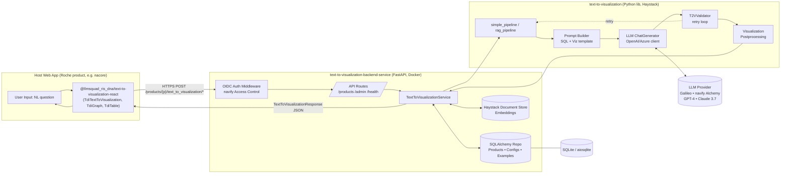
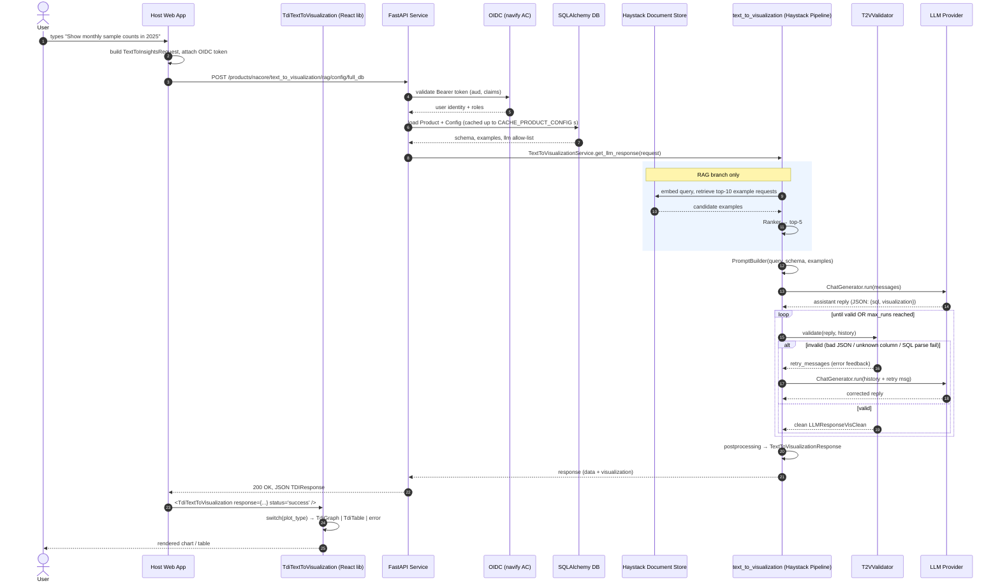
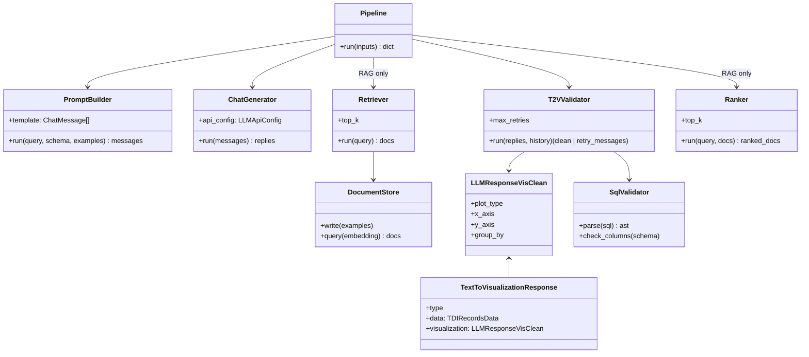
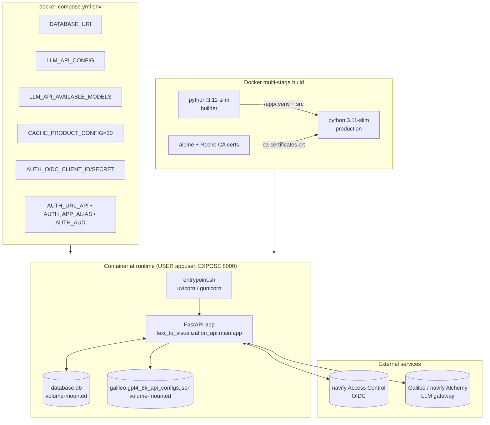

# LabGPT — Text-to-Visualization Workspace Analysis

> Generated: 2026-04-28
> Scope: the three sibling projects under `labgpt-t2v/`.

---

## 1. Workspace Summary

This workspace implements a complete **"natural language → chart"** stack for Roche's *LabGPT / Text-to-Data-Insights* initiative. A user types a question in English, and the system answers with a rendered visualization (table, line, bar, scatter, or pie plot) backed by data the LLM was allowed to query.

The stack is split into three deliberately decoupled deliverables, each published as its own artifact:

| # | Project | Language | Artifact | Role |
|---|---------|----------|----------|------|
| 1 | `text-to-visualization` | Python 3.11 | PyPI / GitLab wheel | **Core LLM pipeline library** (Haystack-based). Builds the prompt, calls the LLM, validates the output, and returns structured visualization instructions. |
| 2 | `text-to-visualization-backend-service` | Python 3.11 / FastAPI | Docker image | **HTTP service** that wraps the library, adds multi-tenant config management, RAG retrieval of example requests, OIDC authentication, and persistence (SQLite/SQLAlchemy + Haystack Document Store). |
| 3 | `text-to-visualization-react-lib` | TypeScript / React 18 | npm package | **Front-end component library** that consumes the backend's JSON response and renders it with Recharts (`TdiGraph`) or `@tanstack/react-table` (`TdiTable`). |

Together they form a clean three-tier pipeline: **React UI → FastAPI service → Python LLM library → LLM provider (Azure OpenAI / navify Alchemy / Anthropic Claude via OpenAI-compatible gateway)**.

---

## 2. High-Level Architecture



---

## 3. Per-Project Analysis

### 3.1 `text-to-visualization` — Core Python Library

**Short summary.** A Haystack-AI-based Python library that turns a natural-language query plus a data-source schema/config into a structured visualization instruction (chosen plot type, axes, group-by, and the SQL/data-fetch spec). It is provider-agnostic over the LLM (anything OpenAI-compatible: Azure OpenAI/Galileo, navify Alchemy gateway hosting Claude 3.7, etc.) and produces output in a schema mirrored by the React lib.

**Purpose & functionality**
- Build prompts (system + user) from a product config (DB schema, allowed columns, examples).
- Call an LLM via `haystack` `ChatGenerator` to produce **(a)** a SQL/data-fetch instruction and **(b)** a visualization spec.
- **Validate** the LLM output (`T2VValidator`) — checks JSON structure, plot type, axes/columns consistency, SQL parseability via `sqlglot` — and **retry** the LLM with an error message in the conversation if invalid.
- Provide both a **simple pipeline** (all examples baked into the prompt) and a **RAG pipeline** (top-k retrieved examples).
- Optional **rendering** via `plotly` for notebook/standalone use (`components/rendering/`).
- Mock helpers (`mock/`) for offline development without an LLM.

**Tech stack**
- Python 3.11–3.12, Pydantic 2, pandas, numpy.
- `haystack-ai` 2.17 (Pipelines, ChatGenerator, ListJoiner).
- `openai` 1.98+ client (used for both OpenAI and Azure / navify-Alchemy gateway).
- `sqlglot` for SQL validation, `transformers` + `torch` (CPU) for embeddings/ranking in the RAG path.
- `plotly` for optional Python-side rendering.

**Key modules** (`src/text_to_visualization/`)

| Module | Responsibility |
|---|---|
| `pipelines/simple_pipeline.py` | `create_simple_pipeline`, `create_simple_pipeline_with_validation` (Prompt → ListJoiner ↔ LLM → T2VValidator with retry loop). |
| `pipelines/rag_pipeline.py` | RAG variant: Retriever → Ranker → Prompt → LLM → Validator. |
| `pipelines/components/prompt.py` | Jinja2 chat-prompt builder (`sql` template). |
| `pipelines/components/llm_client.py` | `create_chat_generator_from_config`, `LLMApiConfig` (azure/openai). |
| `pipelines/components/t2v_validator.py` | Output-validation Haystack component with retry-message emission. |
| `components/data_fetching/sql/` | SQL generation/validation helpers (`sqlglot`). |
| `components/visualization/postprocessing.py` | Cleans LLM viz spec into `LLMResponseVisClean`. |
| `components/llm_agent/llm_response.py` | LLM response parsing models. |
| `components/document_store/` | RAG document store (in-memory / persisted) for example requests. |
| `components/rendering/` | Optional Plotly rendering for notebooks. |
| `types.py`, `constants.py` | `PlotType` enum and response types — **mirrored 1:1 in the React lib**. |

**Integration points**
- Consumed directly by the backend service (`TextToVisualizationService`).
- Its response schema is the authoritative contract — `lib/types.ts` in the React lib annotates each TS type with the Python class it mirrors.

---

### 3.2 `text-to-visualization-backend-service` — FastAPI Service

**Short summary.** A FastAPI service that exposes the core library over HTTPS for multiple "products" (tenants). It manages product/config lifecycle, stores RAG example requests, authenticates via navify OIDC, caches product configs, and orchestrates either a *simple* or *RAG* pipeline per request.

**Purpose & functionality**
- Multi-tenant **product & config CRUD** (`/admin/product`, `/admin/config`, `/products/{p}/config/...`).
- Two text-to-visualization endpoints per product:
  - `POST /products/{p}/text_to_visualization/simple/config/{config_name}` — simple pipeline against a stored config.
  - `POST /products/{p}/text_to_visualization/rag/config/{config_name}` — RAG pipeline with `retriever_top_k` / `ranker_top_k` query params.
  - `POST /products/{p}/text_to_visualization/simple` — same, but the config is **sent in the request body** (dynamic).
  - `POST /products/{p}/text_to_visualization/simple/rse` — CloudEvent-wrapped variant of the above.
  - `POST /products/{p}/text_to_visualization/clear_cache/{config_name}` — drops the in-process config cache.
- **Request examples** management for the RAG pipeline: `/products/{p}/example_requests/...` (CRUD).
- **Auth** via navify Access Control OIDC (client-credentials *or* authorization-code flow), aud-claim filtering (`AUTH_AUD`).
- **Health probes** (`/health/ready`, `/health/live`) for k8s-style deployment.
- **Persistence**: `SQLAlchemy` async (default `sqlite+aiosqlite:///database.db`) for products/configs/examples; Haystack `DocumentStoreService` for embeddings.
- **Caching**: per-config in-process cache (`CACHE_PRODUCT_CONFIG` seconds).
- Auto-creates DB tables and seeds initial products on FastAPI `lifespan` startup.

**Tech stack**
- FastAPI, Pydantic v2 settings.
- SQLAlchemy (async) + aiosqlite.
- The `text-to-visualization` library (installed from Roche GitLab via Poetry HTTP-basic auth).
- Haystack document store (in-memory or persisted) for RAG.
- Docker (multi-stage: builder + production with Roche CA certs baked in), Docker Compose for dev/test/deployment.

**Key modules** (`src/text_to_visualization_api/`)

| Module | Responsibility |
|---|---|
| `main.py` | FastAPI app factory, `lifespan` (DB init + DocumentStore startup + initial products), middleware. |
| `api/main.py` + `api/routes/` | Router aggregation: `health`, `debug`, `admin/`, `products/`. |
| `api/routes/products/text_to_visualization.py` | The five t2v endpoints (see above). |
| `api/routes/products/config.py` | Per-product config CRUD. |
| `api/routes/products/request_examples.py` | RAG examples CRUD. |
| `api/routes/admin/` | Cross-tenant product/config administration. |
| `service/text_to_visualization.py` | `TextToVisualizationService` — wraps the library pipeline, applies caching, fetches config from repo, calls `get_llm_response`. |
| `service/document_store.py` | Lifecycle + writes/reads against the Haystack store for RAG examples. |
| `repository/` | Async SQLAlchemy repositories (Product, Config, ExampleRequest). |
| `models/`, `schemas/` | SQLAlchemy ORM models + Pydantic request/response schemas. |
| `auth/` | OIDC token validation, claim → role mapping (user / product-admin / admin). |
| `core/settings.py`, `core/database.py` | Pydantic settings + async engine/session. |
| `utils/middleware.py` | `GlobalContextMiddleware` (correlation/context propagation). |

**Integration points**
- **Upstream**: imports `text_to_visualization` (the library above) and instantiates its `simple_pipeline` / `rag_pipeline`.
- **Downstream**: returns `TextToVisualizationResponse` JSON consumed by the React lib (`TDIResponse` type).
- **External**: navify Access Control (OIDC), Galileo / navify Alchemy LLM gateways.

---

### 3.3 `text-to-visualization-react-lib` — React Component Library

**Short summary.** A small Vite-built React/TypeScript component library, published as `@llmsquad_ris_dna/text-to-visualization-react`, that renders the backend's response. It is **stateless / transport-agnostic** — the host application performs the HTTP call and passes the resulting `TDIResponse` object as a prop.

**Purpose & functionality**
- Provide drop-in React components that turn a `TDIResponse` into UI:
  - `TdiTextToVisualization` — the umbrella component; switches on `response.type` / `response.visualization.plot_type` to render either an error message, a table, or a chart. Handles `status` of `idle | pending | error | success` with overridable placeholder slots.
  - `TdiGraph` — Recharts-based renderer for `line plot | bar plot | scatter plot | pie plot` (mirrors `text_to_visualization.constants.PlotType`).
  - `TdiTable` — `@tanstack/react-table`-based table renderer for `TDIRecordsData`.
  - `placeholders/` (`StatusPending`, `ErrorDataLoad`, `NotEnoughData`) with bundled SVG assets.
  - `ui/` shadcn-style primitives (Tailwind + `class-variance-authority`).
- Ship with **Storybook** stories (`lib/stories/`, `*.stories.tsx`) and a published Storybook site for documentation.

**Tech stack**
- React 18, TypeScript 5.5, Vite 5 (lib mode, `vite-plugin-dts`, CSS-injected-by-JS).
- Tailwind CSS 4, shadcn-style primitives (`class-variance-authority`, `clsx`, `tailwind-merge`).
- **Recharts 2.15** for charts (note: README mentions Plotly but the actual implementation uses Recharts — Plotly is only used on the Python side).
- `@tanstack/react-table` 8 for tables, `lucide-react` for icons.
- Storybook 8.1 for component docs.

**Key components / files** (`lib/`)

| File | Responsibility |
|---|---|
| `main.tsx` | Library entry — re-exports public components, types, and CSS. |
| `components/index.tsx` | Exports `TdiTable`, `TdiGraph`, `TdiTextToVisualization`. |
| `components/TdiTextToVisualization/TdiTextToVisualization.tsx` | Top-level dispatcher — picks renderer based on `status` + `response`. |
| `components/TdiGraph/` | Recharts wrapper, `graph.layouts.tsx` for default layout. |
| `components/TdiTable/` | TanStack-Table wrapper. |
| `components/placeholders/` | Pending / error / no-data states. |
| `components/ui/` | Reusable shadcn primitives. |
| `types.ts` | `TDIResponse`, `TDIPlotType`, `TDIRecordsData` — **explicitly mirrors the Python types**. |
| `constants.ts`, `plot_stylesheet.ts` | Shared constants and chart styling. |
| `tests/dataExampleRequests.ts`, `tests/dataExamplePlots.ts` | Sample request/response fixtures. |

**Integration points**
- **Input contract**: consumes the JSON returned by the backend's `/text_to_visualization/...` endpoints (`TDIResponse` matches the backend's `TextToVisualizationResponse`).
- **Out of scope**: the lib does **not** make the HTTP call or handle auth — that is the host app's responsibility. This keeps it embeddable in any tenant product.

---

## 4. End-to-End Request Trace



> **Note on `data`.** The current pipeline emits *visualization instructions plus the data fetch spec*; whether the backend executes that SQL itself or expects the host app to run it depends on the product config (`config_data_fetching`). The React lib simply consumes whatever rows the backend returns in `response.data.records`.

---

## 5. Request Trace — Component Deep Dive

This section explains every participant in the sequence diagram above with concrete payloads and code references. It also clarifies the two distinct meanings of the word **"schema"** in this codebase.

### 5.1 The two "schemas" in this system

| # | Sense | What it is | Where it lives |
|---|---|---|---|
| **A** | **Database schema** (the dominant meaning) | A description of the data the LLM is allowed to query: tables, columns, types, descriptions, sample values. It is shoved into the LLM's *system prompt* so the model knows what SQL to write. | `ProductConfig.tables` in the DB → flowed into the pipeline as the variable `schema`. |
| **B** | **API/JSON schema** | The Pydantic / FastAPI request and response models (`TextToInsightsRequest`, `TextToVisualizationResponse`). | `text_to_visualization_api/schemas/`. |

Whenever the trace diagram says **schema**, it means **A** — the database schema (the `ConfigSQLSchema = List[DBTable]` type in `text_to_visualization/types.py`). Concretely it is a JSON list like this (verbatim from the example baked into `TextToInsightsRequestDynamicConfig`):

```json
"tables": [
  {
    "table_name": "device",
    "description": "Unique list of devices in the laboratory.",
    "columns": [
      { "name": "id",   "description": "primary key, id of the device", "type": "BIGINT" },
      { "name": "name", "description": "Name of the device",            "type": "VARCHAR",
        "examples": ["Cobas Pro 1", "cobas p512 || 1"] }
    ]
  }
]
```

Two important things `T2VValidator` does with this schema:

1. It **flattens** it into an allow-list of `table.column` strings, e.g. `["device.id", "device.name"]` (validator code line 189–191).
2. Any column the LLM tries to use that isn't in that list triggers a **retry** with a "you tried to access disallowed columns" message (`prompt_retry_not_allowed_tables`, validator lines 28–34).

So the schema is *both* the LLM's "menu" of what it can query and the security boundary the validator enforces.

### 5.2 Walkthrough using a concrete example

> **User question:** *"How many tests were measured?"*
> **Product:** `nacore`, **Config:** `full_db`, **Pipeline:** `rag`.

#### Step 1 — User → Host Web App
The end user types the question in a Roche product (e.g. nacore portal). The host app is the page/SPA that *embeds* the React lib. The React lib does **not** make the HTTP call itself — that's the host app's job (it owns auth and the API base URL).

#### Step 2 — Host App: build `TextToInsightsRequest`, attach OIDC token
The host serializes the user input into the FastAPI input schema (`schemas/text_to_visualization.py`):

```http
POST https://api.roche/products/nacore/text_to_visualization/rag/config/full_db
Authorization: Bearer eyJhbGciOi... (OIDC token from navify Access Control)
Content-Type: application/json

{ "request": "How many tests were measured?" }
```

The Pydantic model is intentionally tiny:

```python
class TextToInsightsRequest(BaseModel):
    request: str   # the natural-language query
```

The `simple` and `simple/rse` endpoints accept a richer `TextToInsightsRequestDynamicConfig` that *also* includes the schema/config in the body — used when no stored config exists.

#### Step 3 — API → Auth (OIDC navify Access Control)
The route is protected. `auth/` validates the Bearer token: signature, expiry, audience (`AUTH_AUD = ["nqc","nim","nlo","APP.t2v"]`), and the user's claims. Claims are mapped to roles (`user`, `product-admin`, `admin`) and to the `product_name` the user is allowed to access. Failure → `401`/`403`. Success → request continues with a user-context attached by `GlobalContextMiddleware`.

#### Step 4 — API → DB: load Product & Config (cached)
`TextToVisualizationService.get_product_config(product, config_name)` is decorated with `@cached(ttl=settings.CACHE_PRODUCT_CONFIG, noself=True)` (default 30 s). On a cache miss, an async SQLAlchemy query loads the `ProductConfigOutput` row, which contains the `SQLProductConfig` JSON:

```json
{
  "data_fetching": { "sql_dialect": "mysql" },
  "tables":   [ /* the schema shown in §5.1 */ ],
  "examples": {
    "requests":   [ {"request": "Which devices are available?", "response": {"data_query": "SELECT name FROM device", "plot_type": "table"}} ],
    "properties": { "x_axis": [/*…*/], "y_axis": [/*…*/], "group_by": [/*…*/] }
  }
}
```

This single object provides three of the five `PROMPT_VARIABLES` (`constants.py` line 34): `schema` (= `tables`), `config_data_fetching`, and `examples_vis_props` / `docs_examples_request`.

#### Step 5 — API → Library: `TextToVisualizationService.get_llm_response(request)`
The route runs the (synchronous, Haystack) pipeline call inside `fastapi.concurrency.run_in_threadpool` so it doesn't block the event loop. Internally:

- `async_init_client()` resolves the right pipeline (cached in `TextToVisualizationService.pipelines` keyed by `(pipeline_name, llm_model)`),
- `get_fetch_request()` returns a closure pre-bound with `schema`, `config_data_fetching`, examples, and a `with_validator=True` flag,
- `get_llm_response_raw()` calls that closure with `request.request` (the NL string).

#### Step 6 — (RAG branch only) Lib → Document Store → Ranker
For the `rag_pipeline` only:

- The user query is embedded.
- Haystack's `Retriever` queries the `DocumentStore` (managed by `DocumentStoreService`) for the **top-10** most similar previously stored example requests. These examples are CRUD-managed via `/products/{p}/example_requests/...`.
- A `Ranker` re-scores them and keeps the **top-5**. Both `top_k` values are tunable per request via the `retriever_top_k` and `ranker_top_k` query params.

The simple pipeline skips this entirely and uses *all* examples baked into the config.

#### Step 7 — Lib → PromptBuilder(query, schema, examples)
A Haystack `ChatPromptBuilder` (Jinja2-based, see `pipelines/components/prompt.py`) renders a system+user chat message template. The five required variables are exactly `PROMPT_VARIABLES`:

- `query` — the user's NL question
- `config_data_fetching` — `{"sql_dialect": "mysql"}` (tells the LLM which dialect to write)
- `schema` — the `tables` list (the database schema, sense **A**)
- `docs_examples_request` — the few-shot examples (whole list for `simple`, top-5 retrieved for `rag`)
- `examples_vis_props` — example x/y/group-by suggestions per plot type

Output: a `List[ChatMessage]` like *(abbreviated)*

```text
SYSTEM: You generate JSON with keys data_query, explanation, plot_type, x_axis, y_axis, group_by.
        Only use the following schema (mysql):
        Table device(id BIGINT pk, name VARCHAR …)
        Examples: Q: "Which devices are available?" → {"data_query": "SELECT name FROM device", "plot_type": "table"}
USER:   How many tests were measured?
```

#### Step 8 — Lib → LLM (ChatGenerator)
`pipelines/components/llm_client.py::create_chat_generator_from_config` constructs a Haystack `OpenAIChatGenerator` (or Azure variant) from `LLMApiConfig`. The choice of provider — Galileo/Azure GPT-4 or navify Alchemy/Claude 3.7 — is purely runtime config (`LLM_API_CONFIG` env var pointing at a JSON file).

The generator returns `replies: List[ChatMessage]`. The expected payload (see `LLMResponseRaw` in `types.py`):

```json
{
  "data_query": "SELECT test_name, COUNT(*) AS number_of_measured_tests FROM test_results GROUP BY test_name",
  "explanation": "Select all test names from results and count the tests per test name.",
  "plot_type": "table",
  "x_axis": "test_name",
  "y_axis": "number_of_measured_tests",
  "group_by": "test_name"
}
```

The plumbing is clever: the prompt is wired into a `ListJoiner` (`simple_pipeline.py` lines 105–117) sitting *between* the prompt and the LLM, so on retry the validator can feed the joiner additional messages and re-trigger the LLM without rebuilding the prompt:

```text
                |------history-------v
IN -> Prompt -> List Joiner -> LLM -> Validator -> OUT
                ^-------retry--------|
```

#### Step 9 — Lib → T2VValidator (with retry loop)

This is where most of the "robustness" lives. `T2VValidator.run` (validator file, lines 134–233) executes four checks in order, and at any failure step it returns `retry_messages` that get looped back through the `ListJoiner` to the LLM:

| Check | What goes wrong | Retry prompt sent back to the LLM |
|---|---|---|
| **a. JSON extraction** (`_extract_json`) | LLM wrapped JSON in Markdown ` ```json … ``` `, used trailing commas, etc. `clean_llm_response` strips the wrapper; if `json.loads` still fails… | `prompt_retry_json_extraction` — *"…not a valid JSON … triggered this Python exception: {error}. Correct the output …"* |
| **b. Clean → `LLMResponseVisClean`** (`clean_llm_t2v_response`) | Plot type isn't in `PlotType` enum, axes are blank-strings, etc. Normalises into a typed dict. | (no retry; if `plot_type == "error"` returns immediately) |
| **c. SQL parse** (`check_valid_sql_statement` via `sqlglot`, dialect from `config_data_fetching["sql_dialect"]`) | Syntax error, wrong dialect | `prompt_retry_invalid_sql` — *"…not a valid SQL statement for the dialect mysql. Parser error: …"* |
| **d. Security check** (`security_check_sql`) — two parts: | | |
| &nbsp;&nbsp;&nbsp;d1. destructive statement (`INSERT/UPDATE/DELETE/DROP`) | hard fail | **No retry** — short-circuits to `{"plot_type": "error", "response_text": "We do not support manipulation of the database."}` |
| &nbsp;&nbsp;&nbsp;d2. column allow-list (built from `schema`) | LLM referenced a table/column not in the schema | `prompt_retry_not_allowed_tables` — *"…tried to access {col_a, col_b} … only use the columns provided in the schema. If unanswerable, return `{plot_type:"error",…}`."* |
| **e. `check_uses_table_column`** | The SQL doesn't actually reference any real table column (e.g. LLM hallucinated `SELECT 1`) | Returns the canned `RESPONSE_NOT_ANSWERABLE` error |

A nice detail: `filter_history` (see `service/text_to_visualization.py` lines 113–115) drops the original system message (containing the full schema) on the first retry to keep the context window small — only the user message + the LLM's bad reply + the retry prompt are re-sent.

The whole loop is bounded by `max_runs_per_component = settings.PIPELINE_MAX_RETRIES`. Output: a single `LLMResponseClean`.

#### Step 10 — Lib → Postprocessing → `TextToVisualizationResponse`

`clean_llm_t2v_response` (already invoked inside the validator) and the `TextToVisualizationResponse.from_llm_response` factory split the flat LLM dict into two grouped Pydantic models:

```python
class TextToVisualizationResponse(BaseModel):
    request:        TextToInsightsRequest        # echoed back
    data_fetching:  DataFetchingSQL              # data_query + explanation
    visualization:  VisualizationInstructionLLM  # plot_type + x/y/group_by
```

Concrete response body (real example from `CETextToVisualizationResponse`):

```json
{
  "request": { "request": "How many tests were measured?" },
  "data_fetching": {
    "data_query": "SELECT test_name, COUNT(*) AS number_of_measured_tests FROM test_results GROUP BY test_name",
    "explanation": "Select all test names from results and count the tests per test name."
  },
  "visualization": {
    "plot_type": "table",
    "x_axis":   "test_name",
    "y_axis":   "number_of_measured_tests",
    "group_by": "test_name"
  }
}
```

> **Important clarification of the open question from §9.** Reading `service/text_to_visualization.py` confirms that the backend **does not execute the SQL itself**. It returns a *data-fetch instruction* (the `data_query` field) that the host app is expected to run against its own data source. The previously-flagged ambiguity is resolved: the host owns SQL execution.

#### Step 11 — API → Host App (HTTP 200)
FastAPI serializes the Pydantic model. If anything went catastrophically wrong (LLM emitted `plot_type == "error"` *without* falling into the validator's "answerable" path), `service.get_llm_response` raises `HTTPException(500, detail=…)`.

#### Step 12 — Host App → React `<TdiTextToVisualization response={...} status="success" />`
The host app **runs the SQL**, attaches the row data to the response under `response.data`, and passes the merged `TDIResponse` into the React component. The React lib's `TDIResponse.data` field holds `{ columns, records }`; the backend's response only provides the `visualization` and `data_fetching` halves.

#### Step 13 — React → Switches on `plot_type`
`TdiTextToVisualization.tsx` (lines 84–110) is a pure dispatcher:

| `response.type` / `plot_type` | Renderer |
|---|---|
| `type === "error"` | `<div className="tdi-error">{response_text}</div>` |
| `plot_type === "table"` | `<TdiTable {...response.data} />` (TanStack Table) |
| `plot_type ∈ {line plot, bar plot, scatter plot, pie plot}` | `<TdiGraph plotType plotData plotLayout graphLayout/>` (Recharts) |

The four `status` values (`idle`/`pending`/`error`/`success`) drive overridable placeholder slots so the host can show a loading spinner while the backend is running.

#### Step 14 — React → User
The user sees the rendered chart or table. Done.

### 5.3 Annotated flow at a glance

```text
User text ──▶ Host App ──▶ FastAPI auth ──▶ load Product+Config (cached)
                                                       │
                                                       ▼
                                           ┌─────────────────────────────┐
                                           │ schema (List[DBTable])      │   ← "schema" in the trace
                                           │ config_data_fetching        │
                                           │ examples (requests + props) │
                                           └─────────────────────────────┘
                                                       │
                       (RAG only) ─── retrieve+rank ◀──┤
                                                       ▼
                                  PromptBuilder → ListJoiner ⇄ LLM
                                                              │
                                                              ▼
                                              T2VValidator (4 checks)
                                                  │ valid          │ invalid
                                                  ▼                ▼
                                  TextToVisualizationResponse   loop back via ListJoiner
                                                  │
                       Host App runs SQL, fills response.data
                                                  ▼
                                   <TdiTextToVisualization/>  →  user sees chart/table
```

---

## 6. Python Library Component View



---

## 7. Deployment View (Backend Service)



Key deployment facts (from `Dockerfile`, `docker-compose.yml`, `entrypoint.sh`):
- Multi-stage build; final image runs as **non-root** `appuser` (uid 1001) on **port 8000**.
- Roche internal CA bundle is baked in (`REQUESTS_CA_BUNDLE`, `SSL_CERT_FILE`).
- Library installed from Roche GitLab via Poetry HTTP-basic with a build secret (`GITLAB_SECRET`).
- Default DB is **SQLite via aiosqlite**; can be swapped via `DATABASE_URI`.
- LLM provider is selected by mounting an `LLM_API_CONFIG` JSON (Azure/Galileo or navify Alchemy).
- Several compose overlays exist: `docker-compose.dev.yml`, `docker-compose.test.yml`, `docker-compose.deployment-vm.yml`, `docker-compose.build.yml`, `docker-compose.overwrite.yml` — for local dev, CI, VM deployment, and image build respectively.

---

## 8. Per-Project One-Liner Summaries

- **`text-to-visualization`** — Haystack-based Python library that converts a natural-language question + a data-source config into a validated visualization spec (plot type, axes, SQL) by orchestrating prompt → LLM → validator (with retry) and an optional RAG branch.
- **`text-to-visualization-backend-service`** — FastAPI/Docker service that exposes the library to multiple Roche products with OIDC auth, multi-tenant product/config CRUD, RAG example management, async SQLAlchemy persistence, and caching.
- **`text-to-visualization-react-lib`** — Stateless React/TypeScript component library (`TdiTextToVisualization`, `TdiGraph`, `TdiTable`) that renders the backend's JSON response using Recharts and TanStack Table, ready to be embedded in any host app.

---

## 9. Workspace Takeaways

1. **Clean three-tier separation.** Each layer can be developed, versioned, and released independently. The library has its own version (`0.11.6`), the backend its own Docker image, the React lib its own npm package (`0.7.1`).
2. **Single source of truth for the response schema.** The Python `LLMResponseVisClean` / `TextToVisualizationResponse` types are mirrored verbatim in `lib/types.ts` (`TDIResponse`, `TDIPlotType`). Keeping these in sync is the most important cross-repo contract.
3. **LLM-provider agnosticism.** Both Azure (Galileo) and OpenAI-compatible gateways (navify Alchemy → Claude 3.7) are supported by the same `LLMApiConfig`/`ChatGenerator`. The provider is a runtime config, not a code change.
4. **Robustness via validate-and-retry.** `T2VValidator` plus the Haystack `ListJoiner` self-loop is the key trick that keeps LLM hallucinations from breaking the contract. SQL is parsed with `sqlglot` before being trusted.
5. **Multi-tenancy is built-in.** "Products" and "configs" are first-class concepts in the backend; per-config caching (`CACHE_PRODUCT_CONFIG`) and a manual `clear_cache` endpoint let operators tune freshness without restarts.
6. **React lib is intentionally transport-free.** It receives `response` as a prop — host apps own the HTTP call, auth, and any caching/streaming. This lets it be reused inside very different Roche product shells.
7. **Roche-internal infrastructure is assumed.** GitLab package registry, navify Access Control, internal CA bundle, and the Galileo LLM endpoint are all baked into the build/deploy. Outside Roche, configs would need to be substituted.

### Items worth confirming with the team
- Whether the backend executes the generated SQL itself or only emits the data-fetch instruction for the host app to run — both patterns appear plausible from the code; the truth lives in `service/text_to_visualization.py` and the per-product `config_data_fetching`.
- The README of the React lib mentions `TdiPlotlyVisualization`, but the codebase ships `TdiGraph` (Recharts) instead — the README is out-of-date.

