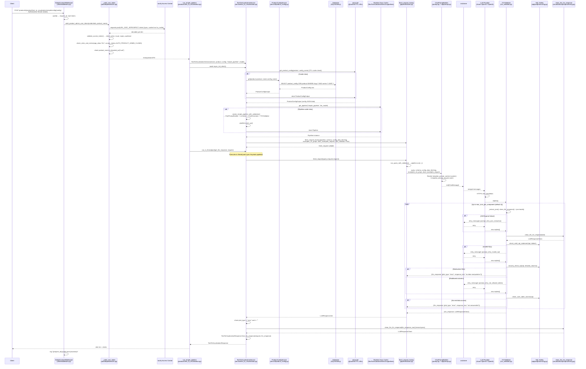
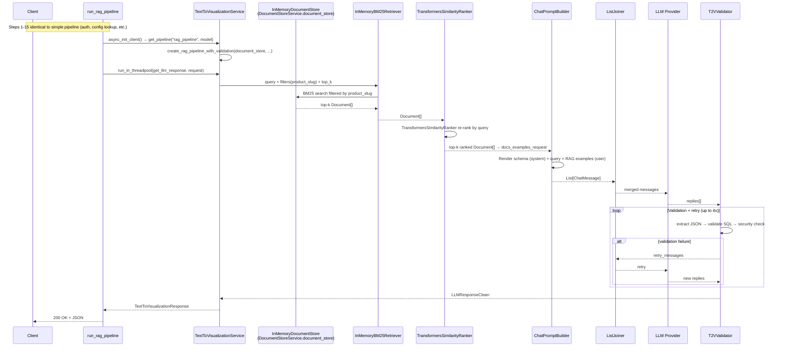

# T2V API Capability Assessment

## 1. Executive Summary

This repository implements a **FastAPI backend service** (v0.10.7) that converts natural language queries into SQL statements and visualization instructions (plot type, axes, grouping) via LLM pipelines built on the Haystack framework. The service is multi-tenant: each **product** (e.g. `nqc`, `nim`, `nlo`) has its own DB-stored configurations and example requests. The LLM generates SQL plus a JSON visualization specification; the service validates the SQL for safety and correctness but **does not execute it** against any data source — SQL execution and data rendering are the caller's responsibility.

The service is tightly coupled to the **navify Access Control** identity provider and currently supports only **Azure OpenAI** and **OpenAI-compatible** LLM backends. It is designed as a single-worker process due to its in-memory document store.

## 2. Scope of Analysis

- Repository: `text-to-visualization-backend-service`
- Version analysed: `0.10.7` (`pyproject.toml` line 3, `src/text_to_visualization_api/version.py`)
- Vendored library: `text-to-visualization` v0.11.x (`lib/text_to_visualization/`)
- All findings are based solely on source code in this repository.

## 3. How the API Works

### 3.1 API Framework

- **Framework**: FastAPI `0.116.1` (`pyproject.toml` line 14)
- **App entrypoint**: `src/text_to_visualization_api/main.py` — creates a `FastAPI` app instance, attaches all routers via `api/main.py`, and adds `GlobalContextMiddleware`
- **Router assembly**: `src/text_to_visualization_api/api/main.py` — builds a top-level `api_router` (`APIRouter`) and includes four sub-routers with per-group auth dependencies via `Security()`
- **ASGI server**: `uvicorn` — production via `entrypoint.sh` (`/app/.venv/bin/uvicorn`), local dev via `python -m uvicorn text_to_visualization_api.main:app --reload --port 8100`
- **Lifespan**: `lifespan()` in `main.py` (lines 13-25) — runs three async startup steps:
  1. `create_db_and_tables(engine)` — creates all SQLAlchemy ORM tables (`utils/init_db.py`)
  2. `DocumentStoreService(session).startup()` — loads all product examples from DB into `InMemoryDocumentStore` (`service/document_store.py`)
  3. `add_initial_products(session, settings.AUTH_AUD)` — seeds initial products from the `AUTH_AUD` tuple (`utils/init_db.py`)
- **Middleware**: `GlobalContextMiddleware` (`utils/middleware.py`) — sets a `ContextVar` UUID per request, times wall-clock and CPU duration, and catches unhandled exceptions returning `500 Internal Server Error`
- **Dependency injection**: `AsyncSessionDep = Annotated[AsyncSession, Depends(get_async_session)]` (`api/dependencies.py`) provides an async DB session per request. Auth dependencies are applied at router level.
- **Annotated path/query params**: `TA_PRODUCT_SLUG`, `TA_CONFIG_SLUG`, `TA_LLM_MODEL` (`api/annotations.py`) — reusable `Annotated` types for product slug, config name, and LLM model selection

### 3.2 API Endpoints

**Route group overview** (defined in `src/text_to_visualization_api/api/main.py`):

| Group | Prefix | Auth dependency (applied at router level) | Router assembly file | Condition |
|---|---|---|---|---|
| Products | `/products/{product_name}` | `Security(valid_product_admin_user_token)` | `api/routes/products/main.py` | Always |
| Admin | `/admin` | `Security(valid_admin_user_token)` | `api/routes/admin/main.py` | Always |
| Health | `/health` | None | `api/routes/health.py` | Always |
| Debug | `/{product_name}/debug` | `Security(valid_product_admin_user_token)` | `api/routes/debug.py` | Only when `settings.ENVIRONMENT ∈ {"dev", "local"}` |

#### 3.2.1 T2V Pipeline Endpoints — `api/routes/products/text_to_visualization.py`

These are the core endpoints that convert natural language into SQL + visualization instructions.

| Method | Path | Handler | Request model | Response model | Query params | Downstream services |
|---|---|---|---|---|---|---|
| `POST` | `.../text_to_visualization/simple/config/{config_name}` | `run_simple_pipeline()` | `TextToInsightsRequest` (body) | `TextToVisualizationResponse` | `llm_model: TLLMModels` | `TextToVisualizationService` → `ProductConfigService` → `ProductConfigRepository` (DB); Haystack `simple_pipeline` → LLM provider |
| `POST` | `.../text_to_visualization/rag/config/{config_name}` | `run_rag_pipeline()` | `TextToInsightsRequest` (body) | `TextToVisualizationResponse` | `llm_model: TLLMModels`, `retriever_top_k: Optional[int]`, `ranker_top_k: Optional[int]` | `TextToVisualizationService` → `ProductConfigService` → `ProductConfigRepository` (DB); `DocumentStoreService.document_store` (RAG); Haystack `rag_pipeline` → LLM provider |
| `POST` | `.../text_to_visualization/simple` | `run_simple_pipeline_with_dynamic_config()` | `TextToInsightsRequestDynamicConfig` (body, includes inline `config: SQLProductConfig`) | `TextToVisualizationResponse` | `llm_model: TLLMModels` | `TextToVisualizationService` → Haystack `simple_pipeline` → LLM provider (no DB config lookup — config is in the request body) |
| `POST` | `.../text_to_visualization/simple/rse` | `run_simple_pipeline_with_dynamic_config_rse()` | `CETextToVisualizationDynamicConfigRequest` (CloudEvent body wrapping `TextToInsightsRequestDynamicConfig`) | `TextToVisualizationResponse` | `llm_model: TLLMModels` | Delegates directly to `run_simple_pipeline_with_dynamic_config()` after extracting `event.data` |
| `POST` | `.../text_to_visualization/clear_cache/{config_name}` | `clear_cache_config()` | None | `204 No Content` | None | `TextToVisualizationService.invalid_cache()` (clears `aiocache` for the given product/config key, or all keys if both are `"-"`) |

**Handler detail — `run_simple_pipeline` (lines 20-73)**:
1. Constructs `TextToVisualizationService(async_session, product_name, config_name, pipeline_name="simple_pipeline", llm_model)`
2. Calls `await service.async_init_client()` — fetches `ProductConfigOutput` from DB (via `ProductConfigService.get()`, cached with `@cached(ttl=CACHE_PRODUCT_CONFIG)`), creates or reuses the `Haystack Pipeline` from the class-level `TextToVisualizationService.pipelines` dict keyed by `(pipeline_name, llm_model)`, builds a `fetch_request` callable via `get_fetch_request()`
3. Runs `await run_in_threadpool(service.get_llm_response, request)` — the pipeline itself is synchronous (Haystack), so it runs in a thread pool
4. `get_llm_response()` (line 279) calls `fetch_request(request.request)`, checks for error `plot_type`, calls `clean_llm_t2v_response()`, and builds `TextToVisualizationResponse.from_llm_response()`

**Handler detail — `run_rag_pipeline` (lines 76-162)**:
Same flow as simple pipeline but with `pipeline_name="rag_pipeline"` and additional `kwargs_fetch_request` for `retriever_top_k` and `ranker_top_k`. The RAG pipeline uses `DocumentStoreService.document_store` (`InMemoryDocumentStore`) with `InMemoryBM25Retriever` + `TransformersSimilarityRanker`.

#### 3.2.2 Product Config Endpoints — `api/routes/products/config.py`

| Method | Path | Handler | Request model | Response model | Downstream service → repository |
|---|---|---|---|---|---|
| `POST` | `.../config/` | `create()` | `ProductConfigInput` (body) | `ProductConfigOutput` (201) | `ProductConfigService.create()` → `ProductConfigRepository.create()`, `ProductRepository.get()` |
| `GET` | `.../config/` | `get()` | None | `List[ProductConfigOutput]` | `ProductConfigService.get_all()` → `ProductConfigRepository.get_all_product_configs()` |
| `GET` | `.../config/{config_name}` | `get_via_name()` | None | `ProductConfigOutput` | `ProductConfigService.get()` → `ProductConfigRepository.get_product_config()` |
| `PUT` | `.../config/{config_name}` | `update_via_name()` | `ProductConfigUpdate` (body) | `ProductConfigOutput` | `ProductConfigService.update()` → `ProductConfigRepository.get()`, `.update()` |
| `DELETE` | `.../config/{config_name}` | `delete_via_id()` | None | `bool` | `ProductConfigService.delete()` → `ProductConfigRepository.get()`, `.delete()` |

#### 3.2.3 Example Request Endpoints — `api/routes/products/request_examples.py`

| Method | Path | Handler | Request model | Response model | Downstream service → repository | Side effects |
|---|---|---|---|---|---|---|
| `POST` | `.../example_requests/` | `create()` | `List[ExampleRequest]` (body) | `List[ExampleRequestOutput]` (201) | `ProductExampleService.create_batch()` → `ProductExampleRepository.create_batch()` | `DocumentStoreService.add_examples_to_docs()` — writes to `InMemoryDocumentStore` |
| `GET` | `.../example_requests/` | `get()` | None | `List[ExampleRequestOutput]` | `ProductExampleService.get_all()` → `ProductExampleRepository.get_all_product_examples()` | — |
| `GET` | `.../example_requests/{example_id}` | `get_via_id()` | None | `ExampleRequestOutput` | `ProductExampleService.get()` → `ProductExampleRepository.get_product_example()` | — |
| `DELETE` | `.../example_requests/` | `delete_all()` | None | `bool` | `ProductExampleService.delete_all()` → `ProductExampleRepository.delete_all()` | `DocumentStoreService.delete_examples()` — removes from `InMemoryDocumentStore` |
| `DELETE` | `.../example_requests/{example_id}` | `delete_via_id()` | None | `bool` | `ProductExampleService.delete()` → `ProductExampleRepository.delete()` | `DocumentStoreService.delete_examples_by_ids()` — removes from `InMemoryDocumentStore` |

#### 3.2.4 Admin Product Endpoints — `api/routes/admin/product.py`

| Method | Path | Handler | Request model | Response model | Downstream service → repository |
|---|---|---|---|---|---|
| `POST` | `/admin/product/` | `create()` | `ProductInput` (body) | `ProductOutput` (201) | `ProductService.create()` → `ProductRepository.exists_in_db()`, `.create()` |
| `GET` | `/admin/product/` | `get()` | Query: `identifier`, `slug`, `name` (all optional) | `List[ProductOutput]` | `ProductService.get()` or `ProductService.get_all()` → `ProductRepository` |
| `GET` | `/admin/product/{product_id}` | `get_via_id()` | None | `ProductOutput` | `ProductService.get(identifier=product_id)` → `ProductRepository.get_product()` |
| `PUT` | `/admin/product/{product_id}` | `update_via_id()` | `ProductUpdate` (body) | `ProductOutput` | `ProductService.update()` → `ProductRepository.get()`, `.update()` |
| `DELETE` | `/admin/product/{product_id}` | `delete_via_id()` | None | `bool` | `ProductService.delete()` → `ProductRepository.get()`, `.delete()` |

#### 3.2.5 Admin Config Endpoints — `api/routes/admin/config.py`

| Method | Path | Handler | Request model | Response model | Downstream service → repository |
|---|---|---|---|---|---|
| `POST` | `/admin/config/` | `create()` | `ProductConfigInput` (body) | `ProductConfigOutput` (201) | `ProductConfigService.create()` → `ProductConfigRepository`, `ProductRepository` |
| `GET` | `/admin/config/` | `get()` | Query: `product_name` (optional) | `List[ProductConfigOutput]` | `ProductConfigService.get_all()` → `ProductConfigRepository.get_all_product_configs()` |
| `GET` | `/admin/config/{config_id}` | `get_via_id()` | None | `ProductConfigOutput` | `ProductConfigService.get(identifier=config_id)` → `ProductConfigRepository.get_product_config()` |
| `PUT` | `/admin/config/{config_id}` | `update_via_id()` | `ProductConfigUpdate` (body) | `ProductConfigOutput` | `ProductConfigService.update()` → `ProductConfigRepository` |
| `DELETE` | `/admin/config/{config_id}` | `delete_via_id()` | None | `bool` | `ProductConfigService.delete()` → `ProductConfigRepository` |

#### 3.2.6 Health Endpoints — `api/routes/health.py`

| Method | Path | Handler | Request model | Response model | Downstream service |
|---|---|---|---|---|---|
| `GET` | `/health/ready` | `readiness_probe()` | None | `ReadinessStatus` (200) or 500 with `ReadinessStatus` detail | `HealthService.readiness_probe()` → `check_database_connection()` (executes `SELECT 1` against DB) |
| `GET` | `/health/live` | `liveness_probe()` | None | `LivenessStatus` (200) or 500 with `LivenessStatus` detail | `HealthService.liveness_probe()` → `check_database_connection()`. Note: `check_llm_service_connection()` exists but is **commented out** (line 49 of `service/health.py`); `llm_service` component always reports `True` |

#### 3.2.7 Debug Endpoints — `api/routes/debug.py`

| Method | Path | Handler | Request model | Response model | Downstream service |
|---|---|---|---|---|---|
| `GET` | `/{product_name}/debug/fetch_url` | `fetch_url()` | Query: `url: str` | `dict` `{"status_code": int, "text": str}` | Direct `httpx.AsyncClient.get(url)` — **no restrictions on target URL** (SSRF risk) |

### 3.3 Request Schemas

All schema classes are defined in `src/text_to_visualization_api/schemas/`.

**T2V pipeline request models** (`schemas/text_to_visualization.py`):

| Schema class | Parent | Fields | Used by |
|---|---|---|---|
| `TextToInsightsRequest` | `BaseModel` | `request: str` — natural language query | `run_simple_pipeline`, `run_rag_pipeline` |
| `TextToInsightsRequestDynamicConfig` | `TextToInsightsRequest` | `request: str`, `config: SQLProductConfig` — inline product config (tables, data_fetching, examples) | `run_simple_pipeline_with_dynamic_config` |
| `CETextToVisualizationDynamicConfigRequest` | `CloudEvent` | CloudEvent envelope; `data: TextToInsightsRequestDynamicConfig`, `type: Literal["com.roche.labgpt.texttovisualizationrequest"]`, `source: str` | `run_simple_pipeline_with_dynamic_config_rse` |

**Product config model** (`schemas/product_config.py`):

| Schema class | Fields | Used by |
|---|---|---|
| `SQLProductConfig` | `data_fetching: ConfigDataFetching` (`sql_dialect: str`), `examples: ConfigExamples` (`properties: Optional[Dict]`, `requests: List[ExampleRequest]`), `tables: List[DBTable]` | Inline config in dynamic endpoints; stored as JSON blob in `ProductConfig.config` |
| `DBTable` | `table_name: str`, `description: str`, `columns: List[DBColumn]` | Schema context for prompts |
| `DBColumn` | `name: str`, `description: str`, `type: str`, `examples: Optional[List[str]]` | Column-level schema for prompts |
| `ProductConfigInput` | `name: SlugString`, `product: str`, `description: Optional[str]`, `config: dict` | POST body for config creation |
| `ProductConfigUpdate` | All fields Optional: `name`, `product`, `description`, `config` | PUT body for config updates |
| `ProductConfigOutput` | `id: int`, `name`, `product_id`, `description`, `config: dict`, `created_at`, `last_edited` | Response model for all config endpoints |

**Product model** (`schemas/product.py`):

| Schema class | Fields | Used by |
|---|---|---|
| `ProductInput` | `slug: SlugString`, `name: str` | POST body for product creation |
| `ProductUpdate` | `slug: Optional[SlugString]`, `name: Optional[str]` | PUT body for product updates |
| `ProductOutput` | `id: int`, `slug: SlugString`, `name: str` | Response model for product endpoints |

**Example request model** (`schemas/product_example.py`):

| Schema class | Fields | Used by |
|---|---|---|
| `ExampleRequest` | `request: str`, `response: LLMResponseExample` | POST body for example creation (as `List[ExampleRequest]`) |
| `LLMResponseExample` | `data_query: str`, `explanation: Optional`, `plot_type: PlotType`, `x_axis: Optional[str]`, `y_axis: Optional[str]`, `group_by: Optional[str]` | Nested in `ExampleRequest.response` |
| `ExampleRequestOutput` | `request`, `response`, `created_at`, `last_edited` | Response model for example endpoints |

**Health model** (`schemas/health.py`):

| Schema class | Fields |
|---|---|
| `ReadinessStatus` | `status: HealthStatus` (`"ok"` \| `"error"`) |
| `LivenessStatus` | `status: HealthStatus`, `components: LivenessComponents` |
| `LivenessComponents` | `database: bool`, `llm_service: bool` |

**Shared types** (`schemas/generics.py`, `utils/utils.py`):

| Type | Definition | Used by |
|---|---|---|
| `SlugString` | `Annotated[str, StringConstraints(pattern=pattern_valid_slug, min_length=1)]` | `ProductInput.slug`, `ProductConfigInput.name` |
| `pattern_valid_slug` | `re.compile(r"^[A-z0-9][A-z0-9\-.]+[A-z0-9]$")` (`utils/utils.py`) | `SlugString`, ORM `@validates("slug")` |

**Query parameters** (`api/annotations.py`):

| Annotated alias | Type | Description | Default |
|---|---|---|---|
| `TA_PRODUCT_SLUG` | `Annotated[str, Path(...)]` | Product slug from URL path | Required |
| `TA_CONFIG_SLUG` | `Annotated[str, Path(...)]` | Config name from URL path | Required |
| `TA_LLM_MODEL` | `Annotated[TLLMModels, Query(...)]` | LLM model selection | `settings.LLM_API_AVAILABLE_MODELS[0]` |

### 3.4 Response Schemas

**Primary T2V response** (`schemas/text_to_visualization.py`):

`TextToVisualizationResponse` — assembled via `TextToVisualizationResponse.from_llm_response(request, llm_response)` (line 102):

```json
{
  "request": {
    "request": "Show me a list of available devices"
  },
  "data_fetching": {
    "data_query": "SELECT name FROM device",
    "explanation": "Select all device names from the device table."
  },
  "visualization": {
    "plot_type": "table",
    "x_axis": null,
    "y_axis": null,
    "group_by": null
  }
}
```

Sub-models:
- `DataFetchingSQL` — `data_query: str`, `explanation: str` (built from `LLMResponseClean` via `DataFetchingSQL.from_llm_response()`)
- `VisualizationInstructionLLM` — `plot_type: PlotType`, `x_axis: Optional[str]`, `y_axis: Optional[str]`, `group_by: Optional[str]` (built from `LLMResponseClean` via `VisualizationInstructionLLM.from_llm_response()`)
- `PlotType` enum (`lib/text_to_visualization/constants.py`): `ERROR`, `TABLE`, `BAR_PLOT`, `LINE_PLOT`, `PIE_PLOT`, `SCATTER_PLOT`

**CloudEvent response** (`schemas/text_to_visualization.py`):
- `CETextToVisualizationResponse` extends `CloudEventResponse` — wraps `TextToVisualizationResponse` as `data` with `type: "com.roche.labgpt.texttovisualizationresponse"`, `source: "com.roche.labgpt"`. Has a `to_response()` method for HTTP serialisation.

**Error responses**:
- LLM error: `HTTPException(500)` with `detail` set to the raw LLM error `dict` `{"plot_type": "error", "response_text": ...}` — raised in `TextToVisualizationService.get_llm_response()` (line 306)
- Empty `plot_type` (`""`): normalised to error with `response_text` from `explanation` field (line 301-305)
- Unhandled exceptions: `GlobalContextMiddleware` catches all → `JSONResponse(500, {"detail": "Internal Server Error"})` (line 44)
- Service-level errors: `HTTPException(404, "Config not found")`, `HTTPException(409, "Config already exists")`, `HTTPException(404, "Product not found")`, `HTTPException(404, "Example not found")`

### 3.5 Runtime Dependencies

| Dependency | Version | Purpose | File |
|---|---|---|---|
| `fastapi` | 0.116.1 | Web framework | `pyproject.toml` |
| `haystack-ai` | ~2.17.x | Pipeline framework (transitive via `text-to-visualization`) | `pyproject.toml` |
| `sqlalchemy` | 2.0.43 | Async ORM for products, configs, examples | `pyproject.toml` |
| `aiosqlite` | 0.21.0 | SQLite async driver (local/test) | `pyproject.toml` |
| `asyncpg` | 0.30.0 | PostgreSQL async driver (prod) | `pyproject.toml` (prod group) |
| `sqlglot[rs]` | 27.12.0 | SQL parsing, validation, transpilation | `pyproject.toml` |
| `torch` | 2.8.0+cpu | ML models for `TransformersSimilarityRanker` in RAG pipeline | `pyproject.toml` |
| `aiocache` | ^0.12.3 | TTL-based caching on `ProductConfigService.get_product_config()` | `pyproject.toml` |
| `cloudevents` | >=1.12.0 | `CloudEvent` / `CloudEventResponse` Pydantic wrappers | `pyproject.toml` |
| `pydantic` | 2.11.7 | Schema validation, request/response models | `pyproject.toml` |
| `pydantic-settings` | 2.10.1 | `Settings` class from env vars / `.env` | `pyproject.toml` |
| `uvicorn` | ^0.35.0 | ASGI server | `pyproject.toml` |
| `httpx` | (transitive) | Async HTTP in `debug.fetch_url` and `health.check_llm_service_connection` | `api/routes/debug.py`, `service/health.py` |
| `requests` | (transitive) | Synchronous HTTP in `auth.introspect_token` | `auth/auth.py` |

### 3.6 Required Configuration and Environment Variables

All settings are defined in `src/text_to_visualization_api/core/settings.py` (`class Settings(BaseSettings)`) and loaded from environment variables or a `.env` file (template: `env-template`).

| Variable | Type | Default | Required | Purpose | File |
|---|---|---|---|---|---|
| `ENVIRONMENT` | `Literal["local", "dev", "staging", "production"]` | `"local"` | No | Controls debug endpoint mounting, auth error detail verbosity | `core/settings.py` L23 |
| `DOCS_ROOT_PATH` | `str` | `""` | No | `root_path` for FastAPI (reverse proxy support) | `core/settings.py` L25 |
| `DATABASE_URI` | `str` | `"sqlite+aiosqlite:///:memory:"` | No (defaults to in-memory SQLite) | SQLAlchemy connection string | `core/settings.py` L28 |
| `DATABASE_CONNECT_ARGS` | `dict` | `{}` | No | Extra connection args (e.g. `{"check_same_thread": false}`) | `core/settings.py` L30 |
| `DEBUG_DATABASE_ECHO` | `bool` | `False` | No | Echo SQL statements to log | `core/settings.py` L31 |
| `LLM_API_CONFIG` | `str` | `"galileo.gpt4_8k_api_configs.json"` | No | Path to JSON file or inline JSON string with LLM backend config (`{type, api_key, api_endpoint, model, api_version}`) | `core/settings.py` L34 |
| `LLM_API_AVAILABLE_MODELS` | `Tuple[str, ...]` | `("gpt-4o-2024-11-20", "gpt-4o-2024-08-06", "gpt-4o-mini-2024-07-18")` | No | Models selectable via `llm_model` query param | `core/settings.py` L35-39 |
| `PIPELINE_MAX_RETRIES` | `int` | `4` | No | Max retry iterations in the T2V validator loop | `core/settings.py` L62 |
| `CACHE_PRODUCT_CONFIG` | `int` | `30` | No | TTL (seconds) for `@cached` on product config retrieval | `core/settings.py` L65 |
| **`AUTH_OIDC_CLIENT_ID`** | `str` | — | **Yes** | navify Access Control OIDC client ID | `core/settings.py` L70 |
| **`AUTH_OIDC_CLIENT_SECRET`** | `str` | — | **Yes** | navify Access Control OIDC client secret | `core/settings.py` L71 |
| `AUTH_URL_API` | `str` | `"https://api.appdevus.platform.navify.com"` | No | navify Access Control API base URL | `core/settings.py` L68 |
| `AUTH_APP_ALIAS` | `str` | `"t2v"` | No | App alias for claim lookups in JWT `apps` array | `core/settings.py` L69 |
| `AUTH_AUD` | `Tuple[str, ...]` | `("nqc", "nim", "nlo", "APP.t2v")` | No | Allowed audience values; also used to seed initial products at startup | `core/settings.py` L74 |
| `AUTH_USER_CLAIMS` | `Tuple[str, ...]` | `("textToVisualizationRequest",)` | No | Claims required for product user access | `core/settings.py` L76 |
| `AUTH_PRODUCT_ADMIN_CLAIMS` | `Tuple[str, ...]` | `("accessTextToVisualizationProductEndpoints",)` | No | Claims required for product admin access | `core/settings.py` L77 |
| `AUTH_ADMIN_CLAIMS` | `Tuple[str, ...]` | `("accessTextToVisualizationAdminEndpoints",)` | No | Claims required for full admin access | `core/settings.py` L78 |
| `AUTH_API_ISSUER` | `str` | `"/api/v1/auth/protocols/oidc"` | No | Issuer path appended to `AUTH_URL_API` | `core/settings.py` L80 |
| `AUTH_API_JWK_ADDRESS` | `str` | `"/api/v1/auth/keys"` | No | JWK keys path (not currently used — introspection used instead) | `core/settings.py` L81 |
| `AUTH_API_OIDC_INTROSPECT` | `str` | `"/api/v1/auth/protocols/oidc/introspect"` | No | Token introspection endpoint path | `core/settings.py` L82 |

**Build-time secrets** (used in Dockerfile only):
- `GITLAB_SECRET` — GitLab read token for the private `text-to-visualization` PyPI registry

## 4. Components and Modules

| Component | Responsibility | Key files / classes / functions | Input | Output | Notes |
|---|---|---|---|---|---|
| **API layer — T2V routes** | Accepts T2V requests, delegates to `TextToVisualizationService`, wraps LLM response in Pydantic model | `src/text_to_visualization_api/api/routes/products/text_to_visualization.py` — `run_simple_pipeline()`, `run_rag_pipeline()`, `run_simple_pipeline_with_dynamic_config()`, `run_simple_pipeline_with_dynamic_config_rse()`, `clear_cache_config()` | `TextToInsightsRequest` or `TextToInsightsRequestDynamicConfig` body; path params `product_name`, `config_name`; query param `llm_model` | `TextToVisualizationResponse` (200) or `HTTPException(500)` on LLM error | Uses `run_in_threadpool()` to run the synchronous Haystack pipeline off the async event loop |
| **API layer — Config routes (product-scoped)** | CRUD for product configs scoped to a product slug | `src/text_to_visualization_api/api/routes/products/config.py` — `create()`, `get()`, `get_via_name()`, `update_via_name()`, `delete_via_id()` | `ProductConfigInput` / `ProductConfigUpdate` body; path params `product_name`, `config_name` | `ProductConfigOutput` or `List[ProductConfigOutput]` or `bool` | Delegates to `ProductConfigService` |
| **API layer — Example request routes** | CRUD for per-product example requests used by RAG pipeline | `src/text_to_visualization_api/api/routes/products/request_examples.py` — `create()`, `get()`, `get_via_id()`, `delete_all()`, `delete_via_id()` | `List[ExampleRequest]` body for create; path params `product_name`, `example_id` | `List[ExampleRequestOutput]` or `ExampleRequestOutput` or `bool` | On create/delete, synchronises `DocumentStoreService` (adds/removes `Document` objects from `InMemoryDocumentStore`) |
| **API layer — Admin product routes** | CRUD for product (tenant) entities | `src/text_to_visualization_api/api/routes/admin/product.py` — `create()`, `get()`, `get_via_id()`, `update_via_id()`, `delete_via_id()` | `ProductInput` / `ProductUpdate` body; path param `product_id`; query params `identifier`, `slug`, `name` | `ProductOutput` or `List[ProductOutput]` or `bool` | Delegates to `ProductService` |
| **API layer — Admin config routes** | CRUD for product configs by integer ID (cross-product) | `src/text_to_visualization_api/api/routes/admin/config.py` — `create()`, `get()`, `get_via_id()`, `update_via_id()`, `delete_via_id()` | `ProductConfigInput` / `ProductConfigUpdate` body; path param `config_id`; query param `product_name` | `ProductConfigOutput` or `List[ProductConfigOutput]` or `bool` | Same `ProductConfigService` as product-scoped routes but accessed by ID |
| **API layer — Health routes** | Kubernetes liveness and readiness probes | `src/text_to_visualization_api/api/routes/health.py` — `readiness_probe()`, `liveness_probe()` | `AsyncSessionDep` (injected) | `ReadinessStatus` or `LivenessStatus` | Readiness checks DB via `SELECT 1`; liveness includes `LivenessComponents` struct. LLM connectivity check is **commented out** (`service/health.py` L49) |
| **API layer — Debug route** | Fetches an arbitrary URL (for debugging network connectivity) | `src/text_to_visualization_api/api/routes/debug.py` — `fetch_url()` | Query param `url: str` | `dict {"status_code": int, "text": str}` | Only mounted when `ENVIRONMENT ∈ {"dev", "local"}`. SSRF risk — no URL validation |
| **Request validation** | Pydantic v2 schema validation, slug format enforcement | `src/text_to_visualization_api/schemas/text_to_visualization.py` (`TextToInsightsRequest`, `TextToInsightsRequestDynamicConfig`, `CETextToVisualizationDynamicConfigRequest`), `schemas/generics.py` (`SlugString`), `schemas/product_config.py` (`SQLProductConfig`, `DBTable`, `DBColumn`, `ProductConfigInput`, `ProductConfigUpdate`), `schemas/product.py` (`ProductInput`, `ProductUpdate`), `schemas/product_example.py` (`ExampleRequest`, `LLMResponseExample`), `utils/utils.py` (`pattern_valid_slug`) | Raw JSON request body | Validated Pydantic model instances; FastAPI auto-returns `422 Unprocessable Entity` on validation failure | `SlugString` enforces `^[A-z0-9][A-z0-9\-.]+[A-z0-9]$` regex. ORM models (`Product`, `ProductConfig`) also have `@validates("slug")` but `is_valid_slug()` has a bug — always returns `True` (`utils/utils.py` L36: `return bool(pattern_valid_slug)` checks the compiled pattern, not the match) |
| **T2V orchestration service** | Coordinates config retrieval, pipeline creation/caching, LLM invocation, response cleaning | `src/text_to_visualization_api/service/text_to_visualization.py` — `TextToVisualizationService`: `__init__()`, `async_init_client()`, `get_pipeline()`, `get_fetch_request()`, `get_llm_response()`, `get_llm_response_raw()`, `get_product_config()` (cached), `clear_cache()`, `invalid_cache()` | `TextToInsightsRequest`, product slug, config name, pipeline name (`"simple_pipeline"` \| `"rag_pipeline"`), LLM model string | `TextToVisualizationResponse` | Class-level `pipelines: Dict[Tuple[str, str], Pipeline]` cache. The pipeline itself is synchronous (Haystack); called via `run_in_threadpool()`. Config fetched with `@cached(ttl=settings.CACHE_PRODUCT_CONFIG)` from `aiocache`. |
| **Product config service** | Business logic for config CRUD — uniqueness checks, product lookup, 404/409 errors | `src/text_to_visualization_api/service/product_config.py` — `ProductConfigService`: `create()`, `get()`, `get_all()`, `update()`, `delete()` | `ProductConfigInput` / `TProductConfigUpdate` + product slug or config ID | `ProductConfigOutput` | Wraps `ProductConfigRepository` + `ProductRepository`; raises `HTTPException` directly |
| **Product service** | Business logic for product CRUD — slug/name uniqueness, 404/409 errors | `src/text_to_visualization_api/service/product.py` — `ProductService`: `create()`, `get()`, `get_all()`, `update()`, `delete()` | `ProductInput` / `TProductUpdate` + identifiers | `ProductOutput` | Wraps `ProductRepository`; raises `HTTPException` directly |
| **Product example service** | Business logic for example CRUD — batch creation, 404 errors | `src/text_to_visualization_api/service/product_example.py` — `ProductExampleService`: `create()`, `create_batch()`, `get()`, `get_all()`, `update()`, `delete()`, `delete_all()` | `ExampleRequest` / `List[ExampleRequest]` + product slug | `ExampleRequestOutput` / `List[ExampleRequestOutput]` | Wraps `ProductExampleRepository`; raises `HTTPException` directly |
| **Document store service** | Manages the in-memory RAG document store — startup loading, add/get/delete examples | `src/text_to_visualization_api/service/document_store.py` — `DocumentStoreService`: class-level `document_store = InMemoryDocumentStore()`, `startup()`, `upload_all_product_examples_from_db()`, `upload_product_examples_from_db()`, `add_examples_to_docs()`, `get_examples()`, `delete_examples()`, `delete_examples_by_ids()` | `List[ExampleRequest]` dicts + product slug | `List[Document]` (Haystack) or `int` (count) | Singleton `InMemoryDocumentStore` at class level — prevents multi-worker deployment. Uses `create_documents_for_examples()` and `create_filter_example()` from the vendored library |
| **Health service** | Database and LLM connectivity probes | `src/text_to_visualization_api/service/health.py` — `HealthService`: `readiness_probe()`, `liveness_probe()`, `check_database_connection()`; module-level `check_llm_service_connection()` | `AsyncSession` | `ReadinessStatus` / `LivenessStatus` | `check_database_connection()` runs `SELECT 1`. `check_llm_service_connection()` calls `GET {api_endpoint}/health/liveness` via `httpx` but is **commented out** in `liveness_probe()` |
| **Product config repository** | SQLAlchemy async CRUD for `ProductConfig` table | `src/text_to_visualization_api/repository/product_config.py` — `ProductConfigRepository`: `create()`, `get()`, `get_all()`, `get_product_config()`, `get_all_product_configs()`, `exists_in_db()`, `update()`, `delete()` | `ProductConfigInputDb` / `TProductConfigUpdate` | `ProductConfigOutput` / `ProductConfig` (ORM) | Joins `Product` table on slug for product-scoped lookups |
| **Product repository** | SQLAlchemy async CRUD for `Product` table | `src/text_to_visualization_api/repository/product.py` — `ProductRepository`: `create()`, `get()`, `get_all()`, `get_product()`, `get_all_products()`, `exists_in_db()`, `update()`, `delete()` | `ProductInput` / `TProductUpdate` | `ProductOutput` / `Product` (ORM) | Filter by `id`, `slug`, or `name` |
| **Product example repository** | SQLAlchemy async CRUD for `ProductExample` table | `src/text_to_visualization_api/repository/product_example.py` — `ProductExampleRepository`: `create()`, `create_batch()`, `get()`, `get_all()`, `get_product_example()`, `get_all_product_examples()`, `exists_in_db()`, `update()`, `delete()`, `delete_all()` | `ExampleRequest` / `TExampleRequestUpdate` + product slug | `ExampleRequestOutput` / `ProductExample` (ORM) | `create_batch()` uses `sqlite_upsert` with `on_conflict_do_update` — **SQLite-specific** (will break on PostgreSQL without modification) |
| **ORM models** | SQLAlchemy table definitions | `src/text_to_visualization_api/models/product.py` (`Product`: `id`, `slug`, `name`, `configs` relationship, `examples` relationship), `models/product_config.py` (`ProductConfig`: `id`, `name`, `product_id` FK, `config` JSON, unique constraint `(product_id, name)`), `models/product_example.py` (`ProductExample`: `id`, `product_id` FK, `request`, `response` JSON, unique constraint `(product_id, request)`), `models/base.py` (`Base`, `repr_factory`), `models/db.py` (re-exports) | — | — | All models use `datetime.utcnow` (deprecated in Python ≥3.12). `Product.slug` has `@validates` but `is_valid_slug()` always returns `True` (bug in `utils/utils.py` L36) |
| **Text-to-SQL generation (simple pipeline)** | Renders schema + query into prompts, calls LLM, returns SQL + viz JSON | `lib/text_to_visualization/pipelines/simple_pipeline.py` — `create_simple_pipeline_with_validation()`: builds Haystack `Pipeline` with `ChatPromptBuilder` → `ListJoiner` → LLM (`ChatGenerator`) → `T2VValidator` (retry loop); `lib/text_to_visualization/pipelines/base.py` — `fetch_request_factory()`, `run_query_with_validator()`, `fetch_request_via_pipeline_with_validator()` | `query: str`, `schema: List[dict]`, `config_data_fetching: dict`, `docs_examples_request: Sequence[Document]`, `examples_vis_props: Optional[ExampleProperties]` | `LLMResponse` (union of `LLMResponseRaw` and `LLMResponseError`) | Pipeline graph: `prompt_builder → list_joiner → llm → t2v_validator` with `t2v_validator.retry_messages → list_joiner` loop. `max_runs_per_component` defaults to `settings.PIPELINE_MAX_RETRIES` (4) |
| **Text-to-SQL generation (RAG pipeline)** | Same as simple but prepends retriever + ranker to fetch relevant examples from document store | `lib/text_to_visualization/pipelines/rag_pipeline.py` — `create_rag_pipeline_with_validation()`, `run_query_with_validator()`, `fetch_request_factory()` | Same as simple pipeline + `product_slug: Optional[str]`, `retriever_top_k: int`, `ranker_top_k: int` | `LLMResponse` | Pipeline graph: `retriever → ranker → prompt_builder → list_joiner → llm → t2v_validator` with retry loop. Retriever is `InMemoryBM25Retriever`, ranker is `TransformersSimilarityRanker`. Examples filtered by `product_slug` via `create_filter_example()` |
| **Prompt templates** | Jinja2 templates for system (schema) + user (query + examples) prompts | `lib/text_to_visualization/components/data_fetching/sql/prompt.py` — `template_prompt_context` (system: renders tables/columns), `template_prompt_request` (user: renders query, dialect, vis properties, examples); `lib/text_to_visualization/pipelines/components/prompt.py` — `create_chat_prompt_builder()` | `schema: List[dict]`, `query: str`, `config_data_fetching: dict`, `examples_vis_props`, `docs_examples_request` | `List[ChatMessage]` (system + user) | Predefined prompt type `"sql"` maps to the SQL templates. Custom `ChatMessage` templates also supported via `TPromptType` |
| **T2V validator** | Validates LLM JSON output, checks SQL syntax/safety, retries on failure | `lib/text_to_visualization/pipelines/components/t2v_validator.py` — `T2VValidator` (Haystack `@component`): `run()`, `_extract_json()`, `_compile_retry_messages()` | `replies: List[ChatMessage]`, `config_data_fetching: dict`, `schema: List[dict]`, `history: List[ChatMessage]` | `{"t2v_response": LLMResponseClean}` on success; `{"retry_messages": List[ChatMessage]}` on failure | Validation steps in order: (1) JSON extraction from LLM text, (2) `clean_llm_t2v_response()`, (3) `check_valid_sql_statement()` via sqlglot, (4) `security_check_sql()` — destructive-statement detection + column allow-list, (5) `check_uses_table_column()` — ensures real data access. Each failure generates a targeted retry prompt |
| **SQL safety checks** | AST-based SQL validation and security enforcement via sqlglot | `lib/text_to_visualization/components/data_fetching/sql/postprocessing.py` — `security_check_sql()`, `has_destructive_statement()`, `get_not_allowed_table_columns()`, `check_valid_sql_statement()`, `check_uses_table_column()`, `transpile_sql()`, `inject_schema_in_table_name()` | `sql_statement: str`, `allowed_table_columns: List[str]`, `read: Optional[str]` (dialect) | `(is_secure: bool, meta: SecurityEvaluationMeta)` with fields `harmful_statement`, `not_allowed_table_columns`, `not_allowed_table_columns_implicit` | Detects `INSERT`, `DROP`, `UPDATE`, `DELETE`, `TRUNCATE`, `ALTER`, `AlterColumn`, `AlterSet`. Column allow-list built from `{table_name}.{column_name}` in product config schema. Known limitation: `check_valid_sql_statement("BLAKELEE")` returns `True` (single identifiers pass sqlglot transpile) |
| **Visualization postprocessing** | Normalises raw LLM output to clean `PlotType` + nullable axes | `lib/text_to_visualization/components/visualization/postprocessing.py` — `clean_llm_t2v_response()`, `extract_sql_column_names()`, `value_or_none()`, `m_raw_plot_types` dict | `LLMResponse` dict | `LLMResponseClean` (`LLMResponseVisClean` or `LLMResponseError`) | `m_raw_plot_types` maps: `"histogram"` → `BAR_PLOT`, `"line chart"` → `LINE_PLOT`, `"bar plot"` → `BAR_PLOT`, etc. Deduplicates `group_by == x_axis` → sets `group_by = None`. Extracts column names from `table.column` format via `split(".")[-1]` |
| **LLM client factory** | Creates Haystack `ChatGenerator` components from a config dict | `lib/text_to_visualization/pipelines/components/llm_client.py` — `create_chat_generator_from_config()` | `llm_or_api_config: Union[Component, LLMApiConfig]`, `llm_model: Optional[str]` | `AzureOpenAIChatGenerator` (for `type: "azure"`) or `OpenAIChatGenerator` (for `type: "openai"`) | Config dict structure: `{"type": "azure"|"openai", "api_key": str, "api_endpoint": str, "model": str, "api_version": str}`. If input is already a `Component`, returns it unchanged. `api_key` wrapped in `Secret.from_token()` |
| **Document store helpers (vendored library)** | Creates Haystack `Document` objects from example requests for RAG | `lib/text_to_visualization/components/document_store/examples.py` — `create_documents_for_examples()`, `create_filter_example()`, `create_example_document_id()` | `List[ExampleRequest]` dicts, `product_slug: str` | `List[Document]` with `content=request`, `meta={"response": ..., "product_slug": ...}` | `create_filter_example()` returns a Haystack filter dict that scopes retrieval by `product_slug` |
| **Authentication** | navify Access Control OIDC token introspection, validation, role/claim checking | `src/text_to_visualization_api/auth/auth.py` — `introspect_token()`, `decode_token_via_introspect()`, `validate_access_token()`, `check_roles_and_claims()`, `get_app_roles_and_claims_from_jwt()`, `is_token_expired()`; `auth/dependencies.py` — `valid_admin_user_token()`, `valid_product_admin_user_token()`, `valid_product_user_token()`, `_valid_user_token()`, `cached_decode_token_via_introspect` | Bearer token from `HTTPBearer`; path param `product_name` for audience checks | `IntrospectionDTO` (decoded JWT) | `introspect_token()` uses **synchronous** `requests.post()` (blocks event loop). `cached_decode_token_via_introspect` uses `lru_cache(maxsize=128)` with **no TTL**. Prod mode hides error details; dev/local mode returns descriptive messages. Validates: active flag, issuer match, expiration, audience overlap, app-specific claims |
| **Auth DTO schemas** | Pydantic models for decoded JWT claims | `src/text_to_visualization_api/auth/schemas.py` — `IntrospectionDTO`, `AppsClaimItemDTO`, `NavifyUserMetadataClaim` | Decoded JWT dict | Typed Pydantic model | `IntrospectionDTO` has 25+ fields covering `active`, `exp`, `apps`, `aud`, `claims`, `email`, `roles`, etc. |
| **Configuration** | Application settings from env vars / `.env` via `pydantic-settings` | `src/text_to_visualization_api/core/settings.py` — `Settings(BaseSettings)`, `settings` singleton | Environment variables / `.env` file | `settings` instance with typed attributes | `llm_api_config` is a `@computed_field` / `@cached_property` that loads from JSON file or inline JSON string, redacting `api_key` in logs. See §3.6 for full variable list |
| **Database engine** | SQLAlchemy async engine and session factory | `src/text_to_visualization_api/core/database.py` — `engine` (`create_async_engine`), `async_session_maker` (`async_sessionmaker`), `get_async_session()` (async generator) | `settings.DATABASE_URI`, `settings.DATABASE_CONNECT_ARGS` | `AsyncSession` yielded per request | `api/dependencies.py` wraps as `AsyncSessionDep = Annotated[AsyncSession, Depends(get_async_session)]` |
| **DB initialisation** | Creates tables and seeds initial products at startup | `src/text_to_visualization_api/utils/init_db.py` — `create_db_and_tables()`, `add_initial_products()` | `AsyncEngine`, `AsyncSession`, `settings.AUTH_AUD` | Tables created; products seeded | `add_initial_products()` iterates `AUTH_AUD` and calls `ProductService.create()`, catching `HTTPException` for already-existing products |
| **Request middleware** | Per-request UUID, latency logging, unhandled error catch | `src/text_to_visualization_api/utils/middleware.py` — `GlobalContextMiddleware(BaseHTTPMiddleware)`: `dispatch()`; `request_id_ctx` (`ContextVar`) | HTTP `Request` | HTTP `Response` (passthrough) or `JSONResponse(500)` on unhandled error | Logs `[{request_id}] {path} took {duration}s (processed: {cpu_time}s)` at INFO level |
| **Logging/observability** | uvicorn and haystack log configuration | `log-config.yaml`, `log-config.debug.yaml` | — | Structured log output to stderr (default) and stdout (access) | No OpenTelemetry, no distributed tracing, no metrics endpoint. Request-ID is logged but not propagated to downstream LLM calls |
| **SQL execution** | **Missing** — not implemented in this service | N/A | N/A | N/A | The service returns SQL to the caller; it never connects to a data source or executes queries |
| **Rendering / chart generation** | **Missing** in the API; exists unused in vendored library | `lib/text_to_visualization/components/rendering/` — module exists with Plotly rendering code (`plots.py`, `style.py`, `visualization.py`, `owc_tokens.py`) | N/A (not wired into API) | N/A | The API only outputs viz instructions (`plot_type`, `x_axis`, `y_axis`, `group_by`); actual chart rendering is the caller's responsibility. The library has Plotly rendering but the API does not use it |
| **Deployment/runtime** | Docker multi-stage build, uvicorn entrypoint, Poetry dependency management | `Dockerfile` (multi-stage: builder → roche-certs → production), `entrypoint.sh`, `docker-compose.yml`, `docker-compose.build.yml`, `docker-compose.dev.yml`, `docker-compose.test.yml` | Docker build context + `GITLAB_SECRET` | Container exposing port 8000, non-root user `appuser:appgroup` (UID 1001) | `entrypoint.sh` defaults `UVICORN_WORKERS=2` — **contradicts** the single-worker constraint of `InMemoryDocumentStore`. `HAYSTACK_TELEMETRY_ENABLED=False` set in Dockerfile. Roche G3 root CA certs injected for internal HTTPS |

## 5. Architecture

### 5.1 Logical Architecture

The service follows a layered architecture: **API layer** → **Service layer** → **Repository layer** → **Database**, with a parallel branch from the service layer into the Haystack **Pipeline layer** for LLM-based text-to-SQL generation. Authentication is enforced at the router level via FastAPI `Security()` dependencies before any handler executes.

#### Component grouping

| Group | Components in this repo | Relationship |
|---|---|---|
| **API layer** | `GlobalContextMiddleware`, FastAPI routers (`products/`, `admin/`, `health/`, `debug/`), `api/main.py` (router assembly) | Entry point — receives HTTP, applies middleware, dispatches to handler |
| **Request validation** | Pydantic v2 schemas (`TextToInsightsRequest`, `SQLProductConfig`, `ProductConfigInput`, `SlugString`, etc.) | Inline with FastAPI — validates request body and path/query params before handler executes |
| **Authentication & authorisation** | `auth/auth.py` (navify introspection), `auth/dependencies.py` (guards), `auth/schemas.py` (`IntrospectionDTO`) | Applied per-router via `Security()` — runs before handler; calls external navify API |
| **Orchestration** | `TextToVisualizationService`, `ProductConfigService`, `ProductService`, `ProductExampleService` | Service classes coordinate config lookup, pipeline selection, LLM invocation, and response assembly |
| **Text-to-SQL generation** | Haystack `Pipeline` (simple + RAG), `ChatPromptBuilder`, `ChatGenerator` (Azure/OpenAI), `ListJoiner` | Synchronous pipeline executed in thread pool; renders prompts, calls LLM, receives raw response |
| **SQL safety / validation** | `T2VValidator` (Haystack component), `sql/postprocessing.py` safety functions | Validates LLM output: JSON extraction, SQL parsing, destructive-statement detection, column allow-listing, retry loop |
| **SQL execution** | **Missing** — not implemented | The service returns generated SQL to the caller; it never connects to a data source |
| **Visualization generation** | `clean_llm_t2v_response()`, `VisualizationInstructionLLM` (Pydantic schema) | Normalises plot types and axis names. `lib/.../components/rendering/` exists (Plotly) but is **not wired** into the API |
| **LLM / model provider integration** | `create_chat_generator_from_config()` (supports `"azure"` and `"openai"`) | Creates Haystack `ChatGenerator` from API config dict; used by pipeline factory |
| **Metadata / schema context** | `ProductConfig` (ORM), `SQLProductConfig` (Pydantic), `ProductConfigRepository` (async CRUD) | Per-product DB schema (tables, columns, types) stored as JSON blob; injected into LLM prompt via Jinja2 |
| **Configuration** | `core/settings.py` (`Settings` via `pydantic-settings`), `env-template`, `.env` | All config from env vars; `llm_api_config` loaded from JSON file or inline string |
| **Logging / observability** | `GlobalContextMiddleware` (request UUID, latency), `log-config.yaml`, service-level `logger` instances | UUID per request, structured debug logs, uvicorn log config. No OpenTelemetry, no metrics |
| **Deployment / runtime** | `Dockerfile` (multi-stage), `entrypoint.sh`, `docker-compose.*.yml` | Container runs uvicorn; single-worker required for `InMemoryDocumentStore` |

#### Mermaid architecture diagram

```mermaid
flowchart TB
    subgraph External
        Client["Client / Platform"]
        NavifyAC["navify Access Control<br/>(OIDC introspection)"]
        LLMProvider["LLM Provider<br/>(Azure OpenAI / OpenAI)"]
        PG[(PostgreSQL<br/><i>prod only</i>)]
    end

    subgraph DockerContainer["Docker Container (port 8000)"]

        subgraph APILayer["API Layer"]
            MW["GlobalContextMiddleware<br/><code>utils/middleware.py</code><br/><i>request UUID, latency, error catch</i>"]
            AuthGuard["Auth Guard<br/><code>auth/dependencies.py</code><br/><code>valid_product_admin_user_token()</code><br/><code>valid_admin_user_token()</code>"]
            ProdRouter["Products Router<br/><code>api/routes/products/main.py</code><br/><i>prefix: /products/{product_name}</i>"]
            AdminRouter["Admin Router<br/><code>api/routes/admin/main.py</code><br/><i>prefix: /admin</i>"]
            HealthRouter["Health Router<br/><code>api/routes/health.py</code><br/><i>prefix: /health (no auth)</i>"]
            DebugRouter["Debug Router<br/><code>api/routes/debug.py</code><br/><i>dev/local only</i>"]
        end

        subgraph Validation["Request Validation"]
            Schemas["Pydantic v2 Schemas<br/><code>schemas/text_to_visualization.py</code><br/><code>schemas/product_config.py</code><br/><code>schemas/generics.py (SlugString)</code>"]
        end

        subgraph ServiceLayer["Orchestration (Service Layer)"]
            T2VSvc["TextToVisualizationService<br/><code>service/text_to_visualization.py</code><br/><i>pipeline caching, config retrieval, LLM call</i>"]
            CfgSvc["ProductConfigService<br/><code>service/product_config.py</code>"]
            ProdSvc["ProductService<br/><code>service/product.py</code>"]
            ExSvc["ProductExampleService<br/><code>service/product_example.py</code>"]
            DocSvc["DocumentStoreService<br/><code>service/document_store.py</code><br/><i>class-level InMemoryDocumentStore</i>"]
            HealthSvc["HealthService<br/><code>service/health.py</code>"]
        end

        subgraph RepoLayer["Repository Layer"]
            CfgRepo["ProductConfigRepository<br/><code>repository/product_config.py</code>"]
            ProdRepo["ProductRepository<br/><code>repository/product.py</code>"]
            ExRepo["ProductExampleRepository<br/><code>repository/product_example.py</code>"]
        end

        subgraph DBLayer["Database"]
            DBEngine["AsyncEngine + AsyncSession<br/><code>core/database.py</code>"]
            ORM["ORM Models<br/><code>models/product.py</code><br/><code>models/product_config.py</code><br/><code>models/product_example.py</code>"]
            SQLiteDB[(SQLite<br/><i>local/test</i>)]
        end

        subgraph PipelineLayer["Text-to-SQL Generation (Haystack Pipeline)"]
            SimplePipe["Simple Pipeline<br/><code>pipelines/simple_pipeline.py</code><br/><code>create_simple_pipeline_with_validation()</code>"]
            RAGPipe["RAG Pipeline<br/><code>pipelines/rag_pipeline.py</code><br/><code>create_rag_pipeline_with_validation()</code>"]
            Retriever["InMemoryBM25Retriever<br/><i>(RAG only)</i>"]
            Ranker["TransformersSimilarityRanker<br/><i>(RAG only, uses torch)</i>"]
            PromptBuilder["ChatPromptBuilder<br/><code>pipelines/components/prompt.py</code><br/><code>sql/prompt.py</code> (Jinja2 templates)"]
            Joiner["ListJoiner<br/><i>(merges prompt + retry messages)</i>"]
            ChatGen["ChatGenerator<br/><code>pipelines/components/llm_client.py</code><br/><code>create_chat_generator_from_config()</code>"]
        end

        subgraph SQLSafety["SQL Safety / Validation"]
            Validator["T2VValidator<br/><code>pipelines/components/t2v_validator.py</code><br/><i>JSON extraction, SQL checks, retry loop</i>"]
            SQLChecks["SQL Safety Functions<br/><code>sql/postprocessing.py</code><br/><code>security_check_sql()</code><br/><code>has_destructive_statement()</code><br/><code>check_valid_sql_statement()</code><br/><code>check_uses_table_column()</code>"]
        end

        subgraph VizGen["Visualization Generation"]
            PostProc["clean_llm_t2v_response()<br/><code>visualization/postprocessing.py</code><br/><i>normalise plot types, axes</i>"]
            RespModel["TextToVisualizationResponse<br/><code>schemas/text_to_visualization.py</code><br/><code>.from_llm_response()</code>"]
        end

        subgraph Config["Configuration"]
            Settings["Settings (pydantic-settings)<br/><code>core/settings.py</code><br/><i>env vars / .env</i>"]
            LLMCfg["llm_api_config<br/><i>@computed_field / @cached_property</i><br/><i>from JSON file or inline</i>"]
        end

        subgraph CacheLayer["Caching"]
            AioCache["aiocache @cached(ttl=30)<br/><i>on get_product_config()</i>"]
            LRUCache["lru_cache(128)<br/><i>on token introspection</i>"]
            PipeDictCache["Class-level dict<br/><code>TextToVisualizationService.pipelines</code><br/><i>keyed by (pipeline_name, llm_model)</i>"]
        end

    end

    %% External connections
    Client -->|"HTTP + Bearer token"| MW
    AuthGuard -->|"sync requests.post()"| NavifyAC
    ChatGen -->|"HTTPS chat completion"| LLMProvider
    DBEngine -->|"asyncpg (prod)"| PG
    DBEngine -->|"aiosqlite (local)"| SQLiteDB

    %% Internal flow: API Layer
    MW --> ProdRouter
    MW --> AdminRouter
    MW --> HealthRouter
    MW --> DebugRouter
    ProdRouter -->|"Security()"| AuthGuard
    AdminRouter -->|"Security()"| AuthGuard
    ProdRouter --> Schemas
    AdminRouter --> Schemas
    Schemas --> T2VSvc
    Schemas --> CfgSvc

    %% Orchestration
    T2VSvc -->|"get config"| CfgSvc
    T2VSvc -->|"get/create pipeline"| PipeDictCache
    T2VSvc -->|"run_in_threadpool"| SimplePipe
    T2VSvc -->|"run_in_threadpool"| RAGPipe
    T2VSvc --> PostProc
    PostProc --> RespModel
    CfgSvc --> CfgRepo
    ProdSvc --> ProdRepo
    ExSvc --> ExRepo
    HealthSvc --> DBEngine

    %% Repository -> DB
    CfgRepo --> DBEngine
    ProdRepo --> DBEngine
    ExRepo --> DBEngine
    DBEngine --> ORM

    %% Pipeline internals
    SimplePipe --> PromptBuilder
    RAGPipe --> Retriever
    Retriever -->|"BM25 search"| DocSvc
    Retriever --> Ranker
    Ranker --> PromptBuilder
    PromptBuilder --> Joiner
    Joiner --> ChatGen
    ChatGen --> Validator
    Validator --> SQLChecks
    Validator -->|"retry_messages"| Joiner
    Validator -->|"success: t2v_response"| T2VSvc

    %% Caching
    T2VSvc --> AioCache
    AuthGuard --> LRUCache

    %% Config
    Settings --> LLMCfg
    LLMCfg --> ChatGen
    Settings --> DBEngine
    Settings --> AuthGuard

    %% Document store
    ExSvc -->|"add/delete"| DocSvc
```



### 5.2 Logical Architecture — Component Interactions

#### 5.2.1 API Layer

**Files**: `src/text_to_visualization_api/main.py`, `src/.../api/main.py`, `src/.../utils/middleware.py`, `src/.../api/routes/{products,admin,health,debug}/`

The FastAPI `app` is created in `main.py` L28-37. `GlobalContextMiddleware` is added at L48 — it wraps every request with a UUID (`request_id_ctx` ContextVar), wall-clock + CPU timers, and a top-level `try/except` that returns `JSONResponse(500, {"detail": "Internal Server Error"})` for unhandled exceptions (L40-44).

The `api_router` is assembled in `api/main.py` L8-17:
- `products.router` (prefix `/products/{product_name}`) gets `Security(valid_product_admin_user_token)` — L9
- `admin.router` (prefix `/admin`) gets `Security(valid_admin_user_token)` — L10
- `health.router` (prefix `/health`) has **no auth** — L11
- `debug.router` (prefix `/{product_name}/debug`) gets `Security(valid_product_admin_user_token)` — only included when `settings.ENVIRONMENT ∈ {"dev", "local"}` — L14-17

CORS middleware exists in code but is **commented out** (`main.py` L39-45).

#### 5.2.2 Request Validation

**Files**: `src/.../schemas/text_to_visualization.py`, `src/.../schemas/product_config.py`, `src/.../schemas/product.py`, `src/.../schemas/product_example.py`, `src/.../schemas/generics.py`, `src/.../utils/utils.py`

FastAPI uses Pydantic v2 models for request body validation. All slug-type fields use `SlugString = Annotated[str, StringConstraints(pattern=pattern_valid_slug)]` from `schemas/generics.py` L8, where `pattern_valid_slug = re.compile(r"^[A-z0-9][A-z0-9\-.]+[A-z0-9]$")` from `utils/utils.py` L6. Invalid requests auto-return `422 Unprocessable Entity`.

Note: The ORM-level `@validates("slug")` in `models/product.py` L30-33 calls `is_valid_slug()` from `utils/utils.py` L35-36, but this function has a bug: it returns `bool(pattern_valid_slug)` which always evaluates to `True` (checks the compiled pattern object, not a match result).

#### 5.2.3 Authentication & Authorisation

**Files**: `src/.../auth/auth.py`, `src/.../auth/dependencies.py`, `src/.../auth/schemas.py`

Token introspection is done via **synchronous** `requests.post()` to the navify Access Control OIDC introspection endpoint (`auth/auth.py` L96). The result is cached via `lru_cache(maxsize=128)` with **no TTL** (`auth/dependencies.py` L12). Validation checks (in order): `active` flag, issuer match, expiration, audience overlap with `ALLOWED_AUDIENCE`, and app-specific claims/roles.

Three guards exist:
- `valid_admin_user_token()` — requires `AUTH_ADMIN_CLAIMS` (`auth/dependencies.py` L142-148)
- `valid_product_admin_user_token()` — requires `AUTH_PRODUCT_ADMIN_CLAIMS` or falls back to admin; also checks `product_name ∈ decoded_jwt["aud"]` (`auth/dependencies.py` L110-139)
- `valid_product_user_token()` — requires `AUTH_USER_CLAIMS` or falls back to admin; also checks audience (`auth/dependencies.py` L78-107)

In production mode (`ENVIRONMENT not in {"dev", "local"}`), all error messages are masked to `"Unauthorized access"` (`auth/auth.py` L20-33).

#### 5.2.4 Orchestration (Service Layer)

**Files**: `src/.../service/text_to_visualization.py`, `src/.../service/product_config.py`, `src/.../service/product.py`, `src/.../service/product_example.py`, `src/.../service/document_store.py`, `src/.../service/health.py`

`TextToVisualizationService` is the central orchestrator (`service/text_to_visualization.py` L34-318). Per request it:
1. Fetches product config from DB via `ProductConfigService.get()`, cached with `@cached(ttl=settings.CACHE_PRODUCT_CONFIG)` from `aiocache` (L202-229)
2. Creates or reuses a Haystack `Pipeline` from the class-level `pipelines: Dict[Tuple[str, str], Pipeline]` dict (L39, L87-138)
3. Builds a `fetch_request` callable via `get_fetch_request()` that closes over the pipeline + config (L140-167)
4. Executes the pipeline synchronously via `run_in_threadpool()` (called from handler, `text_to_visualization.py` L69)
5. Post-processes the result via `clean_llm_t2v_response()` and assembles `TextToVisualizationResponse.from_llm_response()` (L298-318)

Other services follow the same pattern: service class wraps a repository, applies business rules, raises `HTTPException` on failures.

`DocumentStoreService` manages a **class-level singleton** `InMemoryDocumentStore` (L18). At startup (`lifespan()` in `main.py` L22-23), it loads all product examples from the DB into the document store via `startup()` → `upload_all_product_examples_from_db()`. It is also updated when examples are created/deleted via API endpoints (`request_examples.py` L41-44, L123, L155-157). This singleton design means the service **cannot scale horizontally** with multiple workers.

#### 5.2.5 Text-to-SQL Generation (Haystack Pipeline)

**Files**: `lib/text_to_visualization/pipelines/simple_pipeline.py`, `lib/.../pipelines/rag_pipeline.py`, `lib/.../pipelines/base.py`, `lib/.../pipelines/components/prompt.py`, `lib/.../pipelines/components/llm_client.py`, `lib/.../components/data_fetching/sql/prompt.py`

Two pipeline types exist:

**Simple pipeline** (`create_simple_pipeline_with_validation()`, `simple_pipeline.py` L53-119):
```
prompt_builder → list_joiner → llm → t2v_validator
                     ↑                    │
                     └── retry_messages ───┘
```
- `ChatPromptBuilder` renders Jinja2 templates: system prompt (`template_prompt_context` in `sql/prompt.py` L2-14) renders table/column schema; user prompt (`template_prompt_request` L17-58) renders the query, SQL dialect, vis property examples, and few-shot examples from config
- `ListJoiner(List[ChatMessage])` merges prompt messages with retry messages from the validator
- `ChatGenerator` (Azure or OpenAI, created via `create_chat_generator_from_config()` in `llm_client.py` L42-101) sends messages to external LLM

**RAG pipeline** (`create_rag_pipeline_with_validation()`, `rag_pipeline.py` L98-191):
```
retriever → ranker → prompt_builder → list_joiner → llm → t2v_validator
                                            ↑                    │
                                            └── retry_messages ───┘
```
- `InMemoryBM25Retriever(document_store, top_k=10)` — BM25 keyword search on `InMemoryDocumentStore`, filtered by `product_slug` via `create_filter_example()` (`components/document_store/examples.py`)
- `TransformersSimilarityRanker(top_k=5)` — re-ranks retrieved documents using a cross-encoder model (requires `torch`)
- Examples flow into `prompt_builder.docs_examples_request` instead of being baked into the prompt from config

Both pipelines use `max_runs_per_component` (default `settings.PIPELINE_MAX_RETRIES = 4`) to limit validation retry loops.

The pipeline is synchronous (Haystack `Pipeline.run()` is blocking). The service wraps it in `run_in_threadpool()` to avoid blocking the async event loop.

#### 5.2.6 SQL Safety / Validation

**Files**: `lib/.../pipelines/components/t2v_validator.py`, `lib/.../components/data_fetching/sql/postprocessing.py`

`T2VValidator` is a Haystack `@component` (`t2v_validator.py` L38-233) that validates LLM output in a 5-step chain:

1. **JSON extraction** (`_extract_json()` L95-130): `clean_llm_response()` strips markdown/braces/whitespace, then `json.loads()`. On failure → retry with `prompt_retry_json_extraction`.
2. **Viz normalisation** (`clean_llm_t2v_response()` from `postprocessing.py` L81-147): normalises `plot_type` via `m_raw_plot_types` map, deduplicates `group_by == x_axis`. If `plot_type == "error"` → early return (no retry).
3. **SQL syntax** (`check_valid_sql_statement()` L6-30): `sqlglot.transpile()` parsing. On failure → retry with `prompt_retry_invalid_sql`.
4. **SQL security** (`security_check_sql()` L70-135):
   - `has_destructive_statement()` (L138-164): detects `INSERT/DROP/UPDATE/DELETE/TRUNCATE/ALTER` via sqlglot AST → **immediate error** (no retry).
   - `get_not_allowed_table_columns()` (L167-255): compares accessed columns against allow-list built from `{table_name}.{column_name}` in config schema → retry with `prompt_retry_not_allowed_tables`.
5. **Data access** (`check_uses_table_column()` L258-292): ensures SQL references real columns (not just literals) → **immediate error** if false.

On each retry, the validator emits `{"retry_messages": [...]}` which loops back to `list_joiner` → `llm` → `t2v_validator`.

#### 5.2.7 SQL Execution

**Status**: **Missing**

This service generates SQL but does not execute it. There is no database connection to any product data source. The generated SQL is returned to the caller in `TextToVisualizationResponse.data_fetching.data_query`. SQL execution, data retrieval, and result rendering are entirely the caller's responsibility.

#### 5.2.8 Visualization Generation

**Files**: `lib/.../components/visualization/postprocessing.py`, `src/.../schemas/text_to_visualization.py`

`clean_llm_t2v_response()` (`postprocessing.py` L81-147) normalises raw LLM output:
- Maps raw `plot_type` strings to `PlotType` enum via `m_raw_plot_types` dict (e.g. `"histogram"` → `BAR_PLOT`, `"line chart"` → `LINE_PLOT`)
- Deduplicates `group_by == x_axis` → sets `group_by = None`
- Extracts column names from `table.column` format via `split(".")[-1]` (`extract_sql_column_names()` L46-78)
- If `plot_type` is empty or `None` → sets `PlotType.ERROR`

The API returns only **visualization instructions** (`plot_type`, `x_axis`, `y_axis`, `group_by`), not rendered charts. The vendored library contains a Plotly rendering module at `lib/.../components/rendering/` with files `plots.py`, `style.py`, `visualization.py`, `owc_tokens.py` — but this is **not wired into the API** (`main.py` and route handlers never import from `rendering/`).

#### 5.2.9 LLM / Model Provider Integration

**Files**: `lib/.../pipelines/components/llm_client.py`, `src/.../core/settings.py`

`create_chat_generator_from_config(llm_or_api_config, llm_model)` (`llm_client.py` L42-101) creates a Haystack chat generator:

| Config `type` | Generator class | API endpoint pattern | Use case |
|---|---|---|---|
| `"azure"` | `AzureOpenAIChatGenerator` | `{api_endpoint}` (galileo) | Roche Azure OpenAI via galileo endpoints |
| `"openai"` | `OpenAIChatGenerator` | `{api_endpoint}` (navify LLM) | navify LLM service or any OpenAI-compatible API |

Config is loaded once via `Settings.llm_api_config` (`@computed_field` / `@cached_property` in `settings.py` L41-59): from a JSON file (default `galileo.gpt4_8k_api_configs.json`) or inline JSON string. The `api_key` is wrapped in `Secret.from_token()` (`llm_client.py` L77) and redacted in log output (`settings.py` L49, L57).

The LLM model is selectable per request via the `llm_model` query parameter (`api/annotations.py` `TA_LLM_MODEL`); the available models are defined in `settings.LLM_API_AVAILABLE_MODELS` (default: `"gpt-4o-2024-11-20"`, `"gpt-4o-2024-08-06"`, `"gpt-4o-mini-2024-07-18"`).

There is **no streaming support** — the entire LLM response is awaited synchronously.

#### 5.2.10 Metadata / Schema Context

**Files**: `src/.../models/product_config.py`, `src/.../schemas/product_config.py`, `src/.../repository/product_config.py`, `src/.../models/product.py`, `src/.../models/product_example.py`

Product schemas are stored as JSON blobs in the `product_config` table (column `config`, type `JSON`), tied to a `product` via `product_id` FK with unique constraint `(product_id, name)`. The JSON follows the structure defined by `SQLProductConfig`:

```json
{
  "tables": [
    {
      "table_name": "...",
      "description": "...",
      "columns": [
        {"name": "...", "description": "...", "type": "...", "examples": ["..."]}
      ]
    }
  ],
  "data_fetching": {"sql_dialect": "mysql"},
  "examples": {
    "properties": {"x_axis": [...], "y_axis": [...], "group_by": [...]},
    "requests": [
      {"request": "...", "response": {"data_query": "...", "plot_type": "...", ...}}
    ]
  }
}
```

This schema data does two things:
1. **Prompts**: Injected into the LLM system prompt via `template_prompt_context` (Jinja2), rendering table names, column names, types, and descriptions
2. **Security**: Used by `T2VValidator` to build the column allow-list for `security_check_sql()`

Example requests can also be stored separately in the `product_example` table and managed via CRUD endpoints. For the RAG pipeline, these examples are loaded into `InMemoryDocumentStore` at startup and kept in sync via `DocumentStoreService.add_examples_to_docs()` / `delete_examples()` on create/delete operations.

#### 5.2.11 Configuration

**Files**: `src/.../core/settings.py`, `env-template`

All configuration is managed via `pydantic-settings` (`class Settings(BaseSettings)` in `settings.py` L20-85). Settings are loaded from environment variables or a `.env` file (`model_config = SettingsConfigDict(env_file=".env", ...)`).

Key configuration groups:
- **Environment**: `ENVIRONMENT` (`"local"` / `"dev"` / `"staging"` / `"production"`) — controls debug endpoint mounting and auth error verbosity
- **Database**: `DATABASE_URI` (default in-memory SQLite), `DATABASE_CONNECT_ARGS`, `DEBUG_DATABASE_ECHO`
- **LLM**: `LLM_API_CONFIG` (JSON file path or inline), `LLM_API_AVAILABLE_MODELS`
- **Pipeline**: `PIPELINE_MAX_RETRIES` (default 4), `CACHE_PRODUCT_CONFIG` (default 30s TTL)
- **Auth**: `AUTH_OIDC_CLIENT_ID` (required), `AUTH_OIDC_CLIENT_SECRET` (required), `AUTH_URL_API`, `AUTH_APP_ALIAS`, `AUTH_AUD`, claim sets (`AUTH_USER_CLAIMS`, `AUTH_PRODUCT_ADMIN_CLAIMS`, `AUTH_ADMIN_CLAIMS`), endpoint paths

The `llm_api_config` property (`settings.py` L41-59) is a `@computed_field` / `@cached_property` that loads once on first access. If the `LLM_API_CONFIG` value starts with `{`, it's parsed as inline JSON; otherwise it's treated as a file path.

#### 5.2.12 Logging / Observability

**Files**: `src/.../utils/middleware.py`, `log-config.yaml`, `log-config.debug.yaml`

`GlobalContextMiddleware` (`middleware.py` L16-50) provides:
- **Request UUID**: `uuid.uuid4()` stored in `request_id_ctx` ContextVar (L37) — usable for log correlation within a single request
- **Latency logging**: wall-clock (`time.perf_counter`) and CPU time (`time.process_time`) logged at INFO level (L49)
- **Error catch**: unhandled exceptions logged at ERROR level with request UUID (L43), returns generic `500`

Log configuration is in `log-config.yaml` (prod) and `log-config.debug.yaml` (dev/local), configuring uvicorn and haystack loggers. Root log level is `INFO`.

**Not present**:
- No OpenTelemetry integration (no `opentelemetry-*` in `pyproject.toml`, no tracing instrumentation)
- No Prometheus metrics endpoint
- No distributed tracing (request-ID is not propagated to LLM or navify calls)
- No audit trail for generated SQL queries
- LLM health check exists (`service/health.py` `check_llm_service_connection()` L9-19) but is **commented out** in `liveness_probe()` (L49)

### 5.3 Deployment Architecture

**Files**: `Dockerfile`, `entrypoint.sh`, `docker-compose.yml`, `docker-compose.build.yml`, `docker-compose.dev.yml`, `docker-compose.test.yml`

#### Container image

Multi-stage Docker build (`Dockerfile`):
1. **builder** stage (Python 3.11 slim-bookworm): installs Poetry, runs `poetry install --no-root --without dev`, copies application source. Uses `--mount=type=secret,id=GITLAB_SECRET` for private PyPI access to `text-to-visualization` package (L22-40).
2. **roche-certs** stage (Alpine): downloads Roche G3 Root CA + Issuing CA certificates, updates CA store (L46-63).
3. **production** stage (Python 3.11 slim-bookworm): copies venv from builder, certs from roche-certs, installs package with `pip install --no-deps -e .`, creates non-root user `appuser:appgroup` (UID/GID 1001) (L66-98).

Image exposes port 8000, sets `HAYSTACK_TELEMETRY_ENABLED=False`, runs as `appuser`.

#### Entrypoint

`entrypoint.sh` (L1-18) activates the venv and runs:
```bash
uvicorn text_to_visualization_api.main:app \
  --host 0.0.0.0 --port ${API_PORT:-8000} \
  --workers ${UVICORN_WORKERS:-2} \
  --log-level ${UVICORN_LOG_LEVEL:-info} \
  --proxy-headers ${FASTAPI_FLAGS}
```

**Critical issue**: `UVICORN_WORKERS` defaults to `2` (L7). The `InMemoryDocumentStore` is a class-level singleton in `DocumentStoreService` (L18) — it is **not shared across uvicorn workers**. When `UVICORN_WORKERS > 1`, each worker has its own document store with potentially different data, breaking RAG pipeline consistency. Must be set to `1`.

#### Docker Compose variants

| File | Purpose | Key additions |
|---|---|---|
| `docker-compose.yml` | Baseline service definition | Image from GitLab registry, env vars from host, exposes 8000, `DATABASE_URI: sqlite+aiosqlite:///database.db` |
| `docker-compose.build.yml` | Build overlay | Adds `build:` context with `GITLAB_SECRET` secret from `./gitlab_secret.txt` |
| `docker-compose.dev.yml` | Development overlay | Adds `--reload` via `FASTAPI_FLAGS`, mounts `./src`, `./database.db`, `./galileo.*.json` as volumes, publishes port 8000 |
| `docker-compose.test.yml` | Test overlay | Unknown (file exists but was not examined in detail) |

#### Database

| Environment | Driver | URI | Notes |
|---|---|---|---|
| Local / test | `aiosqlite` | `sqlite+aiosqlite:///:memory:` or `sqlite+aiosqlite:///database.db` | Default in `settings.py` L28; `StaticPool` used in test fixtures |
| Production | `asyncpg` | `postgresql+asyncpg://...` | `asyncpg` is in `pyproject.toml` prod group (`asyncpg = 0.30.0`); must set `DATABASE_URI` env var |

The async engine is created once at module level in `core/database.py` L5-9. Table creation runs at startup via `create_db_and_tables()` using `Base.metadata.create_all` (`utils/init_db.py` L10-21).

#### Worker model

Single-process, single-worker deployment required due to:
1. `InMemoryDocumentStore` — class-level singleton, not shared across workers (`service/document_store.py` L18)
2. `TextToVisualizationService.pipelines` — class-level dict, not shared across workers (`service/text_to_visualization.py` L39)
3. `lru_cache` on token introspection — per-process cache, not shared (`auth/dependencies.py` L12)

These are all **in-process** state. Running multiple uvicorn workers would create independent copies of each.

### 5.4 External Dependencies

| External System | Purpose | Protocol | Configuration | Calling code | Blocking? |
|---|---|---|---|---|---|
| **navify Access Control** | OIDC token introspection + validation | HTTPS POST to `{AUTH_URL_API}/api/v1/auth/protocols/oidc/introspect` | `AUTH_URL_API`, `AUTH_OIDC_CLIENT_ID`, `AUTH_OIDC_CLIENT_SECRET`, `AUTH_AUD` (env vars) | `auth/auth.py` `introspect_token()` L87-99 via `requests.post()` | **Yes** — synchronous `requests` library blocks the event loop |
| **Azure OpenAI (galileo)** | LLM chat completion for SQL + viz generation | HTTPS POST to Azure OpenAI endpoint | `LLM_API_CONFIG` with `type: "azure"`, `api_key`, `api_endpoint`, `model`, `api_version` | `lib/.../llm_client.py` `AzureOpenAIChatGenerator` (Haystack) via `create_chat_generator_from_config()` L82-90 | Synchronous (runs in thread pool) |
| **OpenAI-compatible API** (navify LLM service) | Alternative LLM backend | HTTPS POST to OpenAI-compatible endpoint | `LLM_API_CONFIG` with `type: "openai"`, `api_key`, `api_endpoint`, `model` | `lib/.../llm_client.py` `OpenAIChatGenerator` (Haystack) via `create_chat_generator_from_config()` L92-99 | Synchronous (runs in thread pool) |
| **PostgreSQL** (production) | Persistent storage for products, configs, examples | TCP (asyncpg) | `DATABASE_URI` env var | `core/database.py` `create_async_engine()` L5-9 | No — async via `asyncpg` |
| **SQLite** (local/test) | Lightweight local storage or in-memory | File or `:memory:` (aiosqlite) | `DATABASE_URI` env var (default) | `core/database.py` `create_async_engine()` L5-9 | No — async via `aiosqlite` |
| **GitLab PyPI registry** | Private `text-to-visualization` package at build time | HTTPS | `GITLAB_SECRET` Docker build secret | `Dockerfile` L30-31, `pyproject.toml` source `text-to-visualization` L53-56 | Build-time only |
| **Hugging Face model hub** (transitive) | Cross-encoder model for `TransformersSimilarityRanker` | HTTPS (model download) | Implicit — Haystack downloads model on first `warm_up()` | `lib/.../rag_pipeline.py` via `TransformersSimilarityRanker()` | First-call latency; model cached after download |

## 6. Request Workflows

### 6.1 Successful T2V Request — Simple Pipeline (DB-stored config)

**Endpoint**: `POST /products/{product_name}/text_to_visualization/simple/config/{config_name}`
**Handler**: `run_simple_pipeline()` in `src/text_to_visualization_api/api/routes/products/text_to_visualization.py` L20-73

| Step | Action | File / Class / Function | External dependency | Output |
|---|---|---|---|---|
| 1 | Client sends HTTP POST with bearer token and JSON body `{"request": "..."}` | — | — | HTTP request enters ASGI server |
| 2 | `GlobalContextMiddleware.dispatch()` intercepts request, generates UUID via `uuid.uuid4()`, stores in `request_id_ctx` ContextVar, starts `time.perf_counter()` and `time.process_time()` timers | `src/.../utils/middleware.py` L17, L32-37 | — | UUID assigned, timers started |
| 3 | FastAPI resolves `Security(valid_product_admin_user_token)` dependency (applied at router level in `api/main.py` L9) | `src/.../api/main.py` L9, `src/.../auth/dependencies.py` L110-139 | — | Calls `_valid_user_token()` |
| 4 | `_valid_user_token()` extracts bearer token from `HTTPBearer`, calls `cached_decode_token_via_introspect(access_token=token)` | `src/.../auth/dependencies.py` L59-61 | — | Checks `lru_cache(maxsize=128)` first |
| 5 | On cache miss: `auth.decode_token_via_introspect()` → `auth.introspect_token()` sends synchronous `requests.post()` to navify introspection endpoint (`URL_OIDC_INTROSPECT`) with `client_id`, `client_secret`, and the token | `src/.../auth/auth.py` L102-123, L73-99 | **navify Access Control** (`requests.post` to `{AUTH_URL_API}/api/v1/auth/protocols/oidc/introspect`) | `decoded_jwt: dict` |
| 6 | `auth.validate_access_token(decoded_jwt)` — checks `active` flag, issuer match against `URL_ISSUER`, token expiration via `is_token_expired()`, audience overlap with `ALLOWED_AUDIENCE` | `src/.../auth/auth.py` L126-174 | — | Raises `HTTPException(401)` on failure |
| 7 | `auth.check_roles_and_claims(decoded_jwt, app_alias="t2v", accept_claims=AUTH_PRODUCT_ADMIN_CLAIMS)` — extracts `apps` array from JWT, finds entry for `app_alias`, checks claim overlap | `src/.../auth/auth.py` L205-265 | — | Raises `HTTPException(401)` if claims missing |
| 8 | `_valid_user_token()` checks `product_name` against token `aud` — if `required_audience` not in `decoded_jwt["aud"]`, raises `HTTPException(401)` | `src/.../auth/dependencies.py` L71-74 | — | Returns `IntrospectionDTO` on success |
| 9 | FastAPI resolves `AsyncSessionDep` → `get_async_session()` yields an `AsyncSession` from `async_session_maker` | `src/.../api/dependencies.py` L11, `src/.../core/database.py` L17-24 | **Database** (SQLAlchemy async engine) | `AsyncSession` |
| 10 | FastAPI validates request body against `TextToInsightsRequest` (Pydantic v2: `{"request": str}`) and path/query params (`product_name`, `config_name`, `llm_model`) | `src/.../schemas/text_to_visualization.py` L10-17, `src/.../api/annotations.py` | — | Validated Pydantic models; auto `422` on failure |
| 11 | Handler constructs `TextToVisualizationService(async_session, product_name, config_name, pipeline_name="simple_pipeline", llm_model)` — stores params, creates `ProductConfigService(async_session)` internally | `src/.../service/text_to_visualization.py` L47-85 | — | `service` instance |
| 12 | Handler calls `await service.async_init_client()` — since no `product_config` arg, calls `self.get_product_config(product, config_name)` | `src/.../service/text_to_visualization.py` L169-200 | — | Triggers config lookup |
| 13 | `get_product_config()` (decorated with `@cached(ttl=settings.CACHE_PRODUCT_CONFIG)` from `aiocache`) — on cache miss, calls `self.product_config_service.get(product=product, name=config_name)` | `src/.../service/text_to_visualization.py` L202-229 | **aiocache** (in-memory TTL cache, default 30s) | `ProductConfigOutput` |
| 14 | `ProductConfigService.get()` calls `ProductConfigRepository.get_product_config(product=product, name=config_name)` which executes `SELECT ... FROM product_config JOIN product WHERE product.slug = ? AND product_config.name = ? LIMIT 1` | `src/.../service/product_config.py` L127-172, `src/.../repository/product_config.py` L86-155 | **Database** (async SQL query) | `ProductConfigOutput` or raises `HTTPException(404)` |
| 15 | `async_init_client()` extracts `product_config = product_config_entry.config` (the JSON blob `dict`) | `src/.../service/text_to_visualization.py` L188 | — | `dict` with keys `tables`, `data_fetching`, `examples` |
| 16 | `async_init_client()` calls `self.get_pipeline(pipeline_name="simple_pipeline", llm_model=...)` — checks class-level `TextToVisualizationService.pipelines` dict keyed by `("simple_pipeline", llm_model)` | `src/.../service/text_to_visualization.py` L87-138 | — | On cache hit: returns existing `Pipeline` |
| 17 | On pipeline cache miss: calls `pipelines.create_simple_pipeline_with_validation(llm_or_api_config=settings.llm_api_config, llm_model=..., max_runs_per_component=settings.PIPELINE_MAX_RETRIES, kwargs_t2v_validator={"filter_history": ...})` | `lib/text_to_visualization/pipelines/simple_pipeline.py` L53-119 | — | Creates Haystack `Pipeline` |
| 18 | Inside `create_simple_pipeline_with_validation()`: calls `create_chat_generator_from_config(llm_or_api_config, llm_model)` — creates `AzureOpenAIChatGenerator` or `OpenAIChatGenerator` depending on config `type` | `lib/.../pipelines/components/llm_client.py` L42-101 | — | `ChatGenerator` component with API key from `Secret.from_token()` |
| 19 | Pipeline assembled: `prompt_builder` → `list_joiner(ListJoiner)` → `llm(ChatGenerator)` → `t2v_validator(T2VValidator)` with `t2v_validator.retry_messages` → `list_joiner` (retry loop). `pipeline.warm_up()` called. Stored in `TextToVisualizationService.pipelines[key]` | `lib/.../pipelines/simple_pipeline.py` L96-119 | — | Warm `Pipeline` cached at class level |
| 20 | `async_init_client()` calls `self.get_fetch_request(pipeline, "simple_pipeline", product_config, kwargs_fetch_request)` — for simple pipeline: calls `create_documents_for_examples()` on config examples, then calls `pipelines.fetch_request_factory(pipeline, schema, config_data_fetching, examples_vis_props, docs_examples_request, with_validator=True)` | `src/.../service/text_to_visualization.py` L140-167, `lib/.../pipelines/base.py` L278-351 | — | Returns `fetch_request: Callable[[str], LLMResponse]` |
| 21 | `fetch_request_factory()` binds all config args into a closure; internally sets `func = fetch_request_via_pipeline_with_validator` and `func_run_query = run_query_with_validator` | `lib/.../pipelines/base.py` L315-350 | — | Callable `fetch_request(query: str) -> LLMResponse` |
| 22 | Handler calls `await run_in_threadpool(service.get_llm_response, request)` — offloads the synchronous pipeline execution to a thread pool | `src/.../api/routes/products/text_to_visualization.py` L69-72 | — | Blocks thread, not event loop |
| 23 | `get_llm_response(request)` calls `self.get_llm_response_raw(request)` which calls `self.fetch_request(request.request)` — the closure from step 21 | `src/.../service/text_to_visualization.py` L279-298, L256-277 | — | Enters pipeline execution |
| 24 | `fetch_request_via_pipeline_with_validator()` calls `func_run_query(pipeline, query, schema, ...)` which is `run_query_with_validator()` from `lib/.../pipelines/base.py` L106-152 | `lib/.../pipelines/base.py` L219-275, L106-152 | — | Calls `pipeline.run(...)` |
| 25 | `pipeline.run()` — Haystack executes the pipeline graph: **prompt_builder** receives `query`, `schema`, `config_data_fetching`, `examples_vis_props`, `docs_examples_request` | `lib/.../pipelines/components/prompt.py` L17-61, `lib/.../components/data_fetching/sql/prompt.py` | — | `ChatPromptBuilder` renders Jinja2 templates |
| 26 | **prompt_builder** renders: (a) system message via `template_prompt_context` — renders SQL table schemas with column descriptions; (b) user message via `template_prompt_request` — renders query, SQL dialect, vis properties, and example requests | `lib/.../components/data_fetching/sql/prompt.py` L2-58 | — | `List[ChatMessage]` (system + user) |
| 27 | Messages flow through **list_joiner** (`ListJoiner(List[ChatMessage])`) which concatenates prompt messages with any retry messages | `lib/.../pipelines/simple_pipeline.py` L106-107 | — | Merged `List[ChatMessage]` |
| 28 | **llm** (`AzureOpenAIChatGenerator` or `OpenAIChatGenerator`) sends merged messages to external LLM API | `lib/.../pipelines/components/llm_client.py` L82-99 | **Azure OpenAI** or **OpenAI-compatible API** (HTTPS chat completion call) | `replies: List[ChatMessage]` |
| 29 | **t2v_validator** (`T2VValidator.run()`) receives `replies`, `history` (from list_joiner), `config_data_fetching`, `schema`. Increments `iteration_counter` | `lib/.../pipelines/components/t2v_validator.py` L134-161 | — | Begins validation chain |
| 30 | Step 30a: `_extract_json()` — calls `clean_llm_response(replies[0].text)` (strips markdown, double braces, newlines), then `json.loads()` | `lib/.../pipelines/components/t2v_validator.py` L95-130, `lib/.../components/llm_agent/llm_response.py` L9-39 | — | `(dict, None)` on success; `(None, retry_message)` on `ValueError` |
| 31 | Step 30b: `clean_llm_t2v_response(llm_response_dict)` — normalises `plot_type` via `m_raw_plot_types` map, sets nullable axes, handles `group_by == x_axis` dedup, calls `extract_sql_column_names()` | `lib/.../components/visualization/postprocessing.py` L81-147 | — | `LLMResponseClean`; if `plot_type == "error"` early-returns `{"t2v_response": ...}` |
| 32 | Step 30c: `check_valid_sql_statement(sql_statement, read=sql_dialect)` — calls `sqlglot.transpile()` to parse | `lib/.../components/data_fetching/sql/postprocessing.py` L6-30 | **sqlglot** (SQL parser) | `(True, {})` or `(False, errors)` → retry on failure |
| 33 | Step 30d: `security_check_sql(sql_statement, read=sql_dialect, allowed_table_columns=[...])` — (i) `has_destructive_statement()` checks via `sqlglot` AST for INSERT/DROP/UPDATE/DELETE/TRUNCATE/ALTER; (ii) `get_not_allowed_table_columns()` compares explicit + implicit column access against allow-list derived from config schema | `lib/.../components/data_fetching/sql/postprocessing.py` L70-135, L138-255 | **sqlglot** (AST inspection) | `(is_secure: bool, SecurityEvaluationMeta)` |
| 34 | Step 30e: `check_uses_table_column(sql_statement, read=sql_dialect)` — ensures the SQL actually references a table column (not just returning literals) | `lib/.../components/data_fetching/sql/postprocessing.py` L258-292 | **sqlglot** | `bool` |
| 35 | If all checks pass: `T2VValidator` returns `{"t2v_response": t2v_response}` to the pipeline. If any check fails: returns `{"retry_messages": [...]}` which loops back to **list_joiner** → **llm** → **t2v_validator** (up to `max_runs_per_component` times, default 4) | `lib/.../pipelines/components/t2v_validator.py` L164-233 | — | Pipeline loop or final output |
| 36 | `pipeline.run()` returns `PipelineValidatedResponse` dict. `fetch_request_via_pipeline_with_validator()` extracts `pipeline_response["t2v_validator"]["t2v_response"]` | `lib/.../pipelines/base.py` L255-264 | — | `LLMResponse` dict |
| 37 | Back in `get_llm_response()`: checks `plot_type` — if `PlotType.ERROR.value` or `""`, raises `HTTPException(500, detail=llm_response_raw)`. Otherwise calls `clean_llm_t2v_response(llm_response_raw)` (second cleaning pass at service level) | `src/.../service/text_to_visualization.py` L298-310 | — | `LLMResponseClean` |
| 38 | `TextToVisualizationResponse.from_llm_response(request, llm_response)` — builds `DataFetchingSQL.from_llm_response()` and `VisualizationInstructionLLM.from_llm_response()` | `src/.../schemas/text_to_visualization.py` L95-109, L61-92 | — | `TextToVisualizationResponse` Pydantic model |
| 39 | Handler returns `TextToVisualizationResponse` → FastAPI serialises to JSON → `GlobalContextMiddleware` logs `[{request_id}] {path} took {duration}s (processed: {cpu_time}s)` | `src/.../utils/middleware.py` L46-49 | — | `200 OK` + JSON body |

#### Sequence Diagram — Simple Pipeline (DB-stored config)



### 6.2 Successful T2V Request — RAG Pipeline (DB-stored config)

**Endpoint**: `POST /products/{product_name}/text_to_visualization/rag/config/{config_name}`
**Handler**: `run_rag_pipeline()` in `src/text_to_visualization_api/api/routes/products/text_to_visualization.py` L76-162

The RAG pipeline follows the same steps 1–15 as the simple pipeline (§6.1). The differences begin at step 16:

| Step | Action | File / Class / Function | External dependency | Delta from simple pipeline |
|---|---|---|---|---|
| 16 | `get_pipeline("rag_pipeline", llm_model)` — checks class-level cache for `("rag_pipeline", llm_model)` key | `src/.../service/text_to_visualization.py` L109-110, L126-135 | — | Different cache key |
| 17 | On cache miss: calls `rag_pipeline.create_rag_pipeline_with_validation(document_store=self.document_store, ...)` — `self.document_store` is `DocumentStoreService.document_store` (class-level `InMemoryDocumentStore` singleton) | `lib/.../pipelines/rag_pipeline.py` L98-191 | — | Pipeline includes `InMemoryBM25Retriever` + `TransformersSimilarityRanker` |
| 18 | Pipeline graph: `retriever(InMemoryBM25Retriever)` → `ranker(TransformersSimilarityRanker)` → `prompt_builder` → `list_joiner` → `llm` → `t2v_validator` with retry loop back to `list_joiner` | `lib/.../pipelines/rag_pipeline.py` L160-191 | — | Two extra components prepended |
| 20 | `get_fetch_request()` — for `"rag_pipeline"`: uses `rag_pipeline.fetch_request_factory` (not `pipelines.fetch_request_factory`), sets `product_slug=self.product` instead of `docs_examples_request` | `src/.../service/text_to_visualization.py` L154-156 | — | RAG factory passes `product_slug` for doc store filtering |
| 21 | `rag_pipeline.fetch_request_factory()` binds `func_run_query = rag_pipeline.run_query_with_validator` which passes `retriever: {query, filters, top_k}` and `ranker: {query, top_k}` to `pipeline.run()` | `lib/.../pipelines/rag_pipeline.py` L314-395, L254-311 | — | Retriever and ranker get their own input params |
| 24–25 | `pipeline.run()` executes: **retriever** queries `InMemoryDocumentStore` with BM25, filtered by `create_filter_example(product_slug)` → top-k documents. **ranker** re-ranks using `TransformersSimilarityRanker` → top-k ranked documents. Ranked documents flow to `prompt_builder.docs_examples_request` | `lib/.../pipelines/rag_pipeline.py` L295-311, `lib/.../components/document_store/examples.py` | **InMemoryDocumentStore** (Haystack, in-process), **torch** (for TransformersSimilarityRanker model) | Prompt includes RAG-retrieved examples instead of config-provided examples |

All subsequent steps (26–39) are identical to the simple pipeline.



### 6.3 Successful T2V Request — Simple Pipeline (Dynamic inline config)

**Endpoint**: `POST /products/{product_name}/text_to_visualization/simple`
**Handler**: `run_simple_pipeline_with_dynamic_config()` in `src/text_to_visualization_api/api/routes/products/text_to_visualization.py` L191-242

| Step | Delta from DB-stored config flow (§6.1) | File / Function |
|---|---|---|
| 10 | Request body is `TextToInsightsRequestDynamicConfig` — includes `config: SQLProductConfig` inline (tables, data_fetching, examples) | `schemas/text_to_visualization.py` L20-58 |
| 11 | Service constructed with `config_name="<dummy>"` (a placeholder, never used for DB lookup) | `api/routes/products/text_to_visualization.py` L232 |
| 12 | `await service.async_init_client(product_config=request.config)` — passes inline config, **skips DB lookup entirely** | `service/text_to_visualization.py` L169, L189-190 |
| 13–14 | **Skipped** — no `get_product_config()` call, no DB query, no cache interaction. The `SQLProductConfig` is converted to `dict` via `.model_dump()` | `service/text_to_visualization.py` L189-191 |

Steps 1–9 (middleware, auth, session) and 16–39 (pipeline execution) are identical to §6.1.

### 6.4 Successful T2V Request — CloudEvent Wrapper

**Endpoint**: `POST /products/{product_name}/text_to_visualization/simple/rse`
**Handler**: `run_simple_pipeline_with_dynamic_config_rse()` in `src/text_to_visualization_api/api/routes/products/text_to_visualization.py` L245-289

This is a thin wrapper:
1. FastAPI validates body as `CETextToVisualizationDynamicConfigRequest` (CloudEvent with `data: TextToInsightsRequestDynamicConfig`) — `schemas/text_to_visualization.py` L112-173
2. Handler extracts `event.data` and delegates directly to `run_simple_pipeline_with_dynamic_config(async_session, product_name, request=event.data, llm_model)` — `text_to_visualization.py` L284-289
3. All subsequent steps are identical to §6.3

### 6.5 Failure Workflows

Each failure is traced to the exact step, file, and function where it originates.

#### F1. Invalid request body (malformed JSON or schema violation)

| Aspect | Detail |
|---|---|
| **Trigger** | Request body does not match `TextToInsightsRequest`, `TextToInsightsRequestDynamicConfig`, or `CETextToVisualizationDynamicConfigRequest` Pydantic schema |
| **Step** | 10 (FastAPI request validation) |
| **File/function** | FastAPI framework + Pydantic v2 validators in `src/.../schemas/text_to_visualization.py`, `src/.../schemas/product_config.py` |
| **Response** | `422 Unprocessable Entity` with `{"detail": [{"loc": [...], "msg": "...", "type": "..."}]}` |
| **External deps** | None |

#### F2. Authentication failure — invalid, expired, or inactive token

| Aspect | Detail |
|---|---|
| **Trigger** | Missing/malformed bearer token, inactive token, wrong issuer, expired token |
| **Step** | 3–6 |
| **File/function** | `src/.../auth/dependencies.py` `_valid_user_token()` L59-61 → `src/.../auth/auth.py` `decode_token_via_introspect()` L102-123, `validate_access_token()` L126-174 |
| **Response** | `401 Unauthorized` — detail is `"Unauthorized access"` in prod, descriptive message in dev/local (`auth/auth.py` L21-33) |
| **External deps** | **navify Access Control** (introspection endpoint must be reachable for cache-miss) |

#### F3. Authorization failure — missing claims or wrong audience

| Aspect | Detail |
|---|---|
| **Trigger** | Token valid but lacks required claims (`AUTH_PRODUCT_ADMIN_CLAIMS`) or `product_name` not in token `aud` |
| **Step** | 7–8 |
| **File/function** | `src/.../auth/auth.py` `check_roles_and_claims()` L205-265 (claim check), `src/.../auth/dependencies.py` L71-74 (audience check) |
| **Response** | `401 Unauthorized` — `"Missing app claims"` or `"Unauthorized access"` depending on prod mode |
| **External deps** | None (token already decoded) |

#### F4. navify introspection endpoint unreachable

| Aspect | Detail |
|---|---|
| **Trigger** | Network failure or navify Access Control downtime when `lru_cache` misses |
| **Step** | 5 |
| **File/function** | `src/.../auth/auth.py` `introspect_token()` L96 — `requests.post()` raises `requests.exceptions.ConnectionError` or `HTTPError`; caught by `decode_token_via_introspect()` L116-123 |
| **Response** | `401 Unauthorized` — detail is `str(e)` in dev/local, `"Unauthorized access"` in prod |
| **External deps** | **navify Access Control** (unreachable) |

#### F5. Product config not found (404)

| Aspect | Detail |
|---|---|
| **Trigger** | `product_name` or `config_name` does not exist in the database |
| **Step** | 14 |
| **File/function** | `src/.../service/product_config.py` `ProductConfigService.get()` L160-162 — `ProductConfigRepository.get_product_config()` returns `None` → raises `HTTPException(status_code=404, detail="Config not found")` |
| **Response** | `404 Not Found` with `{"detail": "Config not found"}` |
| **External deps** | **Database** (query returns no rows) |

#### F6. LLM returns invalid JSON (retryable)

| Aspect | Detail |
|---|---|
| **Trigger** | LLM response text cannot be parsed as JSON after `clean_llm_response()` stripping |
| **Step** | 30a (within T2VValidator) |
| **File/function** | `lib/.../pipelines/components/t2v_validator.py` `_extract_json()` L95-130 — `json.loads()` raises `ValueError` |
| **Behavior** | `T2VValidator` emits `retry_messages` containing `prompt_retry_json_extraction` with the error message. Messages loop back via `list_joiner` → `llm` → `t2v_validator`. Retried up to `max_runs_per_component` times (default `settings.PIPELINE_MAX_RETRIES = 4`, set in `src/.../service/text_to_visualization.py` L45) |
| **If retries exhausted** | Haystack raises an exception, caught by `fetch_request_via_pipeline_with_validator()` L265 → returns `{"plot_type": "error", "response_text": "Unknown Error occurred"}` (`lib/.../pipelines/base.py` L265-274) |
| **Final response** | `get_llm_response()` sees `plot_type == "error"` → raises `HTTPException(500, detail={"plot_type": "error", "response_text": "Unknown Error occurred"})` (`src/.../service/text_to_visualization.py` L300-308) |
| **External deps** | **LLM provider** (produced unparseable output) |

#### F7. LLM returns invalid SQL (retryable)

| Aspect | Detail |
|---|---|
| **Trigger** | Generated SQL fails `sqlglot.transpile()` parsing |
| **Step** | 30c (within T2VValidator) |
| **File/function** | `lib/.../components/data_fetching/sql/postprocessing.py` `check_valid_sql_statement()` L6-30 returns `(False, errors)`. `T2VValidator.run()` L181-186 emits retry with `prompt_retry_invalid_sql` |
| **Behavior** | Retry loop: `retry_messages` → `list_joiner` → `llm` → `t2v_validator` |
| **If retries exhausted** | Same as F6 — Haystack exception → `{"plot_type": "error", "response_text": "Unknown Error occurred"}` → `HTTPException(500)` |
| **External deps** | **sqlglot** (parser), **LLM provider** (retry calls) |

#### F8. LLM returns destructive SQL (non-retryable, immediate error)

| Aspect | Detail |
|---|---|
| **Trigger** | Generated SQL contains INSERT, DROP, UPDATE, DELETE, TRUNCATE, ALTER, AlterColumn, or AlterSet |
| **Step** | 30d (within T2VValidator) |
| **File/function** | `lib/.../components/data_fetching/sql/postprocessing.py` `has_destructive_statement()` L138-164 returns `True`. `T2VValidator.run()` L200-206 returns `{"t2v_response": {"plot_type": "error", "response_text": "We do not support manipulation of the database."}}` |
| **Behavior** | **No retry** — immediate error response from validator. `fetch_request_via_pipeline_with_validator()` extracts `t2v_response` at L264. `get_llm_response()` sees `plot_type == "error"` → `HTTPException(500)` |
| **Response** | `500 Internal Server Error` with `{"detail": {"plot_type": "error", "response_text": "We do not support manipulation of the database."}}` |
| **External deps** | **sqlglot** (AST inspection) |

#### F9. LLM accesses disallowed tables/columns (retryable)

| Aspect | Detail |
|---|---|
| **Trigger** | SQL references columns not in the allow-list built from `{table_name}.{column_name}` in the product config schema |
| **Step** | 30d (within T2VValidator) |
| **File/function** | `lib/.../components/data_fetching/sql/postprocessing.py` `security_check_sql()` L70-135 → `get_not_allowed_table_columns()` L167-255 returns non-empty explicit or implicit sets. `T2VValidator.run()` L209-224 emits retry with `prompt_retry_not_allowed_tables` listing the disallowed columns |
| **Behavior** | Retry loop. If LLM cannot produce compliant SQL and retries exhaust → same path as F6 |
| **External deps** | **sqlglot** (AST column extraction), **LLM provider** (retry calls) |

#### F10. LLM returns query with no real data access (non-retryable, immediate error)

| Aspect | Detail |
|---|---|
| **Trigger** | SQL does not reference any table column (e.g. `SELECT "literal"`) |
| **Step** | 30e (within T2VValidator) |
| **File/function** | `lib/.../components/data_fetching/sql/postprocessing.py` `check_uses_table_column()` L258-292 returns `False`. `T2VValidator.run()` L226-232 returns `{"t2v_response": {"plot_type": "error", "response_text": "The query is not answerable with the present data."}}` |
| **Response** | `500 Internal Server Error` with `{"detail": {"plot_type": "error", "response_text": "The query is not answerable with the present data."}}` |
| **External deps** | **sqlglot** |

#### F11. LLM returns empty plot_type (non-retryable)

| Aspect | Detail |
|---|---|
| **Trigger** | `T2VValidator` passes but the final `plot_type` is `""` |
| **Step** | 37 |
| **File/function** | `src/.../service/text_to_visualization.py` `get_llm_response()` L300-305 — checks `plot_type == ""`, rewrites `llm_response_raw` to `{"plot_type": PlotType.ERROR, "response_text": llm_response_raw.get("explanation")}` |
| **Response** | `HTTPException(500, detail={"plot_type": "error", "response_text": "..."})` |
| **External deps** | None |

#### F12. LLM provider unreachable / timeout

| Aspect | Detail |
|---|---|
| **Trigger** | Network failure or timeout when `ChatGenerator` calls the LLM API |
| **Step** | 28 |
| **File/function** | Haystack `AzureOpenAIChatGenerator` or `OpenAIChatGenerator` raises an exception (connection error, timeout, HTTP error). Caught by `fetch_request_via_pipeline_with_validator()` L265-274 → returns `{"plot_type": "error", "response_text": "Unknown Error occurred"}` |
| **Response** | `500 Internal Server Error` with `{"detail": {"plot_type": "error", "response_text": "Unknown Error occurred"}}` |
| **External deps** | **Azure OpenAI** or **OpenAI-compatible API** (unreachable) |

#### F13. Unhandled exception (catch-all)

| Aspect | Detail |
|---|---|
| **Trigger** | Any exception not caught by the service layer or pipeline |
| **Step** | Any — caught at middleware level |
| **File/function** | `src/.../utils/middleware.py` `GlobalContextMiddleware.dispatch()` L40-44 — `except Exception as e: logger.error(...); return JSONResponse(status_code=500, content={"detail": "Internal Server Error"})` |
| **Response** | `500 Internal Server Error` with `{"detail": "Internal Server Error"}` |
| **External deps** | None |

#### F14. Database connection failure (during config lookup)

| Aspect | Detail |
|---|---|
| **Trigger** | Database unreachable or query fails during `ProductConfigRepository` operations |
| **Step** | 14 |
| **File/function** | `src/.../repository/product_config.py` `get()` L113-124 — SQLAlchemy raises `OperationalError` or similar. Not explicitly caught by `ProductConfigService` → propagates to middleware catch-all (F13) |
| **Response** | `500 Internal Server Error` with `{"detail": "Internal Server Error"}` |
| **External deps** | **Database** (SQLAlchemy async engine, `aiosqlite` / `asyncpg`) |

### 6.6 Summary of failure response codes

| Failure | HTTP status | Error origin | Retryable by pipeline? |
|---|---|---|---|
| F1. Invalid request body | `422` | FastAPI/Pydantic | No |
| F2. Invalid/expired token | `401` | `auth/auth.py` | No |
| F3. Missing claims/audience | `401` | `auth/dependencies.py` | No |
| F4. Introspection endpoint down | `401` | `auth/auth.py` | No |
| F5. Config not found | `404` | `service/product_config.py` | No |
| F6. LLM invalid JSON | `500` | `t2v_validator.py` → `pipelines/base.py` → `service/text_to_visualization.py` | Yes (up to 4x) |
| F7. LLM invalid SQL | `500` | `t2v_validator.py` → `sql/postprocessing.py` | Yes (up to 4x) |
| F8. Destructive SQL | `500` | `t2v_validator.py` | No (immediate) |
| F9. Disallowed columns | `500` | `t2v_validator.py` → `sql/postprocessing.py` | Yes (up to 4x) |
| F10. No real data access | `500` | `t2v_validator.py` | No (immediate) |
| F11. Empty plot_type | `500` | `service/text_to_visualization.py` | No |
| F12. LLM unreachable | `500` | `pipelines/base.py` | No |
| F13. Unhandled exception | `500` | `utils/middleware.py` | No |
| F14. Database failure | `500` | `utils/middleware.py` (catch-all) | No |

## 7. Pros and Cons for Platform Service Offering

This section evaluates the API not only for Text-to-SQL / Text-to-Visualization, but also for broader platform use cases where the API may need to produce structured outputs such as JSON, XML, chart specifications, tables, summaries, or other caller-defined response formats.

| Area | Pros | Cons / Risks | Platform implication |
|---|---|---|---|
| API design | Clean layered architecture (Route → Service → Repository → DB). FastAPI with Pydantic v2 schemas provide typed request/response validation. CloudEvent wrappers (`CETextToVisualizationDynamicConfigRequest`) support event-driven integration. Both DB-stored config and dynamic inline config endpoints exist (`/simple/config/{config_name}` vs `/simple`). Health endpoints (`/health/ready`, `/health/live`) are Kubernetes-ready (`api/routes/health.py`). | Response format is fixed to `TextToVisualizationResponse` — always returns `data_fetching` (SQL) + `visualization` (plot instructions). No content negotiation. CORS middleware is commented out (`main.py` L39-45). Debug endpoint (`debug.py`) has unrestricted SSRF (`fetch_url` accepts arbitrary URLs with no allow-list). | A platform service would need extensible response contracts. The fixed T2V response model means any non-SQL/viz use case requires new endpoints and schemas. |
| Modularity | Service layer cleanly separates concerns: `TextToVisualizationService`, `ProductConfigService`, `ProductService`, `ProductExampleService`, `DocumentStoreService`, `HealthService`. Repository layer uses async SQLAlchemy CRUD with Pydantic output schemas. Haystack pipeline layer separates prompt building, LLM invocation, and validation into composable components. Library is vendored separately in `lib/text_to_visualization/`. | Pipeline creation is tightly coupled to SQL — `create_simple_pipeline_with_validation()` hardcodes T2V prompt type (`prompt_type="sql"` default in `simple_pipeline.py` L56), `T2VValidator` hardcodes SQL validation steps (JSON → `clean_llm_t2v_response` → `check_valid_sql_statement` → `security_check_sql` → `check_uses_table_column` in `t2v_validator.py` L160-233). Adding a non-SQL task type requires building a new pipeline, new validator, and new response schema. Services raise `HTTPException` directly (`product.py` L51, `product_config.py` L59) instead of returning result types, mixing HTTP concerns into business logic. | Reusable components exist (prompt builder supports custom `ChatMessage` templates via `TPromptType` in `prompt.py` L12, LLM client factory supports multiple backends), but the orchestration and validation layer must be refactored to support non-SQL task types. |
| Security | Three-tier auth: `valid_admin_user_token`, `valid_product_admin_user_token`, `valid_product_user_token` (`auth/dependencies.py`). Token introspection via navify Access Control with claim-based access (`AUTH_USER_CLAIMS`, `AUTH_PRODUCT_ADMIN_CLAIMS`, `AUTH_ADMIN_CLAIMS`). Product-scoped audience check (`product_name ∈ decoded_jwt["aud"]`). Prod mode masks error details (`auth/auth.py` L27-33). | Token introspection uses **synchronous** `requests.post()` (`auth/auth.py` L96), blocking the async event loop on cache miss. `lru_cache(maxsize=128)` on introspection has **no TTL** (`auth/dependencies.py` L12) — revoked tokens remain valid until process restart or cache eviction. `is_valid_slug()` has a bug: returns `bool(pattern_valid_slug)` which is always `True` (`utils/utils.py` L36`). ORM `@validates("slug")` is ineffective. `OIDC client_secret` is passed in env vars and forwarded in HTTP body (`auth/auth.py` L94) — standard but requires secure deployment. | Auth is tightly coupled to navify Access Control. A platform service would need pluggable identity providers. The sync introspection call and no-TTL cache are operational risks under load. |
| SQL safety | AST-based validation via sqlglot: `has_destructive_statement()` detects INSERT/DROP/UPDATE/DELETE/TRUNCATE/ALTER (`sql/postprocessing.py` L138-164). Column allow-list enforcement via `get_not_allowed_table_columns()` (`L167-255`). `check_uses_table_column()` prevents literal-only responses (`L258-292`). Multi-step retry loop in `T2VValidator` with targeted prompts for each failure type (`t2v_validator.py` L17-34). Destructive SQL is **non-retryable** (immediate error, `L200-207`). | `check_valid_sql_statement("BLAKELEE")` returns `True` (single identifiers pass `sqlglot.transpile()` — acknowledged as known bug in `postprocessing.py` L25). Column allow-list has known limitations: no wildcard expansion, `COUNT(*)` requires explicit `*` allowance, no special handling for WHERE clause columns (`t2v_validator.py` L61-71`). `sql_dialect` is taken from `config_data_fetching` without validation. `ProductExampleRepository.create_batch()` uses `sqlite_upsert` which is **SQLite-specific** and will break on PostgreSQL. | SQL safety is the strongest component. For a T2SQL platform service, the validation pipeline is production-grade with minor edge cases. Non-SQL use cases gain nothing from these checks. |
| Multi-tenancy | Product-scoped data: `Product` → `ProductConfig` → `ProductExample` with FK relationships and unique constraints (`(product_id, name)`, `(product_id, request)`). Audience-based tenant isolation via `product_name ∈ decoded_jwt["aud"]` (`auth/dependencies.py` L71-74`). RAG document store filtered by `product_slug` via `create_filter_example()` (`document_store/examples.py`). Config caching is keyed by `(product, config_name)`. | Tenant isolation relies on `AUTH_AUD` matching product slugs. No explicit row-level security in DB queries — repository methods filter by product slug/FK but don't enforce it at the DB layer. `InMemoryDocumentStore` is shared across all tenants (single namespace, filtered at retrieval). Pipeline cache (`TextToVisualizationService.pipelines`) is keyed by `(pipeline_name, llm_model)` — **not** by product, so all tenants share the same pipeline instance. Config cache is invalidated per product/config pair (`invalid_cache()` in `text_to_visualization.py` L241-254`). | Multi-tenancy model is adequate for the current product set (4 tenants in `AUTH_AUD`). At platform scale with many tenants, the shared in-memory stores and pipeline caches would need per-tenant isolation or external stores. |
| Data-source abstraction | Service generates SQL but **does not execute it**. SQL execution is the caller's responsibility. `data_fetching` config supports `sql_dialect` field for dialect-aware transpilation. `inject_schema_in_table_name()` exists in library for schema injection (`sql/postprocessing.py` L295-322`). | No data-source connector abstraction layer exists. The API cannot validate generated SQL against a live schema. Cannot introspect actual table metadata. Callers must know their own DB schema and provide it via config. | For T2SQL as a platform service, this is architecturally intentional (SQL generation without execution). Supporting data-source introspection or live validation would require a new component. |
| LLM abstraction | `create_chat_generator_from_config()` supports `"azure"` (AzureOpenAI) and `"openai"` (any OpenAI-compatible API including navify LLM service) (`llm_client.py` L42-101`). Config-driven: LLM backend is determined by `LLM_API_CONFIG` JSON. Per-request model selection via `llm_model` query param (`api/annotations.py` `TA_LLM_MODEL`). LLM API key wrapped in `Secret.from_token()` and redacted in logs. | Only OpenAI-compatible chat completion APIs supported. No support for Anthropic native API, Google Gemini, AWS Bedrock (directly), or local models. No streaming support — entire response is awaited synchronously. No model-specific parameter tuning (temperature, top_p, max_tokens) — Haystack defaults used. | Two backends cover most enterprise LLM access patterns (Azure OpenAI + OpenAI-compatible). Adding new providers requires extending `create_chat_generator_from_config()` with new Haystack generator types — straightforward but not pluggable. |
| Prompt management | Predefined `"sql"` prompt type with Jinja2 templates (`sql/prompt.py` L1-58`): system prompt renders table schema, user prompt renders query + SQL dialect + vis properties + examples. `create_chat_prompt_builder()` supports custom `ChatMessage` templates via `TPromptType` (`prompt.py` L12, L47-55`). RAG pipeline dynamically injects retrieved examples. `PROMPT_VARIABLES` constant defines template variables (`constants.py` L34-40`). | Only one predefined prompt type (`"sql"`) exists. Custom prompts require passing raw `ChatMessage` dicts — no DB-stored prompt templates, no prompt versioning, no A/B testing, no prompt registry. Prompt changes require code changes or config JSON updates. Few-shot examples are embedded inline, not separated into a prompt management system. | Custom prompt support exists at the library level but is not exposed through the API. A platform service would need prompt templates stored in DB, versioned per product/use-case, and selectable at request time. |
| Output format flexibility | Response is always `TextToVisualizationResponse` with fixed structure: `request` + `data_fetching` (`data_query`, `explanation`) + `visualization` (`plot_type`, `x_axis`, `y_axis`, `group_by`). `PlotType` enum has 6 values: `ERROR`, `TABLE`, `BAR_PLOT`, `LINE_PLOT`, `PIE_PLOT`, `SCATTER_PLOT` (`constants.py` L15-23`). | No mechanism for the caller to specify desired output format. No Accept header handling. No JSON/XML/YAML/markdown format selection. No support for custom response schemas. The LLM is always prompted to return the same JSON structure (`sql/prompt.py` L38-46`). | A platform service offering structured-output generation would need: (1) caller-specified output format, (2) response schema injection into prompts, (3) format-specific validators. None of these currently exist. |
| Caller-defined response contracts | Dynamic config endpoint (`/simple`) accepts inline `SQLProductConfig` including tables, data_fetching, and examples — caller controls the schema context. CloudEvent wrapper (`/simple/rse`) allows event-driven integration. | Caller cannot define the **response** structure — only the input context (DB schema). The LLM's output format is fixed by the prompt template (`sql/prompt.py` L38-46`). No mechanism to pass caller-expected response schemas. `TextToVisualizationResponse` is the only response model. | For T2SQL/T2V this is acceptable (fixed contract). For a broader structured-output service, the caller must be able to define/select the expected response schema, and the API must validate against it. |
| Non-SQL use case support | Haystack `Pipeline` framework is task-agnostic. `create_chat_prompt_builder()` accepts custom `ChatMessage` templates (`prompt.py` L47-55`). `ChatGenerator` is a generic LLM caller not coupled to SQL. | Every validation step in `T2VValidator` is SQL-specific: `clean_llm_t2v_response()` normalises plot types, `check_valid_sql_statement()` parses SQL, `security_check_sql()` checks SQL safety (`t2v_validator.py` L160-233`). The response schema requires `data_query` (SQL). The service-level response construction (`TextToVisualizationResponse.from_llm_response()` in `schemas/text_to_visualization.py` L102-109`) expects `data_query`, `plot_type`, `x_axis`, `y_axis`, `group_by`. There is no generic structured-output validator. | Non-SQL use cases would require: a new validator component, new response schema, new prompt templates, and new route endpoints. The existing pipeline infrastructure (Haystack, prompt builder, LLM client) is reusable; the validation and response layers are not. |
| Validation of generated outputs | `T2VValidator` implements a 5-step validation chain with retry loop (up to `max_runs_per_component` iterations, default 4): JSON extraction, viz normalisation, SQL syntax check, SQL security check, data access check (`t2v_validator.py` L134-233`). Each failure type has a targeted retry prompt. `clean_llm_t2v_response()` normalises raw LLM output (`visualization/postprocessing.py` L81-147`). | Validation is SQL+viz-specific. No generic JSON Schema validation. No XML validation. No caller-provided schema validation. Retry prompts are hardcoded strings (`t2v_validator.py` L17-34`). No support for structured output modes (e.g. OpenAI `response_format: json_schema`). | The retry-loop pattern in `T2VValidator` is a solid architectural pattern that could be generalised. A platform service would need a pluggable validator interface where SQL validation is one implementation, and JSON schema / XML schema / custom validators are others. |
| Observability | `GlobalContextMiddleware` provides per-request UUID and wall-clock + CPU latency logging (`middleware.py` L16-50`). Service classes use Python `logging.getLogger()` with structured dict messages. `uvicorn` log config files exist (`log-config.yaml`, `log-config.debug.yaml`). LLM API key is redacted in log output (`settings.py` L49, L57`). `HAYSTACK_TELEMETRY_ENABLED=False` in Dockerfile. | No OpenTelemetry integration (`opentelemetry-*` not in `pyproject.toml`). No Prometheus metrics endpoint. No distributed tracing — request-ID is not propagated to LLM or navify calls. No audit trail for generated SQL. No log correlation with external systems. LLM health check exists but is **commented out** (`service/health.py` L49`). | A platform service requires distributed tracing (OpenTelemetry), metrics (latency histograms, error rates, LLM token usage), and an audit trail for generated outputs. These are all additive — the existing middleware pattern is a good foundation. |
| Extensibility | Haystack pipeline is component-based and extensible. Pipeline factory supports custom `prompt_type` and `kwargs_t2v_validator` (`simple_pipeline.py` L53-59`). `create_chat_generator_from_config()` dispatches on `type` field — new LLM backends can be added. Product/config/example CRUD provides a multi-tenant config management infrastructure. CloudEvent support allows event-driven integration. | Adding a new task type (e.g. text-to-JSON, text-to-XML) requires: (1) new pipeline factory function, (2) new validator component, (3) new prompt templates, (4) new response schema, (5) new route handlers. There is no plugin registry, no dynamic task-type routing, no use-case configuration model. `TPromptType` supports custom prompts but this is not exposed through the API. | The building blocks are reusable. The gap is an orchestration layer that can select pipeline type, validator, prompt, and response schema based on a task-type configuration rather than hardcoded routes. |
| Testing | Tests in `src/tests/text_to_visualization_api/` with dedicated fixture files re-exported via `conftest.py`. `database_fixture.py` provides in-memory SQLite with `StaticPool`. `testclient_fixtures.py` overrides FastAPI deps via `app.dependency_overrides` — two fixtures: `client_fixture` (auth overridden) and `client_with_auth_fixture` (real auth). `auth_fixture.py` provides `dummy_user_factory` for unit tests and real token fixtures for integration. Repository tests cover CRUD operations. Route tests exist for admin products, product configs. Async test support via `pytest-asyncio` with session-scoped event loop. | No tests for T2V pipeline execution (no mocked LLM tests for `run_simple_pipeline` or `run_rag_pipeline` handlers). No tests for `T2VValidator` validation chain. No tests for SQL safety functions (`security_check_sql`, `has_destructive_statement`). No test for `DocumentStoreService` startup or RAG retrieval. No integration tests for auth token flow with mocked navify. No load/performance tests. Test coverage appears partial — CRUD and basic route tests exist but core pipeline logic is untested in this repo. | For a platform service, testing of the core value path (prompt → LLM → validate → response) is critical. The test infrastructure is solid but coverage of the T2V pipeline — the most complex and risk-bearing component — is absent. |
| Deployment | Multi-stage Docker build with non-root user (`appuser`, UID 1001). Roche G3 CA certs injected. `HAYSTACK_TELEMETRY_ENABLED=False`. `docker-compose.yml` variants for build, dev, and test. Poetry dependency management. `asyncpg` for production PostgreSQL. | `entrypoint.sh` defaults `UVICORN_WORKERS=2` (`L7`), **contradicting** the single-worker constraint of `InMemoryDocumentStore` (`service/document_store.py` L18`) and class-level pipeline cache (`service/text_to_visualization.py` L39`). `datetime.utcnow()` used in ORM models (deprecated in Python ≥3.12). No Kubernetes manifests in repo. No CI/CD pipeline definition visible. `GITLAB_SECRET` for build-time PyPI access requires secure handling. | The worker count issue is a critical deployment bug. For a platform service, Kubernetes manifests, Helm charts, and CI/CD pipelines would be expected. The in-memory architecture fundamentally limits horizontal scaling. |
| Maintainability | Clean separation of concerns across layers. Pydantic v2 for all data contracts. SQLAlchemy async for DB access. Type hints throughout. `ruff` for linting (120 char line length), `mypy` for type checking. Vendored library has `py.typed` marker. `pyproject.toml` with Poetry for dependency management. Version dynamically loaded from `pyproject.toml` via `version.py`. | Services raise `HTTPException` directly instead of returning result types — couples business logic to HTTP. `is_valid_slug()` bug (`utils/utils.py` L36`). `ProductExampleRepository.create_batch()` uses SQLite-specific upsert that will break on PostgreSQL. `datetime.utcnow()` deprecated. `clean_llm_t2v_response()` is called twice: once in `T2VValidator` and once in `get_llm_response()` (`service/text_to_visualization.py` L310`). `auth/auth.py` `introspect_token()` uses sync `requests` in an async app. | Codebase is readable and well-structured for its current scope. The bugs and tech debt items are minor and fixable. For platform use, the main maintainability concern is the tight coupling to SQL/viz in the pipeline and validation layers — extending for new task types would add complexity without a plugin model. |

## 8. Service Readiness Assessment

Use these statuses only:

- Ready
- Needs modification
- Missing
- Unknown

| Capability | Status | Evidence from repo | Required action |
|---|---|---|---|
| API stability | Needs modification | Endpoints are well-defined with Pydantic v2 schemas (`schemas/text_to_visualization.py`, `schemas/product_config.py`). Version `0.10.7` (`pyproject.toml` L3). However, no API versioning in URL paths (no `/v1/` prefix), no deprecation policy, and CORS is commented out (`main.py` L39-45`). | Add API version prefix to routes. Enable and configure CORS for platform consumers. |
| Authentication | Needs modification | navify Access Control OIDC introspection with claim-based checks (`auth/auth.py`, `auth/dependencies.py`). Three guard functions with prod-mode error masking. `lru_cache(maxsize=128)` on introspection (`auth/dependencies.py` L12`). | Fix: sync `requests.post()` in `introspect_token()` blocks event loop — replace with `httpx.AsyncClient`. Add TTL to `lru_cache` to handle token revocation. Consider pluggable auth providers for platform use. |
| Authorization | Ready | Three-tier claim-based authorization: user (`AUTH_USER_CLAIMS`), product admin (`AUTH_PRODUCT_ADMIN_CLAIMS`), admin (`AUTH_ADMIN_CLAIMS`). Product-scoped audience check (`product_name ∈ decoded_jwt["aud"]`). Guards applied at router level via `Security()` (`api/main.py` L9-17`). Fallback from product-admin to admin check (`auth/dependencies.py` L132-134`). | None for T2SQL/T2V. For platform: evaluate whether claim names should be configurable per tenant. |
| Tenant isolation | Needs modification | Product-scoped data model with FK relationships (`Product` → `ProductConfig`, `Product` → `ProductExample`). Audience-based access control. RAG doc store filtered by `product_slug` (`document_store/examples.py` `create_filter_example()`). But pipeline cache is shared across tenants (keyed by `(pipeline_name, llm_model)`, not by product — `service/text_to_visualization.py` L39, L109`). No DB row-level security. | Add product key to pipeline cache. Evaluate row-level security for DB queries at scale. |
| SQL read-only enforcement | Ready | `has_destructive_statement()` detects INSERT/DROP/UPDATE/DELETE/TRUNCATE/ALTER via sqlglot AST (`sql/postprocessing.py` L138-164`). Non-retryable immediate error on detection (`t2v_validator.py` L200-207`). Returns `{"plot_type": "error", "response_text": "We do not support manipulation of the database."}`. | None — enforcement is AST-based and comprehensive for standard destructive statements. |
| SQL injection / unsafe SQL protection | Needs modification | Column allow-list enforcement via `get_not_allowed_table_columns()` (`sql/postprocessing.py` L167-255`). `check_uses_table_column()` prevents literal-only queries (`L258-292`). Retry loop with targeted prompts on disallowed column access. But service does **not execute** SQL — it generates and returns it. `check_valid_sql_statement("BLAKELEE")` passes (known bug, `L25`). | Fix single-identifier false positive in `check_valid_sql_statement()`. Since the service does not execute SQL, the primary risk is returning unsafe SQL to the caller — the current checks substantially mitigate this. |
| Data-source abstraction | Missing | The service generates SQL but does not connect to any data source. No data-source connector, no live schema introspection, no query execution. `sql_dialect` is passed in config but only used for sqlglot transpilation. No data-source registry. | If data-source abstraction is required: build a connector layer with connection pooling, schema introspection, and query execution. If not (current architecture): document that SQL execution is the caller's responsibility. |
| LLM provider abstraction | Needs modification | `create_chat_generator_from_config()` supports `"azure"` and `"openai"` backends dispatched by config `type` field (`llm_client.py` L42-101`). Config-driven model selection via `LLM_API_CONFIG` env var + `llm_model` query param. API key wrapped in `Secret.from_token()`. | Add support for additional providers if needed (extend the `if/elif` in `create_chat_generator_from_config()`). No streaming support — add if required for large outputs. No per-request model parameter tuning (temperature, max_tokens). |
| Prompt management | Needs modification | One predefined prompt type `"sql"` with Jinja2 templates (`sql/prompt.py`). `create_chat_prompt_builder()` accepts custom `ChatMessage` templates via `TPromptType` (`prompt.py` L17-61`). Template variables defined in `PROMPT_VARIABLES` (`constants.py` L34-40`). | Expose custom prompt selection through the API (currently only available at library level). Add DB-stored prompt templates for per-product/use-case customisation. Add prompt versioning. |
| Configuration management | Ready | `pydantic-settings` with `SettingsConfigDict(env_file=".env")` (`core/settings.py` L20-21`). All settings typed and documented. `llm_api_config` as `@computed_field`/`@cached_property` supports JSON file or inline JSON (`L41-59`). Product configs stored in DB as JSON blobs with CRUD endpoints. `env-template` documents all variables. `CACHE_PRODUCT_CONFIG` TTL for config caching. | None — configuration management is well-implemented for current scope. |
| Secret management | Needs modification | `AUTH_OIDC_CLIENT_SECRET` and LLM API key loaded from env vars. API key redacted in log output (`settings.py` L49, L57`). `Secret.from_token()` wraps LLM API key in Haystack. `GITLAB_SECRET` for build-time PyPI access mounted as Docker secret. | No vault integration (HashiCorp Vault, AWS Secrets Manager, etc.). Secrets in env vars and `.env` files are standard for containerised deployments but require secure orchestration (Kubernetes secrets, sealed secrets). |
| Observability/logging | Needs modification | `GlobalContextMiddleware` provides request UUID and latency logging (`middleware.py`). Structured dict log messages in service classes. Log config files for prod and debug. API key redacted. | Missing: OpenTelemetry distributed tracing, Prometheus metrics endpoint, audit trail for generated SQL, request-ID propagation to LLM/navify calls. LLM health check exists but is commented out (`service/health.py` L49`). |
| Error handling | Needs modification | `GlobalContextMiddleware` catches unhandled exceptions → generic `500` (`middleware.py` L40-44`). Service-level `HTTPException` for 404/409 cases. `T2VValidator` retry loop with targeted error messages. LLM errors mapped to `HTTPException(500)` with error detail dict (`service/text_to_visualization.py` L298-308`). Pipeline catch-all returns `{"plot_type": "error", "response_text": "Unknown Error occurred"}` (`pipelines/base.py` L265-274`). | All LLM errors return `500` regardless of cause (bad input vs LLM timeout vs validation failure). No semantic error codes. Error detail for LLM failures leaks internal dict structure. No retry at the HTTP/service level for transient LLM errors (only within the pipeline validation loop). | Add semantic error types and HTTP status differentiation (e.g. `502` for LLM provider failure, `422` for invalid generated output). |
| Deployment readiness | Needs modification | Multi-stage Dockerfile with non-root user, Roche CA certs, `HAYSTACK_TELEMETRY_ENABLED=False`. Docker Compose variants for build/dev/test. | **Critical**: `entrypoint.sh` defaults `UVICORN_WORKERS=2` — breaks `InMemoryDocumentStore` and pipeline cache (must be `1`). No Kubernetes manifests. No CI/CD pipeline definition in repo. `datetime.utcnow()` deprecated in Python ≥3.12. |
| Test coverage | Needs modification | Test infrastructure is solid: in-memory SQLite fixtures, test client factories, auth mock, repository fixtures, `pytest-asyncio`. Tests exist for: admin product CRUD (`test_product.py`), product config CRUD (`test_config.py`), repository CRUD, health routes, auth validation. | **Missing**: no tests for T2V pipeline execution (no mocked LLM), no tests for `T2VValidator` validation chain, no tests for SQL safety functions, no tests for `DocumentStoreService`, no load/performance tests. Core value path is untested. |
| Maintainability | Needs modification | Clean layered architecture. Pydantic v2 schemas. Async SQLAlchemy. Type hints throughout. `ruff` linting, `mypy` type checking. Vendored library with `py.typed`. | Fix bugs: `is_valid_slug()` always returns `True` (`utils/utils.py` L36`), double `clean_llm_t2v_response()` call (`service/text_to_visualization.py` L310`), `create_batch()` uses SQLite-specific upsert. Replace sync `requests` with async `httpx` in auth. |
| Output format selection | Missing | Response is always `TextToVisualizationResponse`. No mechanism for caller to select output format (JSON, XML, markdown, chart spec, etc.). No Accept header handling. No format parameter. | Build output format selection: request field or query param to choose format; format-specific serialisers; format-specific validators. |
| JSON response generation | Needs modification | LLM is prompted to return JSON (`sql/prompt.py` L36-46`). `T2VValidator._extract_json()` parses with `json.loads()` and retries on failure (`t2v_validator.py` L95-130`). Response is always JSON (FastAPI default). | JSON is generated but only for the fixed T2V schema. No support for caller-defined JSON schemas. No use of OpenAI `response_format: json_schema` or similar structured output modes. For generic JSON generation: add schema injection into prompts and JSON Schema validation on output. |
| XML response generation | Missing | No XML generation, parsing, validation, or serialisation anywhere in the codebase. No XML-related imports or dependencies. | Would require: XML prompt templates, XML parser/validator, `lxml` or similar dependency, XML serialisation in response. |
| Schema-based response validation | Missing | `T2VValidator` validates SQL syntax and safety but does **not** validate against a response schema (JSON Schema, Pydantic model, etc.). `TextToVisualizationResponse` Pydantic model validates the final assembled response but the raw LLM output is validated only for SQL correctness, not structural conformance to a schema. | Add JSON Schema or Pydantic model validation on LLM output before response assembly. For platform use: accept caller-provided schemas and validate generated output against them. |
| Caller-defined output schema support | Missing | Caller can provide input context (DB schema via `SQLProductConfig`) but cannot define expected output schema. Response structure is fixed by `TextToVisualizationResponse`. | Build a mechanism for callers to register or provide output schemas. Inject schema into prompt. Validate LLM output against schema before returning. |
| Non-SQL workflow support | Missing | Every pipeline, validator, and response schema is SQL+viz-specific. `T2VValidator` hardcodes SQL checks. `TextToVisualizationResponse` requires `data_query`. Prompt templates render SQL schema and request SQL+viz JSON output. | To support non-SQL workflows: (1) abstract the validator to a task-type interface, (2) allow task-type-specific pipelines, (3) allow task-type-specific response schemas, (4) route requests to the appropriate pipeline based on task type. |
| Pluggable task orchestration | Missing | Pipeline selection is hardcoded to `"simple_pipeline"` or `"rag_pipeline"` (`service/text_to_visualization.py` L28, L87-138`). No task-type routing. No dynamic pipeline registration. No plugin/extension mechanism. | Build a task-type registry that maps task identifiers to (pipeline factory, validator, prompt template, response schema) tuples. Route requests based on task type from config or request. |
| Use-case-specific prompt templates | Needs modification | `create_chat_prompt_builder()` supports custom `ChatMessage` templates via `TPromptType` (`prompt.py` L12, L47-55`). But only the `"sql"` predefined prompt is wired into the API. Custom prompts require code-level changes. | Expose prompt template selection through the API. Store prompt templates in DB per product/use-case. Allow prompt versioning and A/B testing. |
| Response post-processing | Needs modification | `clean_llm_t2v_response()` normalises plot types and axes (`visualization/postprocessing.py` L81-147`). `clean_llm_response()` strips markdown/braces/whitespace (`llm_agent/llm_response.py`). `TextToVisualizationResponse.from_llm_response()` assembles the final Pydantic model (`schemas/text_to_visualization.py` L102-109`). | Post-processing is SQL+viz-specific. No pluggable post-processor interface. For platform use: allow use-case-specific post-processing functions registered per task type. |
| Structured-output error handling | Needs modification | `T2VValidator` retry loop handles JSON parse failures, invalid SQL, disallowed columns with targeted retry prompts (`t2v_validator.py` L17-34`). Destructive SQL and no-data-access are non-retryable immediate errors (`L200-232`). Pipeline catch-all returns generic error (`pipelines/base.py` L265-274`). | Error handling is SQL-specific. For structured-output: add format-specific error reporting (e.g. "generated output does not match schema at path $.foo"). Differentiate retryable vs non-retryable errors generically, not just for SQL. |

## 9. Broader Offering Feasibility

This section evaluates whether the API can be offered as a general-purpose platform capability beyond SQL and visualization use cases.

### 9.1 Target Offering Models

Evaluate whether the API can support one or more of the following offering models:

| Offering model | Description | Feasibility | Evidence from repo | Required changes |
|---|---|---|---|---|
| T2SQL service | Converts natural language into SQL | High | Core functionality. Complete pipeline: prompt rendering (`sql/prompt.py`), LLM invocation (`llm_client.py`), SQL safety validation (`sql/postprocessing.py`, `t2v_validator.py`), response assembly (`schemas/text_to_visualization.py`). Multi-tenant config management. Two pipeline variants (simple + RAG). Per-request model selection. Config caching. | Fix `entrypoint.sh` worker count default. Fix `is_valid_slug()` bug. Add API versioning. Add observability (OpenTelemetry). Add pipeline execution tests. Fix sync auth introspection. Strip visualization fields from response if T2SQL-only. |
| T2V service | Converts natural language into visualization output | High | SQL generation + `VisualizationInstructionLLM` (`plot_type`, `x_axis`, `y_axis`, `group_by`) in response. `clean_llm_t2v_response()` normalises plot types. Plotly rendering library exists in `lib/.../components/rendering/` (unused by API but available). `PlotType` enum covers 6 types. | Same as T2SQL. Optionally wire in Plotly rendering from vendored library for server-side chart generation. Add more plot types if needed. |
| Structured JSON generation service | Produces JSON responses based on caller-defined schema or task | Medium | LLM is prompted to return JSON and `T2VValidator._extract_json()` validates with retry (`t2v_validator.py` L95-130`). Haystack pipeline infrastructure is task-agnostic. `create_chat_prompt_builder()` supports custom prompt templates (`prompt.py` L47-55`). FastAPI returns JSON natively. | Requires: (1) new generic JSON validator replacing `T2VValidator` SQL checks, (2) caller-provided JSON Schema injection into prompts, (3) JSON Schema validation on output (`jsonschema` library), (4) new response schema that passes through the validated JSON, (5) new route endpoints or task-type routing, (6) decouple from SQL-specific `config_data_fetching`. |
| Structured XML generation service | Produces XML responses based on caller-defined schema or task | Low | No XML capability exists. No XML imports, no XML templates, no XML validation. Haystack pipeline and LLM client are format-agnostic at the transport level but all prompts, validators, and response schemas are JSON/SQL-specific. | Requires everything in JSON generation (above) plus: XML prompt templates, XML parser (`lxml`), XML Schema validation, XML serialisation in responses, Accept header / format parameter support. Substantial new development. |
| General structured-output service | Produces caller-defined structured output such as JSON, XML, YAML, markdown, or domain-specific formats | Low | Pipeline infrastructure (Haystack, prompt builder, LLM client) is format-agnostic. Multi-tenant config management exists. But all validation, post-processing, and response schemas are SQL+viz-specific. No output format selection mechanism. No pluggable validator interface. | Requires architectural refactoring: pluggable validator registry, output format routing, caller-defined schema support, format-specific serialisers, per-task-type configuration model. The foundation is reusable (~30-40% of codebase: API framework, auth, config management, LLM client, pipeline framework) but the domain-specific layer (~60% of value logic) needs replacement. |
| Domain-specific reasoning API | Performs reasoning over a domain-specific context and returns structured output | Medium | Context injection model exists: product config provides domain schema (tables, columns, descriptions) injected into prompts via Jinja2 templates. RAG pipeline adds example-based context retrieval. Dynamic config endpoint (`/simple`) supports per-request context. LLM abstraction supports multiple backends. | Requires: (1) generalise the context injection from SQL schema to arbitrary domain context, (2) allow task-specific prompt templates, (3) pluggable output validation, (4) flexible response schemas. The context-injection + RAG + prompt-rendering pattern is a strong foundation. |
| Reusable LLM orchestration service | Provides configurable prompt, model, context, validation, and output handling | Low | Components exist: LLM client factory (`llm_client.py`), prompt builder (`prompt.py`), pipeline framework (Haystack), config management, multi-tenancy, auth. But these are assembled into a fixed SQL+viz workflow with no runtime configurability of the orchestration pipeline. | Requires: task-type registry, dynamic pipeline assembly, pluggable validators, pluggable post-processors, pluggable response schemas, prompt template management. This is effectively a new orchestration framework that would reuse ~20-30% of existing code (LLM client, auth, config CRUD, API framework). |

Use these feasibility values:

- High
- Medium
- Low
- Not feasible
- Unknown

### 9.2 Key Questions for Non-SQL Use Cases

Assess the following:

| Question | Assessment | Evidence from repo | Implication |
|---|---|---|---|
| Is the workflow tightly coupled to SQL generation? | Yes — tightly coupled | `T2VValidator` hardcodes SQL validation chain: `check_valid_sql_statement()`, `security_check_sql()`, `check_uses_table_column()` (`t2v_validator.py` L176-232`). Prompt templates ask for SQL (`sql/prompt.py` L21`). Config requires `sql_dialect` in `data_fetching` (`t2v_validator.py` L178`). Response requires `data_query` field (`schemas/text_to_visualization.py` L64`). | Non-SQL use cases cannot reuse the validator or response schema. A new validator component and response model are required per task type. |
| Is visualization generation tightly coupled to SQL result sets? | Yes — coupled | `VisualizationInstructionLLM` uses SQL column names for `x_axis`, `y_axis`, `group_by` (`schemas/text_to_visualization.py` L76-92`). `clean_llm_t2v_response()` calls `extract_sql_column_names()` which strips `table.column` format (`visualization/postprocessing.py` L46-78`). Prompt asks for SQL + viz together in a single JSON response (`sql/prompt.py` L38-46`). | Visualization cannot be generated independently of SQL. Separating them requires: independent prompt, independent response schema, independent post-processing. |
| Can the caller specify the desired output format? | No | Response is always `TextToVisualizationResponse` (JSON with fixed fields). No `format` parameter, no Accept header handling, no content negotiation. All route handlers return the same model (`api/routes/products/text_to_visualization.py`). | A platform service must support output format specification — either via request field, query param, or content type header. |
| Can the caller provide or select an output schema? | No | Caller can provide input context (`SQLProductConfig`) but cannot define expected output structure. LLM output format is fixed by prompt template (`sql/prompt.py` L38-46`) and validated by `T2VValidator` which expects SQL+viz fields. | Requires: schema field in request, schema injection into prompts, schema-based validation on output. |
| Can the API validate generated JSON/XML before returning it? | Partially — JSON only, SQL-specific | `T2VValidator._extract_json()` validates JSON parsability with retry (`t2v_validator.py` L95-130`). But validation is for the fixed T2V response structure, not against a caller-provided schema. No JSON Schema validation (`jsonschema` not in dependencies). No XML validation at all. | Add `jsonschema` for JSON Schema validation. Add `lxml` for XML Schema validation. Make validation pluggable per task type. |
| Can different use cases have different prompt templates? | Partially — at library level only | `create_chat_prompt_builder()` accepts `TPromptType` which can be `"sql"` (predefined) or custom `ChatMessage` list (`prompt.py` L12, L47-55`). But the API always uses `"sql"` — custom prompts are not exposed through route endpoints. No DB-stored prompt templates. | Expose prompt template selection in the API. Store prompt templates in DB per product/use-case. Allow per-request prompt override or selection. |
| Can the orchestration layer support different task types? | No — currently fixed | Pipeline type is `Literal["simple_pipeline", "rag_pipeline"]` (`service/text_to_visualization.py` L28`). Pipeline creation in `get_pipeline()` hardcodes two cases (`L117-137`). `get_fetch_request()` hardcodes `"simple_pipeline"` vs `"rag_pipeline"` logic (`L140-167`). No task-type routing, no plugin registry. | Requires: task-type enum, task-type-to-pipeline mapping, task-type-specific validators and response schemas. Haystack `Pipeline` is extensible but the service layer must be refactored to support dynamic pipeline selection. |
| Can response post-processing be customized per use case? | No | `clean_llm_t2v_response()` is the only post-processor, hardcoded for SQL+viz output (`visualization/postprocessing.py` L81-147`). `TextToVisualizationResponse.from_llm_response()` is the only response assembler (`schemas/text_to_visualization.py` L102-109`). | Requires: pluggable post-processor interface, per-task-type registration, post-processor configuration in product config. |
| Can the platform enforce output contracts? | Partially — for T2V only | `TextToVisualizationResponse` Pydantic model enforces the T2V output contract on response assembly. `T2VValidator` enforces SQL safety and structure. FastAPI serialises only valid Pydantic models. | Contract enforcement is strong but fixed to one contract type. Platform needs a mechanism to register and enforce multiple output contracts per task type. |
| Can non-SQL use cases avoid unnecessary database dependencies? | No | `TextToVisualizationService.__init__()` always creates `ProductConfigService(async_session)` (`service/text_to_visualization.py` L77`). `async_init_client()` can skip DB lookup when given inline config (`L184-190`), but the service still expects `AsyncSession` and initialises DB-related services. | Dynamic config endpoint (`/simple`) reduces DB dependency but doesn't eliminate it. A non-SQL use case would still need to pass through the product-scoped auth and config infrastructure. |
| Can the service expose a stable contract for multiple consumers? | Partially | The T2V response contract is well-defined and stable (`TextToVisualizationResponse`). CloudEvent wrappers support event-driven consumers (`CETextToVisualizationDynamicConfigRequest`, `CETextToVisualizationResponse`). But there's only one contract — multiple consumers must accept the same response structure. | For platform use with diverse consumers: add contract versioning, consumer-specific response transformations, or a generic response envelope with task-type-specific `data` fields. |

### 9.3 Output Contract Assessment

Evaluate the current and required response contract.

| Capability | Current state | Required for platform offering | Gap |
|---|---|---|---|
| Fixed response format | `TextToVisualizationResponse` with `request` + `data_fetching` (SQL) + `visualization` (plot instructions). Always JSON. Defined in `schemas/text_to_visualization.py` L95-109. | Stable, versioned response contracts per use case | No versioning mechanism. Single fixed format. Adequate for T2SQL/T2V; insufficient for multi-use-case platform. |
| Caller-selected response format | Not supported. No `format` parameter, no Accept header handling, no content negotiation. All endpoints return the same JSON model. | Caller can request JSON, XML, chart spec, markdown, table, or other supported formats | Complete gap. Requires: format parameter in request or query, format-specific serialisers, content-type header support. |
| Caller-defined schema | Not supported. Caller can provide input context (`SQLProductConfig`) but cannot define expected output schema. | Caller can provide or reference a schema for the expected response | Complete gap. Requires: schema field in request or config, schema injection into LLM prompts, schema-based output validation. |
| Response validation | `T2VValidator` validates: JSON parsability, SQL syntax (sqlglot), SQL safety (destructive statements, column allow-list), data access check. Post-processing normalises plot types and axes. But validation is SQL+viz-specific, not schema-driven. (`t2v_validator.py` L134-233`, `visualization/postprocessing.py` L81-147`). | API validates generated output against the requested schema before returning | Partial. JSON parsing + SQL validation exists but is not generalised. Need: pluggable validators, JSON Schema / XML Schema / Pydantic model validation. |
| Format-specific error reporting | Errors return `HTTPException(500, detail={"plot_type": "error", "response_text": "..."})` for LLM failures. Validation retry prompts describe the specific failure (JSON parse error, invalid SQL, disallowed columns). But error format is not standardised. | API returns clear errors when generated output does not match requested format/schema | Partial. Internal error reporting (retry prompts) is good. External error responses need standardisation: semantic error codes, schema violation details, format-specific error messages. |
| Versioned response contracts | Not supported. No API versioning in URL paths. No contract version field in response. Response model is defined once in `schemas/text_to_visualization.py`. | API supports versioned contracts for different consumers/use cases | Complete gap. Requires: API version prefix (`/v1/`, `/v2/`), contract version negotiation, backward compatibility policy. |
| Post-processing pipeline | `clean_llm_response()` → `clean_llm_t2v_response()` → `TextToVisualizationResponse.from_llm_response()`. Fixed three-step chain. Not pluggable. | API can transform, validate, redact, or enrich generated output before returning | Fixed to T2V. Requires: pluggable post-processor chain, per-task-type registration, configurable steps (transform, validate, redact, enrich). |
| Content negotiation | Not supported. No Accept header processing. No format query parameter. All responses are `application/json` via FastAPI default. | API can determine response format from request field, Accept header, or use-case config | Complete gap. Standard FastAPI middleware or custom dependency can be added, but format-specific serialisers must also be built. |

### 9.4 Platform Fit Beyond T2SQL/T2V

| Dimension | Assessment | Evidence from repo | Platform implication |
|---|---|---|---|
| Coupling to SQL | High coupling | `T2VValidator` hardcodes 5 SQL validation steps (`t2v_validator.py` L134-233`). Prompts render SQL schema (`sql/prompt.py`). Config requires `sql_dialect` (`t2v_validator.py` L178`). Response requires `data_query` (`schemas/text_to_visualization.py` L64`). Pipeline factories default to `prompt_type="sql"` (`simple_pipeline.py` L56`). | SQL-specific logic is embedded in the validation and prompting layers. These layers would need to be abstracted (not just extended) for non-SQL use cases. Estimated 40-50% of the pipeline/validation code is SQL-specific. |
| Coupling to visualization | Moderate coupling | Visualization is a response decoration on top of SQL. `VisualizationInstructionLLM` is a flat model (`plot_type`, `x_axis`, `y_axis`, `group_by` — `schemas/text_to_visualization.py` L76-92`). `clean_llm_t2v_response()` normalises plot types (`visualization/postprocessing.py`). Removing visualization from the response is straightforward (strip the `visualization` field, remove `clean_llm_t2v_response()` from the chain). | Visualization coupling is additive, not structural. A T2SQL-only offering can ignore it. The prompt still asks for `plot_type` etc. but could be adjusted. |
| Generic orchestration capability | Low — currently fixed | Pipeline selection is `Literal["simple_pipeline", "rag_pipeline"]` (`service/text_to_visualization.py` L28`). Haystack `Pipeline` is generic, but the service layer hardcodes two pipeline types with SQL-specific factories (`get_pipeline()` L87-138`, `get_fetch_request()` L140-167`). | Haystack provides solid orchestration primitives (component graph, retry loops, input/output contracts). But the service layer must be refactored to support dynamic pipeline selection based on task type. Haystack is the right framework; the service code wrapping it needs abstraction. |
| Prompt configurability | Medium — library supports it, API does not expose it | `create_chat_prompt_builder()` accepts `TPromptType` = `Literal["sql"]` or custom `ChatMessage` list (`prompt.py` L12`). But API always uses `"sql"` (hardcoded in `create_simple_pipeline_with_validation()` default, `simple_pipeline.py` L56`). Custom prompts require code changes. | The foundation exists in the library. Exposing it through the API requires: prompt template storage, selection mechanism, and per-product/use-case configuration. Estimated effort: moderate (days, not weeks). |
| Context injection model | Strong — well-designed for SQL, generalisable | Product config provides structured context (tables, columns, descriptions, examples) stored in DB and injected into LLM prompts via Jinja2 (`sql/prompt.py`). RAG pipeline adds dynamic example retrieval. Dynamic config endpoint accepts context inline. | The context injection pattern (structured config → Jinja2 template → LLM prompt) is reusable for any domain. The schema structure (`tables`, `columns`) is SQL-specific but the pattern (domain context → prompt rendering) generalises well. |
| Model/provider abstraction | Adequate for current scope | `create_chat_generator_from_config()` dispatches on `type` field: `"azure"` → `AzureOpenAIChatGenerator`, `"openai"` → `OpenAIChatGenerator` (`llm_client.py` L42-101`). Config-driven. Per-request model selection via query param. | Covers Azure OpenAI and OpenAI-compatible APIs. Adding new providers (Anthropic, Gemini, local models) requires extending the factory function — straightforward. No provider-specific features (function calling, structured output mode, streaming) are supported. |
| Output parser abstraction | None — hardcoded | `T2VValidator._extract_json()` + `clean_llm_t2v_response()` is the only output parser chain (`t2v_validator.py` L95-130`, `visualization/postprocessing.py` L81-147`). Not abstracted behind an interface. Not pluggable. | A platform service needs a pluggable output parser registry: JSON parser, XML parser, markdown parser, custom parsers per task type. Each parser needs corresponding validation and error handling. |
| Validation layer | SQL-specific — not pluggable | `T2VValidator` is a single Haystack `@component` with 5 hardcoded steps (`t2v_validator.py`). Retry logic is internal. Error messages are SQL-specific strings (`L17-34`). No interface for alternative validators. | The retry-loop-with-targeted-prompts pattern is excellent and should be preserved. The implementation needs abstraction: a `Validator` interface with `validate()` method, pluggable validation strategy per task type, generic retry messaging. |
| Consumer-specific configuration | Partial — per-product configs exist | Products, configs, and examples are managed per tenant with CRUD APIs (`api/routes/products/`, `api/routes/admin/`). Configs stored as JSON blobs in DB. Per-product audience-based auth. | Config management infrastructure is reusable. But configs only support `SQLProductConfig` schema. For a platform service: extend config schema to support task-type-specific settings (prompt template, validator type, output schema, post-processors). |
| Extensibility for new task types | Low without refactoring | No task-type concept exists. No plugin registry. Pipeline and validator are hardcoded. Adding a new task type requires: new routes, new pipeline factory, new validator, new response schema, new post-processor — essentially a parallel vertical slice. | The codebase is well-structured enough that a task-type abstraction could be introduced without rewriting existing code. But it is a significant refactoring effort (estimated 2-4 weeks for the orchestration layer). |
| Operational complexity | Moderate | Single-worker constraint limits scalability (`InMemoryDocumentStore`, class-level caches). `torch` dependency for `TransformersSimilarityRanker` adds container size and startup latency. No distributed tracing. No metrics. | For a platform service at scale: (1) replace `InMemoryDocumentStore` with external store (Redis, Elasticsearch), (2) add OpenTelemetry, (3) add Prometheus metrics, (4) enable multi-worker deployment. These are all additive changes that do not require architectural redesign. |

## 10. Recommendation

Choose one:

- Adopt as-is for T2SQL/T2V only
- Adopt with platform modifications for T2SQL/T2V only
- Extend into a broader structured-output platform service
- Reuse selected components only
- Build a separate generic structured-output service
- Build our own T2SQL/T2V capability
- Further spike required

### 10.1 Recommendation

### 10.2 Rationale

### 10.3 Main Strengths

### 10.4 Main Blockers or Risks

### 10.5 Conditions That Would Change the Recommendation

### 10.6 Recommended Offering Scope

| Scope option | Recommendation | Rationale |
|---|---|---|
| T2SQL only |  |  |
| T2V only |  |  |
| T2SQL + T2V |  |  |
| Generic JSON/XML structured-output API |  |  |
| General-purpose LLM orchestration API |  |  |

## 11. Open Questions for Owning Team

### 11.1 API Contract

- The response is fixed to `TextToVisualizationResponse` (`schemas/text_to_visualization.py` L95-109), which always returns `data_fetching` (SQL) + `visualization` (plot instructions). Is this the only response contract the API is intended to support, or are there plans to offer alternative response structures for different consumers?
- There is no API versioning in URL paths (no `/v1/` prefix) and no contract version field in responses. Is there a versioning or deprecation strategy for the response contract, and how would breaking changes be communicated to existing consumers?
- The only serialisation format is JSON via FastAPI defaults. No `format` parameter, no Accept header handling, and no content negotiation exist. Are there current or anticipated consumers that require non-JSON responses (XML, CSV, chart specs, markdown)?
- The CloudEvent wrapper (`CETextToVisualizationDynamicConfigRequest` in `schemas/text_to_visualization.py` L112-173) supports event-driven integration. Is this actively used in production, and should the CloudEvent response wrapper (`CETextToVisualizationResponse`) be the default for platform consumers?
- CORS middleware is commented out (`main.py` L39-45`). Is this intentional for the current deployment model, or does it need to be enabled for browser-based or cross-origin platform consumers?

### 11.2 SQL and Visualization Scope

- The LLM prompt requests both SQL and visualization in a single response (`sql/prompt.py` L38-46`), and `TextToVisualizationResponse` always includes both `data_fetching` and `visualization` fields. Is there a use case for SQL-only output without visualization instructions, and if so, would a separate endpoint or a response field toggle be preferred?
- Visualization instructions (`plot_type`, `x_axis`, `y_axis`, `group_by`) reference SQL column names and are post-processed by `extract_sql_column_names()` (`visualization/postprocessing.py` L46-78`). Can visualization generation consume inputs other than SQL result sets (e.g., pre-aggregated JSON data, API responses)?
- The API generates SQL but does not execute it — there is no data-source connector or query execution layer. Is this separation intentional and permanent, or is there a roadmap to add SQL execution and return data alongside the query?
- The `PlotType` enum has 6 values: `ERROR`, `TABLE`, `BAR_PLOT`, `LINE_PLOT`, `PIE_PLOT`, `SCATTER_PLOT` (`constants.py` L15-23`). Are additional plot types planned (heatmap, histogram, box plot, geographic)? The Plotly rendering module exists in `lib/.../components/rendering/` but is not wired into the API — is there intent to offer server-side chart rendering?
- `config_data_fetching` requires a `sql_dialect` field (`t2v_validator.py` L178`), and this value is passed to sqlglot without validation. Which SQL dialects are officially supported, and is there a validated set?

### 11.3 Non-SQL Use Cases

- Has the API been used or tested for any use case other than SQL generation and visualization (e.g., text-to-JSON for structured data extraction, text-to-report, text-to-API-call)? The library's `create_chat_prompt_builder()` supports custom `ChatMessage` templates (`prompt.py` L47-55`), but this is not exposed through the API — has it been used internally?
- Every validation step in `T2VValidator` is SQL-specific: JSON extraction, `clean_llm_t2v_response()`, `check_valid_sql_statement()`, `security_check_sql()`, `check_uses_table_column()` (`t2v_validator.py` L160-233`). Is there any plan or design for a non-SQL validator that could validate LLM output for other task types?
- Pipeline selection is hardcoded to `"simple_pipeline"` or `"rag_pipeline"` (`service/text_to_visualization.py` L28`). Is there a concept of task types or workflow types beyond these two pipeline variants? Would new use cases (e.g., text-to-JSON, text-to-report) be implemented as new pipeline types, new endpoints, or a different mechanism?
- The `ProductConfig` stores a JSON blob following the `SQLProductConfig` schema (`tables`, `data_fetching`, `examples`). If a non-SQL use case is added, would its configuration follow a different schema, or would the existing `ProductConfig` model need to support multiple configuration formats per product?
- The dynamic config endpoint (`POST /products/{product_name}/text_to_visualization/simple`) bypasses DB config lookup but still requires `AsyncSession` and product-scoped auth. Could non-SQL use cases operate without the product/config database layer entirely?

### 11.4 Output Format and Validation

- The LLM is prompted to return a fixed JSON structure (`sql/prompt.py` L38-46`) and `T2VValidator._extract_json()` retries on parse failure (`t2v_validator.py` L95-130`). Is there intent to use OpenAI's `response_format: json_schema` or similar structured output modes to guarantee JSON conformance at the model level?
- `T2VValidator` validates SQL correctness and safety but does not validate the LLM response against a JSON Schema or Pydantic model before assembly. The `TextToVisualizationResponse` Pydantic model validates the final assembled response, but this happens after post-processing, not on the raw LLM output. Is this deliberate, or should raw LLM output be validated against a schema before entering post-processing?
- There is no JSON Schema validation library in the dependency list (`jsonschema` is absent from `pyproject.toml`). If callers need to provide expected output schemas for validation, is JSON Schema the preferred mechanism, or would Pydantic model validation suffice?
- The retry mechanism in `T2VValidator` uses hardcoded prompt strings for each failure type (`prompt_retry_json_extraction`, `prompt_retry_invalid_sql`, `prompt_retry_not_allowed_tables` in `t2v_validator.py` L17-34`). Are these retry prompts tuned for the current LLM models, and is there a mechanism to update them without code changes?
- `clean_llm_t2v_response()` is called twice: once inside `T2VValidator` (`t2v_validator.py` L168-170`) and again in `get_llm_response()` (`service/text_to_visualization.py` L310`). Is the second call intentional (e.g., defensive re-normalisation) or a bug?

### 11.5 Platform Integration

- The `lru_cache(maxsize=128)` on `decode_token_via_introspect` (`auth/dependencies.py` L12`) has no TTL — revoked tokens remain valid until process restart or cache eviction. Is this an accepted risk, and what is the expected token lifetime? Would adding a TTL (e.g., 5 minutes) be acceptable?
- Authentication is tightly coupled to navify Access Control via OIDC introspection (`auth/auth.py`). If this API is offered to platform consumers outside of the navify ecosystem, is there a plan for pluggable identity providers or federated auth?
- `introspect_token()` uses synchronous `requests.post()` (`auth/auth.py` L96`), which blocks the async event loop. Has this caused observable latency issues under load, and is a migration to async `httpx` planned?
- Pipeline cache (`TextToVisualizationService.pipelines`) is keyed by `(pipeline_name, llm_model)` and shared across all tenants (`service/text_to_visualization.py` L39, L109`). Is this acceptable for tenant isolation, or should pipeline instances be scoped per product?
- The `InMemoryDocumentStore` (class-level singleton in `DocumentStoreService`, `service/document_store.py` L18`) prevents multi-worker deployment and horizontal scaling. Is there a plan to migrate to an external document store (Elasticsearch, Redis, Qdrant) for production use?
- `entrypoint.sh` defaults `UVICORN_WORKERS=2` (`L7`), which breaks `InMemoryDocumentStore` and class-level pipeline cache. Is this default overridden in production deployments? Should it be changed to `1` in the entrypoint itself?
- The `ProductExampleRepository.create_batch()` uses `sqlite_upsert` with `on_conflict_do_update` (`repository/product_example.py`), which is SQLite-specific and will break on PostgreSQL. Is this code path exercised in production (PostgreSQL), or only in local/test (SQLite)?

### 11.6 Security and Governance

- The debug endpoint (`GET /{product_name}/debug/fetch_url` in `api/routes/debug.py` L14`) accepts arbitrary URLs with no allow-list, creating an SSRF risk. It is only mounted when `ENVIRONMENT ∈ {"dev", "local"}` — is there a risk of this being accidentally enabled in non-local environments?
- Generated SQL is validated for safety (`security_check_sql()` in `sql/postprocessing.py` L70-135`) but is not logged or audited before being returned to the caller. Is there a requirement for an audit trail of generated SQL queries for compliance or governance purposes?
- LLM prompts include the full database schema (table names, column names, descriptions, example values) from product config (`sql/prompt.py` L2-14`). Is this schema considered sensitive, and are there controls to prevent it from being logged or leaked in error responses?
- `is_valid_slug()` always returns `True` due to a bug (`utils/utils.py` L36`: `return bool(pattern_valid_slug)` checks the compiled pattern object, not a match result). This means the ORM-level `@validates("slug")` is ineffective. Is there a known case where invalid slugs have entered the database, and is this tracked as a known issue?
- The `check_valid_sql_statement("BLAKELEE")` returns `True` (single identifiers pass `sqlglot.transpile()`, acknowledged as a known bug in `postprocessing.py` L25`). Has this edge case caused issues in practice, and is a fix planned?
- Token introspection results are cached with no TTL (`lru_cache(maxsize=128)` in `auth/dependencies.py` L12`). If a token is revoked, it remains valid in the cache until process restart. Is there a compensating control (e.g., short token lifetimes, periodic cache flushes)?
- Are there any prompt injection mitigations beyond SQL safety checks? The user's natural language query is injected directly into the prompt template (`sql/prompt.py` L19`: `"{{query}}"`) — is there input sanitisation or guardrail content before prompt rendering?

### 11.7 Ownership and Support Model

- The vendored library (`lib/text_to_visualization/`) is copied from `../text-to-visualization/src/text_to_visualization/` and also available as a private PyPI package (`v0.11.x` from `code.roche.com`). What is the update cadence, and who is responsible for keeping the vendored copy in sync with the upstream library?
- Prompt templates are hardcoded in `sql/prompt.py` (system prompt at L2-14, user prompt at L17-58`). Who owns prompt changes — the service team, the data science team, or the consuming product team? Is there a review or approval process for prompt modifications?
- If the API is exposed as a platform service, who owns the `ProductConfig` schemas (table definitions, column descriptions, SQL dialect settings) for each tenant? Are these managed by the platform team, the product team, or self-service by tenants via the CRUD API?
- Validation failures from `T2VValidator` (e.g., disallowed columns, destructive SQL, invalid JSON) result in retries and eventually `HTTPException(500)`. Who is responsible for diagnosing and resolving persistent validation failures — the platform team, the model owner, or the consuming product team?
- The service has no visible CI/CD pipeline definition in the repository. What is the current deployment process, and who triggers and approves releases?
- Core pipeline logic (T2V pipeline execution, `T2VValidator` chain, SQL safety functions, `DocumentStoreService`) has no test coverage in this repo. Is this tested elsewhere (e.g., in the upstream `text-to-visualization` library repo), or is it a known coverage gap?
- What is the expected availability SLA if this service is offered to platform consumers? The single-worker constraint (`InMemoryDocumentStore`) and synchronous auth introspection (`requests.post()`) are potential single points of failure — are these accepted risks for the current deployment model?

## 12. Recommended Next Steps

| Step | Description | Owner | Outcome |
|---|---|---|---|
| 1 | Confirm whether the API is intended to be T2SQL/T2V-specific or a broader structured-output service |  | Clear offering boundary |
| 2 | Identify all current response formats supported by the API |  | Response contract inventory |
| 3 | Verify whether SQL generation, SQL execution, and visualization generation can be independently enabled or bypassed |  | Modularity assessment |
| 4 | Test whether the API can produce strict JSON for a non-SQL use case |  | JSON feasibility result |
| 5 | Test whether the API can produce XML for a non-SQL use case |  | XML feasibility result |
| 6 | Check whether generated outputs can be validated against caller-provided schemas |  | Validation gap analysis |
| 7 | Assess whether the orchestration layer can support multiple task types |  | Extensibility decision |
| 8 | Identify required platform controls for multi-consumer use |  | Platform hardening backlog |
| 9 | Decide the target offering scope: T2SQL/T2V only or broader structured-output service |  | Product/platform decision |
| 10 | Produce final recommendation: adopt, extend, reuse, or build separately |  | Engineering decision |

## 13. Appendix: Evidence Index

| Topic | File path | Function/class/symbol | Why it matters |
|---|---|---|---|
| API endpoint |  |  |  |
| Request schema |  |  |  |
| Response schema |  |  |  |
| SQL generation |  |  |  |
| SQL validation/safety |  |  |  |
| SQL execution |  |  |  |
| Visualization generation |  |  |  |
| Output format selection |  |  |  |
| JSON/XML generation |  |  |  |
| Output validation |  |  |  |
| Prompt management |  |  |  |
| Orchestration logic |  |  |  |
| Configuration |  |  |  |
| Error handling |  |  |  |
| Tests |  |  |  |
| Deployment |  |  |  |