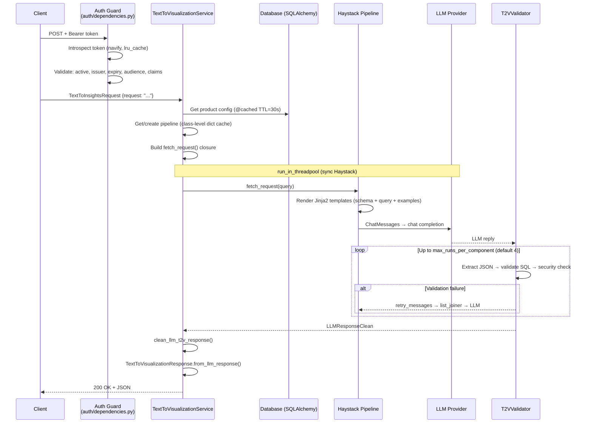

# T2V API — Platform Capability Assessment

## 1. Executive Summary

| Question | Answer |
|----------|--------|
| Can this API support T2SQL/T2V as a platform service? | **Yes, with targeted modifications.** Core pipeline is production-grade; operational defects are fixable in 1–2 sprints. |
| Can this API support broader structured-output use cases (JSON, XML)? | **No, not without major refactoring.** Every validator, prompt, and response schema is SQL-specific (~40–50% of pipeline code). |
| Is the response format fixed or caller-configurable? | **Fixed.** Always returns `TextToVisualizationResponse` (SQL + visualization JSON). No format selection, no content negotiation. |
| What modifications are required for platform adoption? | Fix worker count bug, replace sync auth with async, add observability, add pipeline test coverage. See §7.4. |
| Should we adopt, extend, reuse components, or build separately? | **Adopt with platform modifications for T2SQL/T2V only.** |

**What the service does:** Converts natural language → SQL + visualization instructions (plot type, axes, grouping) via LLM pipelines. Multi-tenant. Does **not** execute SQL — that is the caller's responsibility.

**Key facts:**
- FastAPI v0.116.1, Haystack v2.17.x, sqlglot v27.x, Python 3.11
- Version: `0.10.7` — `text-to-visualization-backend-service`
- Vendored library: `text-to-visualization` v0.11.x (`lib/text_to_visualization/`)
- Single-worker constraint (in-memory document store)
- Auth: navify Access Control (OIDC introspection)
- LLM backends: Azure OpenAI + OpenAI-compatible APIs
- All findings based solely on source code in this repository.

---

## 2. Architecture

### 2.1 Layered Structure

```
Client → [Auth Guard] → API Routes → Service Layer → Repository → Database
                                          ↓
                              Haystack Pipeline (threadpool)
                                          ↓
                                    LLM Provider
```

| Layer | Key files | Responsibility |
|-------|-----------|----------------|
| API | `api/routes/products/text_to_visualization.py` | HTTP endpoints, request validation, `run_in_threadpool` delegation |
| Auth | `auth/dependencies.py`, `auth/auth.py` | navify OIDC introspection, claim-based guards (`valid_admin_user_token`, `valid_product_admin_user_token`, `valid_product_user_token`) |
| Service | `service/text_to_visualization.py` | Config retrieval, pipeline caching, LLM invocation, response assembly |
| Repository | `repository/product_config.py`, `repository/product.py`, `repository/product_example.py` | Async SQLAlchemy CRUD → Pydantic output schemas |
| Pipeline | `lib/.../pipelines/simple_pipeline.py`, `rag_pipeline.py` | Haystack graph: prompt → LLM → validator (retry loop) |
| Validation | `lib/.../pipelines/components/t2v_validator.py` | JSON extraction, SQL parsing, security enforcement |
| SQL Safety | `lib/.../components/data_fetching/sql/postprocessing.py` | AST-based destructive-statement detection, column allow-list |

### 2.2 Pipeline Variants

**Simple pipeline** (`create_simple_pipeline_with_validation()` — `simple_pipeline.py` L53–119):
```
prompt_builder → list_joiner → llm → t2v_validator
                     ↑                    │
                     └── retry_messages ───┘
```

**RAG pipeline** (`create_rag_pipeline_with_validation()` — `rag_pipeline.py` L98–191):
```
retriever → ranker → prompt_builder → list_joiner → llm → t2v_validator
                                            ↑                    │
                                            └── retry_messages ───┘
```

- Retriever: `InMemoryBM25Retriever` filtered by `product_slug`
- Ranker: `TransformersSimilarityRanker` (torch, cross-encoder)
- Max retries: `settings.PIPELINE_MAX_RETRIES` (default 4)
- Pipelines are synchronous (Haystack); executed via `run_in_threadpool()` to avoid blocking the async event loop.

### 2.3 Core Endpoints

| Method | Path | Purpose | Config source |
|--------|------|---------|---------------|
| POST | `/products/{product}/text_to_visualization/simple/config/{config}` | Simple pipeline | DB |
| POST | `/products/{product}/text_to_visualization/rag/config/{config}` | RAG pipeline | DB |
| POST | `/products/{product}/text_to_visualization/simple` | Simple pipeline, inline config | Request body (`SQLProductConfig`) |
| POST | `/products/{product}/text_to_visualization/simple/rse` | CloudEvent wrapper | Request body |
| POST | `/products/{product}/text_to_visualization/clear_cache/{config}` | Invalidate config cache | — |

Auth: All product endpoints require `Security(valid_product_admin_user_token)` — navify claim-based, product-audience-scoped.

Additional route groups: Admin CRUD (`/admin/product/`, `/admin/config/`), Health (`/health/ready`, `/health/live`), Debug (dev/local only).

### 2.4 Response Contract (Fixed)

```json
{
  "request": { "request": "Show me available devices" },
  "data_fetching": {
    "data_query": "SELECT name FROM device",
    "explanation": "Select all device names from the device table."
  },
  "visualization": {
    "plot_type": "table",
    "x_axis": null, "y_axis": null, "group_by": null
  }
}
```

- Schema: `TextToVisualizationResponse` (`schemas/text_to_visualization.py` L95–109)
- Sub-models: `DataFetchingSQL` (L61–73), `VisualizationInstructionLLM` (L76–92)
- `PlotType` enum (`lib/.../constants.py`): `ERROR`, `TABLE`, `BAR_PLOT`, `LINE_PLOT`, `PIE_PLOT`, `SCATTER_PLOT`
- CloudEvent wrapper available: `CETextToVisualizationResponse`
- **No** caller-selectable format. **No** content negotiation. **No** versioning.

### 2.5 Schema Grounding (Two-Pass)

| Pass | Mechanism | File |
|------|-----------|------|
| **Soft** (prompt) | SQL schema (tables, columns, types, descriptions) injected into system prompt via Jinja2 | `sql/prompt.py` L2–14 |
| **Hard** (validator) | sqlglot AST parses generated SQL; compares accessed columns against allow-list built from `{table_name}.{column_name}` in config schema | `t2v_validator.py` L189–224, `sql/postprocessing.py` L167–255 |

### 2.6 SQL Safety Validation Chain

`T2VValidator` (`t2v_validator.py` L134–233) — Haystack `@component`:

| Step | Check | On failure |
|------|-------|------------|
| 1 | JSON extraction (`clean_llm_response()` + `json.loads()`) | Retry with `prompt_retry_json_extraction` |
| 2 | Viz normalisation (`clean_llm_t2v_response()`) | Early return if `plot_type == "error"` |
| 3 | SQL syntax (`check_valid_sql_statement()` via `sqlglot.transpile()`) | Retry with `prompt_retry_invalid_sql` |
| 4a | Destructive statements (`has_destructive_statement()` — INSERT/DROP/UPDATE/DELETE/TRUNCATE/ALTER) | **Immediate error** (no retry) |
| 4b | Column allow-list (`get_not_allowed_table_columns()`) | Retry with `prompt_retry_not_allowed_tables` |
| 5 | Data access check (`check_uses_table_column()`) | **Immediate error** |

Known limitation: `check_valid_sql_statement("BLAKELEE")` returns `True` (single identifiers pass sqlglot — `postprocessing.py` L25).

### 2.7 External Dependencies

| System | Protocol | Blocking? | Code |
|--------|----------|-----------|------|
| navify Access Control | HTTPS (introspection) | **Yes** — sync `requests.post()` | `auth/auth.py` L96 |
| Azure OpenAI / OpenAI-compatible | HTTPS (chat completion) | Sync in threadpool | `llm_client.py` via Haystack ChatGenerator |
| PostgreSQL (prod) / SQLite (local) | TCP (asyncpg) / file (aiosqlite) | No — async | `core/database.py` |
| Hugging Face (transitive) | HTTPS (model download) | First-call only | `TransformersSimilarityRanker` in RAG pipeline |

### 2.8 Deployment Constraints

- **Single-worker only**: `InMemoryDocumentStore` (class-level singleton) + `TextToVisualizationService.pipelines` dict are not shared across OS processes
- **Critical bug**: `entrypoint.sh` defaults `UVICORN_WORKERS=2` — causes divergent state across workers
- Docker multi-stage build, non-root user (`appuser`, UID 1001), Roche CA certs, `HAYSTACK_TELEMETRY_ENABLED=False`
- Required env vars: `AUTH_OIDC_CLIENT_ID`, `AUTH_OIDC_CLIENT_SECRET`. All others have defaults. See `env-template`.

---

## 3. Request Flow



### Failure Modes

| Failure | HTTP | Retryable by pipeline? | Origin |
|---------|------|------------------------|--------|
| Invalid request body | 422 | No | FastAPI/Pydantic |
| Auth failure (invalid/expired token, wrong claims) | 401 | No | `auth/auth.py`, `auth/dependencies.py` |
| Config not found | 404 | No | `service/product_config.py` |
| LLM returns invalid JSON | 500 | Yes (up to 4×) | `t2v_validator.py` |
| LLM returns invalid SQL | 500 | Yes (up to 4×) | `t2v_validator.py` → `sql/postprocessing.py` |
| Destructive SQL detected | 500 | No (immediate) | `t2v_validator.py` L200–207 |
| Disallowed columns accessed | 500 | Yes (up to 4×) | `t2v_validator.py` → `sql/postprocessing.py` |
| LLM unreachable / timeout | 500 | No | `pipelines/base.py` L265–274 |
| Unhandled exception | 500 | No | `utils/middleware.py` L40–44 |

---

## 4. Multi-Tenancy Model

| Mechanism | Implementation | Evidence |
|-----------|----------------|----------|
| Data isolation | `Product` → `ProductConfig` → `ProductExample` (FK + unique constraints) | `models/product.py`, `models/product_config.py` |
| Access control | `product_name ∈ decoded_jwt["aud"]` | `auth/dependencies.py` L71–74 |
| RAG filtering | `create_filter_example(product_slug)` scopes document retrieval | `document_store/examples.py` |
| Config caching | `@cached` keyed by `(product, config_name)` with 30s TTL | `service/text_to_visualization.py` L202 |
| Pipeline caching | Keyed by `(pipeline_name, llm_model)` — **shared across tenants** | `service/text_to_visualization.py` L39 |

**Gap**: Pipeline instances are not tenant-scoped. All tenants share the same `Pipeline` object for a given `(pipeline_name, model)` key. Acceptable at current scale (~4 tenants in `AUTH_AUD`); add product key to cache at platform scale.

---

## 5. Service Readiness Assessment

| Capability | Status | Evidence | Required action |
|------------|--------|----------|-----------------|
| API stability | Needs modification | Pydantic v2 schemas, well-defined endpoints. No API versioning, CORS commented out (`main.py` L39–45). | Add `/v1/` prefix. Enable CORS. |
| Authentication | Needs modification | navify OIDC + claim checks. Sync `requests.post()` blocks event loop (`auth/auth.py` L96`). `lru_cache` with no TTL (`auth/dependencies.py` L12`). | Replace with async `httpx`. Add TTL. |
| Authorization | Ready | Three-tier claims (`AUTH_USER_CLAIMS`, `AUTH_PRODUCT_ADMIN_CLAIMS`, `AUTH_ADMIN_CLAIMS`). Product-scoped audience. Router-level `Security()`. | None. |
| Tenant isolation | Needs modification | Product-scoped data + audience auth + RAG filtering. Pipeline cache shared across tenants. | Add product to pipeline cache key at scale. |
| SQL read-only enforcement | Ready | `has_destructive_statement()` detects INSERT/DROP/UPDATE/DELETE/TRUNCATE/ALTER via sqlglot AST (`sql/postprocessing.py` L138–164`). Non-retryable. | None. |
| SQL column safety | Needs modification | Column allow-list via sqlglot AST (`sql/postprocessing.py` L167–255`). Known bug: single identifiers pass validation (`L25`). | Fix false positive in `check_valid_sql_statement()`. |
| LLM provider abstraction | Needs modification | Azure OpenAI + OpenAI-compatible. Config-driven (`llm_client.py` L42–101`). No streaming, no model param tuning. | Extend for new providers if needed. Add streaming if required. |
| Prompt management | Needs modification | Predefined `"sql"` prompt. Library supports custom templates (`prompt.py` L47–55`) but API does not expose them. | Expose prompt selection through API if needed. |
| Configuration management | Ready | `pydantic-settings`, DB-stored JSON configs with CRUD, caching, `env-template`. | None. |
| Secret management | Needs modification | Env vars for secrets. API key redacted in logs. `Secret.from_token()` for Haystack. | No vault integration. Standard for K8s secrets-based deployment. |
| Observability | Needs modification | Request UUID + latency logging (`middleware.py`). No OTel, no metrics, no SQL audit trail, no request-ID propagation. | Add OpenTelemetry, Prometheus, audit logging. |
| Error handling | Needs modification | Middleware catch-all → 500. T2VValidator retry with targeted prompts. All LLM errors → 500 (no semantic codes). | Differentiate 502 (LLM down) from 500 (validation exhausted). |
| Deployment readiness | Needs modification | Multi-stage Docker, non-root. **`UVICORN_WORKERS` defaults to 2 — breaks InMemoryDocumentStore**. No K8s manifests. | Fix worker default. Add K8s manifests. |
| Test coverage | Needs modification | Solid fixture infra. CRUD + route tests present. **No tests for T2VValidator, SQL safety functions, pipeline execution, or DocumentStoreService.** | Add mocked-LLM pipeline tests for core value path. |
| Maintainability | Needs modification | Clean layers, type hints, ruff + mypy. Bugs: `is_valid_slug()` always True (`utils/utils.py` L36`), double `clean_llm_t2v_response()` call, SQLite-specific `create_batch()`. | Fix identified bugs. Replace sync `requests` with async. |
| Output format selection | Missing | Response always `TextToVisualizationResponse`. No format param, no Accept header. | Not needed for T2SQL/T2V scope. Build if platform requires it. |
| Caller-defined output schema | Missing | Caller provides input context only. Cannot define response structure. | Not needed for current scope. |
| Non-SQL workflow support | Missing | All validators, prompts, schemas are SQL-specific. No task-type routing. | Out of scope for recommended adoption. |

---

## 6. Broader Offering Feasibility

### 6.1 Feasibility by Offering Model

| Offering | Feasibility | Key gap |
|----------|-------------|---------|
| **T2SQL service** | High | Fix operational blockers only |
| **T2V service** (SQL + viz) | High | Same as T2SQL — viz is additive |
| **Structured JSON generation** (caller-defined schema) | Medium | New validator, JSON Schema injection into prompts, `jsonschema` validation, new response schema, new routes |
| **Structured XML generation** | Low | No XML capability exists anywhere in codebase |
| **Domain-specific reasoning API** | Medium | Generalise context injection from SQL schema to arbitrary domain; pluggable validation |
| **General LLM orchestration** | Low | Only ~20–30% of code reusable. Needs task-type registry, dynamic pipeline assembly, pluggable everything. |

### 6.2 Key Coupling Assessment

| Dimension | Assessment | Evidence |
|-----------|------------|----------|
| Coupling to SQL | **High** | `T2VValidator` hardcodes 5 SQL checks. Prompts render SQL schema. Config requires `sql_dialect`. Response requires `data_query`. Pipeline factories default to `prompt_type="sql"`. |
| Coupling to visualization | **Moderate** (additive) | `VisualizationInstructionLLM` references SQL column names. Removing viz from response is straightforward — strip field, adjust prompt. |
| Output format flexibility | **None** | Fixed response model. No format parameter. No content negotiation. No caller-defined schema. |
| Validation pluggability | **None** | `T2VValidator` is a single hardcoded component. No validator interface, no registry, no alternative implementations. |
| Prompt configurability | **Library yes, API no** | `create_chat_prompt_builder()` accepts custom `ChatMessage` templates. But API always uses `"sql"`. Not exposed through endpoints. |
| Context injection model | **Strong, generalisable** | Structured config → Jinja2 template → LLM prompt. Pattern works for any domain. Current schema structure is SQL-specific but the pattern generalises. |
| Orchestration extensibility | **Low without refactoring** | Pipeline type is `Literal["simple_pipeline", "rag_pipeline"]`. No task-type concept, no plugin system. Adding a new task type requires a parallel vertical slice. Estimated 2–4 weeks for abstraction layer. |

### 6.3 What Is Reusable vs. SQL-Specific

| Reusable (~30–40% of codebase) | SQL/Viz-specific (~60%) |
|--------------------------------|-------------------------|
| FastAPI framework + Pydantic schemas | `T2VValidator` (5-step SQL chain) |
| Auth infrastructure (navify guards) | SQL prompt templates (`sql/prompt.py`) |
| Multi-tenant config CRUD + caching | `TextToVisualizationResponse` schema |
| LLM client factory (`create_chat_generator_from_config()`) | `clean_llm_t2v_response()` (plot normalisation) |
| Haystack pipeline primitives | `security_check_sql()`, `check_valid_sql_statement()` |
| RAG document store infrastructure | `SQLProductConfig` model |
| `GlobalContextMiddleware` | `extract_sql_column_names()` |

### 6.4 Output Contract Gap Analysis

| Capability | Current state | Required for generic platform |
|------------|---------------|-------------------------------|
| Fixed response format | `TextToVisualizationResponse` — always SQL + viz JSON | Versioned contracts per use case |
| Caller-selected format | Not supported | Format param or Accept header |
| Caller-defined schema | Not supported | Schema field in request; schema-based output validation |
| Response validation | SQL-specific (AST checks) | Pluggable validators (JSON Schema, XML Schema, custom) |
| Content negotiation | Not supported | Format-specific serialisers |

---

## 7. Recommendation

### 7.1 Decision

**Adopt with platform modifications for T2SQL/T2V only.**

### 7.2 Rationale

**T2SQL/T2V readiness: High.** The service delivers a complete pipeline with production-grade SQL safety enforcement, multi-tenant config management, and a well-layered async architecture. The core value path (prompt rendering → LLM invocation → AST-based validation with retry → response assembly) is mature and would take significant effort to rebuild. Identified blockers are operational defects — fixable in 1–2 sprints without architectural redesign.

**Generic structured-output readiness: Low.** Every validation step in `T2VValidator` is SQL-specific. The response schema requires `data_query` and SQL column-derived axes. Prompts hardcode SQL output format. ~40–50% of pipeline code is SQL-specific. There is no pluggable validator interface, no task-type routing, and no caller-defined output schema support. Generalising would require a new orchestration abstraction layer (estimated 2–4 weeks) with unvalidated demand.

The service is adopted for what it does well (T2SQL/T2V) with targeted fixes for operational readiness, not extended into a scope it was not designed for.

### 7.3 Main Strengths

1. **Production-grade SQL safety.** AST-based enforcement via sqlglot: destructive statement detection, column allow-list with explicit/implicit resolution, targeted retry prompts. (`t2v_validator.py` L134–233; `sql/postprocessing.py` L70–255)

2. **Two-pass schema grounding.** Schema injected into prompt (soft) + AST column validation against config-derived allow-list (hard). Significantly reduces hallucinated table/column references. (`sql/prompt.py` L2–14; `t2v_validator.py` L189–224)

3. **Complete multi-tenant config management.** Product → Config → Examples data model, audience-based auth scoping, per-product RAG filtering, TTL caching with per-key invalidation. (`service/text_to_visualization.py` L202–254; §5 Configuration management: Ready)

4. **Well-designed pipeline architecture.** Haystack component graph with retry loops, two variants (simple + RAG), class-level pipeline caching, `run_in_threadpool` for async safety. Dynamic config endpoint supports per-request context without DB lookup. (`service/text_to_visualization.py` L87–200)

5. **Enterprise LLM abstraction.** Config-driven Azure OpenAI + OpenAI-compatible support, per-request model selection via query param, API key redaction. (`llm_client.py` L42–101)

### 7.4 Blockers Requiring Fix

| # | Blocker | Severity | Fix |
|---|---------|----------|-----|
| 1 | `entrypoint.sh` defaults `UVICORN_WORKERS=2` — breaks `InMemoryDocumentStore` and pipeline cache | Critical | Set to `1` |
| 2 | `introspect_token()` uses sync `requests.post()` on async event loop (`auth/auth.py` L96`) | High | Replace with `httpx.AsyncClient` |
| 3 | No tests for `T2VValidator`, SQL safety, or pipeline execution | High | Add mocked-LLM pipeline tests |
| 4 | No observability (no OTel, no metrics, no SQL audit) | Medium | Add OpenTelemetry + Prometheus |
| 5 | `InMemoryDocumentStore` prevents horizontal scaling | Medium | Acceptable now; migrate to external store at >10 tenants |
| 6 | `is_valid_slug()` always returns `True` (`utils/utils.py` L36`) | Low | Fix to check match result, not pattern object |

### 7.5 Conditions That Would Change the Recommendation

| Condition | Changed recommendation |
|-----------|----------------------|
| Validated demand from ≥2 consumers for non-SQL structured output | **Reuse selected components only** — extract LLM client, auth, config mgmt (~30%); build new orchestration |
| No engineering capacity to fix blockers (§7.4 items 1–3) within 2 sprints | **Further spike required** — reassess after fixes are scoped |
| Owning team will not maintain or accept contributions | **Build our own T2SQL/T2V capability** — this assessment provides an architectural blueprint |
| Horizontal scaling to >50 users or >10 tenants near-term | Recommendation holds; expand scope to include external document store migration |
| Upstream library has comprehensive `T2VValidator` tests | Blocker #3 (§7.4) mitigated; fewer modifications needed |

### 7.6 Recommended Offering Scope

| Scope | Recommendation | Rationale |
|-------|----------------|-----------|
| T2SQL only | **Recommended** | Core capability complete. Optionally strip viz fields for SQL-only consumers. |
| T2SQL + T2V | **Recommended (primary)** | Natural scope. Single pipeline serves both. No extra effort beyond T2SQL. |
| T2V standalone (no SQL) | Not recommended | Viz is coupled to SQL column names (`extract_sql_column_names()`). Cannot operate independently. |
| Generic JSON/XML API | **Not recommended** | 5 of 6 required platform capabilities are Missing (§5). 2–4 week refactoring with unvalidated demand. |
| General LLM orchestration | **Not recommended** | Only ~20–30% reusable. Would be a new product, not an extension. |

---

## 8. Open Questions for Owning Team

### 8.1 API Contract & Scope

1. Is the response contract (`TextToVisualizationResponse`) the only one intended, or are alternative structures planned?
2. Is there a use case for SQL-only output without visualization? The prompt combines both in one LLM call (`sql/prompt.py` L38–46).
3. Is SQL execution planned, or is the generate-only separation permanent?
4. Is there a versioning strategy? No `/v1/` prefix exists. No contract version in responses.
5. CORS is commented out (`main.py` L39–45`). Is this intentional?

### 8.2 Platform Integration

6. `introspect_token()` uses sync `requests.post()` (`auth/auth.py` L96`). Has this caused latency issues?
7. `lru_cache(maxsize=128)` on introspection has no TTL (`auth/dependencies.py` L12`). Revoked tokens remain valid until restart. Accepted risk?
8. `entrypoint.sh` defaults `UVICORN_WORKERS=2`. Is this overridden in production?
9. `InMemoryDocumentStore` prevents horizontal scaling (`service/document_store.py` L18`). Migration planned?
10. `ProductExampleRepository.create_batch()` uses SQLite-specific upsert. Runs on PostgreSQL in prod?
11. Pipeline cache is shared across tenants (keyed by `(pipeline_name, llm_model)` not by product). Acceptable for isolation?

### 8.3 Non-SQL / Extensibility

12. Has the API been used for any non-SQL task? Library supports custom prompts (`prompt.py` L47–55`) but API does not expose them.
13. Is there a concept of task types beyond `"simple_pipeline"` / `"rag_pipeline"`?
14. Would non-SQL use cases operate through the same product/config infrastructure?

### 8.4 Security & Governance

15. Is audit logging of generated SQL required?
16. Debug endpoint (`debug.py`) has unrestricted SSRF — only guarded by `ENVIRONMENT ∈ {"dev", "local"}`. Risk of accidental enablement?
17. User query injected directly into prompt (`sql/prompt.py` L19: `"{{query}}"`). Prompt-injection mitigations beyond SQL safety checks?
18. `is_valid_slug()` always returns `True` (`utils/utils.py` L36`). Tracked? Invalid slugs in DB?
19. `check_valid_sql_statement("BLAKELEE")` returns `True` (known bug, `postprocessing.py` L25`). Issues in practice?

### 8.5 Ownership & Support

20. Who keeps vendored library (`lib/text_to_visualization/`) in sync with upstream?
21. Who owns prompt changes (`sql/prompt.py`)?
22. Core pipeline logic has no test coverage in this repo. Tested upstream?
23. Expected availability SLA if offered as platform service?
24. Current CI/CD process? No pipeline definition visible in repo.

---

## 9. Recommended Next Steps

| # | Action | Priority | Outcome |
|---|--------|----------|---------|
| 1 | Fix `entrypoint.sh` to default `UVICORN_WORKERS=1` | Critical | Eliminate data corruption risk |
| 2 | Replace sync `requests.post()` in auth with `httpx.AsyncClient` | High | Unblock event loop under load |
| 3 | Add test coverage for `T2VValidator` chain and SQL safety functions | High | Confidence in core value path |
| 4 | Add OpenTelemetry tracing + Prometheus metrics endpoint | Medium | Platform-grade observability |
| 5 | Fix `is_valid_slug()` bug (`utils/utils.py` L36`) | Medium | Restore slug validation |
| 6 | Add API version prefix (`/v1/`) to all routes | Medium | Contract stability for consumers |
| 7 | Confirm offering scope with owning team (§8 questions) | High | Clear adoption boundary |
| 8 | Evaluate upstream `text-to-visualization` library test coverage | Medium | May reduce blocker #3 |
| 9 | Add TTL to auth introspection cache | Medium | Handle token revocation |
| 10 | Document that SQL execution is caller's responsibility | Low | Clear contract expectation |

---

## 10. Appendix: Key Evidence References

| Topic | File | Symbol | Significance |
|-------|------|--------|--------------|
| T2V route (simple) | `api/routes/products/text_to_visualization.py` L20–73 | `run_simple_pipeline()` | Primary endpoint; orchestrates service + threadpool |
| Pipeline factory | `lib/.../pipelines/simple_pipeline.py` L53–119 | `create_simple_pipeline_with_validation()` | Pipeline assembly with validator loop |
| SQL validator | `lib/.../pipelines/components/t2v_validator.py` L38–233 | `T2VValidator` | 5-step validation chain; core safety guarantee |
| SQL safety functions | `lib/.../components/data_fetching/sql/postprocessing.py` L70–293 | `security_check_sql()`, `get_not_allowed_table_columns()`, `has_destructive_statement()`, `check_uses_table_column()` | AST-based enforcement |
| Prompt templates | `lib/.../pipelines/components/prompt.py` L1–58 | `template_prompt_context`, `template_prompt_request` | Schema grounding; output format instruction |
| LLM client factory | `lib/.../pipelines/components/llm_client.py` L42–101 | `create_chat_generator_from_config()` | Provider abstraction (azure/openai) |
| Viz postprocessing | `lib/.../components/visualization/postprocessing.py` L81–147 | `clean_llm_t2v_response()` | Plot type normalisation; column name extraction |
| Service orchestrator | `service/text_to_visualization.py` L34–319 | `TextToVisualizationService` | Pipeline caching, config retrieval, LLM call |
| Response schema | `schemas/text_to_visualization.py` L95–109 | `TextToVisualizationResponse` | Fixed output contract |
| Auth (sync issue) | `auth/auth.py` L96 | `introspect_token()` | Sync `requests.post()` blocks event loop |
| Auth cache (no TTL) | `auth/dependencies.py` L12 | `lru_cache(maxsize=128)` | Revoked tokens remain valid |
| Worker count bug | `entrypoint.sh` L7 | `UVICORN_WORKERS:-2` | Breaks InMemoryDocumentStore singleton |
| Slug bug | `utils/utils.py` L36 | `is_valid_slug()` | Always returns True |
| Document store singleton | `service/document_store.py` L18 | `DocumentStoreService.document_store` | Class-level; prevents multi-worker |
| Config caching | `service/text_to_visualization.py` L202 | `@cached(ttl=settings.CACHE_PRODUCT_CONFIG)` | 30s TTL via aiocache |
| Pipeline cache | `service/text_to_visualization.py` L39 | `TextToVisualizationService.pipelines` | Dict keyed by (pipeline_name, model); shared across tenants |
| RAG pipeline | `lib/.../pipelines/rag_pipeline.py` L98–191 | `create_rag_pipeline_with_validation()` | Adds retriever + ranker before prompt |
| Fetch request factory | `lib/.../pipelines/base.py` L278–351 | `fetch_request_factory()` | Binds pipeline + config into callable |
| Custom prompt support | `lib/.../pipelines/components/prompt.py` L47–55 | `create_chat_prompt_builder(prompt_type)` | Accepts custom ChatMessage templates (unused by API) |

