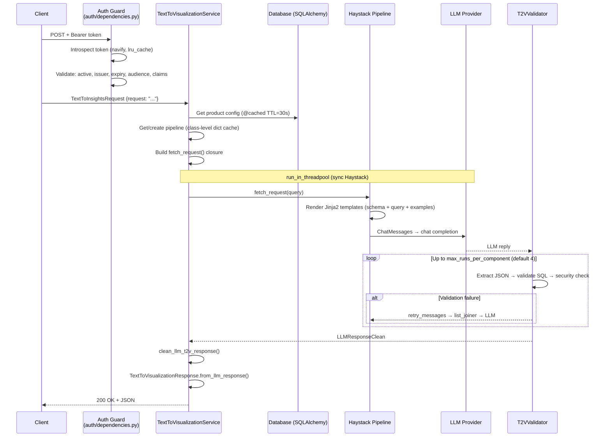
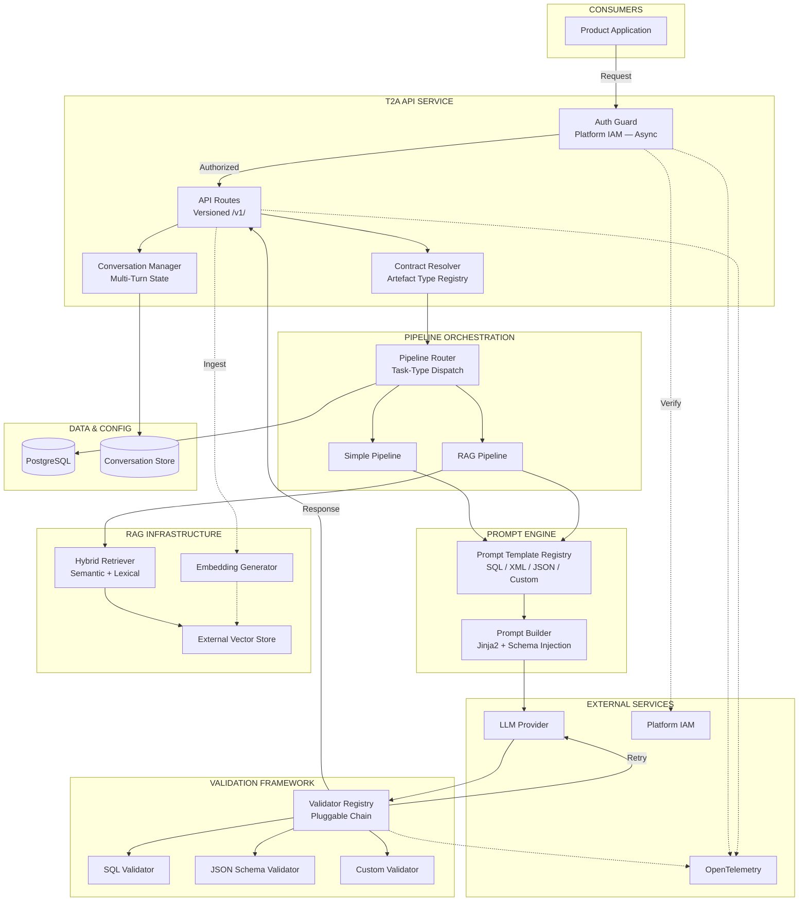

# T2V API — Final Comprehensive Assessment

## 1. Executive Summary

| Question | Answer |
|----------|--------|
| Can this API support T2SQL/T2V as a platform service? | **Yes, with targeted modifications.** Core pipeline is production-grade; operational defects are fixable in 1–2 sprints. |
| Can this API support broader structured-output use cases (JSON, XML)? | **No, not without major refactoring.** Every validator, prompt, and response schema is SQL-specific (~60% of pipeline code). |
| Is the response format fixed or caller-configurable? | **Fixed.** Always returns `TextToVisualizationResponse` (SQL + visualization JSON). No format selection, no content negotiation. |
| What modifications are required for platform adoption? | Fix worker count bug, replace sync auth with async, add observability, add pipeline test coverage. See §9.4. |
| Can it evolve into a generic Text-to-Artefact (T2A) platform? | **Partially.** ~30–40% of the codebase is artefact-agnostic and reusable. A phased evolution is recommended rather than building from scratch. |
| Should we adopt, extend, reuse components, or build separately? | **Adopt with platform modifications for T2SQL/T2V.** Evaluate generic T2A only after validated demand from ≥2 non-SQL consumers. |

**What the service does:** Converts natural language → SQL + visualization instructions (plot type, axes, grouping) via LLM pipelines. Multi-tenant. Does **not** execute SQL — that is the caller's responsibility.

**Key facts:**
- FastAPI v0.116.x, Haystack v2.17.x, sqlglot v27.x, Python 3.11
- Version: `0.10.7` — `text-to-visualization-backend-service`
- Vendored library: `text-to-visualization` v0.11.x (`lib/text_to_visualization/`)
- Single-worker constraint (in-memory document store)
- Auth: navify Access Control (OIDC introspection)
- LLM backends: Azure OpenAI + OpenAI-compatible APIs
- All findings based solely on source code in this repository.

---

## 2. Technology Stack

| Technology | Version | Purpose |
|------------|---------|---------|
| **FastAPI** | 0.116.x | Web framework; async REST API with automatic OpenAPI docs |
| **Pydantic** | 2.11.x | Request/response validation, settings management, schema generation |
| **haystack-ai** | 2.17.x | Pipeline orchestration framework; provides `Pipeline`, `Component`, `Document`, `InMemoryDocumentStore`, `InMemoryBM25Retriever`, `TransformersSimilarityRanker`, `ChatPromptBuilder`, `ChatGenerator` |
| **SQLAlchemy** | 2.0.x | Async ORM for product/config/example persistence |
| **aiosqlite** / **asyncpg** | — | Async DB drivers (SQLite for local dev, PostgreSQL for prod) |
| **sqlglot** | 27.x | SQL parsing, AST analysis, dialect transpilation, and validation in the T2V validator |
| **sentence-transformers** | — | Powers `TransformersSimilarityRanker` cross-encoder reranking in RAG pipeline |
| **Jinja2** | — | Prompt template rendering (SQL schema context + user query → LLM prompt) |
| **aiocache** | 0.12.x | TTL-based caching decorator on service methods (config resolution) |
| **cloudevents** | 1.12.x | Pydantic-based CloudEvent envelope for API responses |
| **uvicorn** | — | ASGI server (single-worker only due to in-memory document store) |
| **PyTorch** | 2.8.x | Runtime dependency for transformer-based ranker model inference |
| **Azure OpenAI SDK** / **OpenAI SDK** | — | LLM provider integration via Haystack's `AzureOpenAIChatGenerator` and `OpenAIChatGenerator` |
| **PostgreSQL** | — | Production database for product, config, and example storage |
| **navify Access Control** | — | OIDC token introspection for authentication and role-based authorization |

---

## 3. Architecture

### 3.1 Layered Structure

```
Client → [Auth Guard] → API Routes → Service Layer → Repository → Database
                                          ↓
                              Haystack Pipeline (threadpool)
                                          ↓
                                    LLM Provider
```

| Layer | Key Files | Responsibility |
|-------|-----------|----------------|
| API | `api/routes/products/text_to_visualization.py` | HTTP endpoints, request validation, `run_in_threadpool` delegation |
| Auth | `auth/dependencies.py`, `auth/auth.py` | navify OIDC introspection, claim-based guards (`valid_admin_user_token`, `valid_product_admin_user_token`, `valid_product_user_token`) |
| Service | `service/text_to_visualization.py` | Config retrieval, pipeline caching, LLM invocation, response assembly |
| Repository | `repository/product_config.py`, `repository/product.py`, `repository/product_example.py` | Async SQLAlchemy CRUD → Pydantic output schemas |
| Pipeline | `lib/.../pipelines/simple_pipeline.py`, `rag_pipeline.py` | Haystack graph: prompt → LLM → validator (retry loop) |
| Validation | `lib/.../pipelines/components/t2v_validator.py` | JSON extraction, SQL parsing, security enforcement |
| SQL Safety | `lib/.../components/data_fetching/sql/postprocessing.py` | AST-based destructive-statement detection, column allow-list |

### 3.2 Pipeline Variants

**Simple pipeline** (`create_simple_pipeline_with_validation()` — `simple_pipeline.py` L53–119):
```
prompt_builder → list_joiner → llm → t2v_validator
                     ↑                    │
                     └── retry_messages ───┘
```

**RAG pipeline** (`create_rag_pipeline_with_validation()` — `rag_pipeline.py` L98–191):
```
retriever → ranker → prompt_builder → list_joiner → llm → t2v_validator
                                            ↑                    │
                                            └── retry_messages ───┘
```

- Retriever: `InMemoryBM25Retriever` filtered by `product_slug`
- Ranker: `TransformersSimilarityRanker` (torch, cross-encoder)
- Max retries: `settings.PIPELINE_MAX_RETRIES` (default 4)
- Pipelines are synchronous (Haystack); executed via `run_in_threadpool()` to avoid blocking the async event loop.

### 3.3 Core Endpoints

| Method | Path | Purpose | Config source |
|--------|------|---------|---------------|
| POST | `/products/{product}/text_to_visualization/simple/config/{config}` | Simple pipeline | DB |
| POST | `/products/{product}/text_to_visualization/rag/config/{config}` | RAG pipeline | DB |
| POST | `/products/{product}/text_to_visualization/simple` | Simple pipeline, inline config | Request body (`SQLProductConfig`) |
| POST | `/products/{product}/text_to_visualization/simple/rse` | CloudEvent wrapper | Request body |
| POST | `/products/{product}/text_to_visualization/clear_cache/{config}` | Invalidate config cache | — |

Auth: All product endpoints require `Security(valid_product_admin_user_token)` — navify claim-based, product-audience-scoped (`api/main.py` L9).

Additional route groups: Admin CRUD (`/admin/product/`, `/admin/config/`), Health (`/health/ready`, `/health/live`), Debug (dev/local only, guarded by `ENVIRONMENT ∈ {"dev", "local"}`).

### 3.4 Response Contract (Fixed)

```json
{
  "request": { "request": "Show me available devices" },
  "data_fetching": {
    "data_query": "SELECT name FROM device",
    "explanation": "Select all device names from the device table."
  },
  "visualization": {
    "plot_type": "table",
    "x_axis": null, "y_axis": null, "group_by": null
  }
}
```

- Schema: `TextToVisualizationResponse` (`schemas/text_to_visualization.py` L95–109)
- Sub-models: `DataFetchingSQL` (L61–73), `VisualizationInstructionLLM` (L76–92)
- `PlotType` enum (`lib/.../constants.py`): `ERROR`, `TABLE`, `BAR_PLOT`, `LINE_PLOT`, `PIE_PLOT`, `SCATTER_PLOT`
- CloudEvent wrapper available: `CETextToVisualizationResponse`
- **No** caller-selectable format. **No** content negotiation. **No** versioning.

### 3.5 Schema Grounding (Two-Pass)

| Pass | Mechanism | File |
|------|-----------|------|
| **Soft** (prompt) | SQL schema (tables, columns, types, descriptions) injected into system prompt via Jinja2 | `sql/prompt.py` L2–14 |
| **Hard** (validator) | sqlglot AST parses generated SQL; compares accessed columns against allow-list built from `{table_name}.{column_name}` in config schema | `t2v_validator.py` L189–224, `sql/postprocessing.py` L167–255 |

### 3.6 SQL Safety Validation Chain

`T2VValidator` (`t2v_validator.py` L134–233) — Haystack `@component`:

| Step | Check | On failure |
|------|-------|------------|
| 1 | JSON extraction (`clean_llm_response()` + `json.loads()`) | Retry with `prompt_retry_json_extraction` |
| 2 | Viz normalisation (`clean_llm_t2v_response()`) | Early return if `plot_type == "error"` |
| 3 | SQL syntax (`check_valid_sql_statement()` via `sqlglot.transpile()`) | Retry with `prompt_retry_invalid_sql` |
| 4a | Destructive statements (`has_destructive_statement()` — INSERT/DROP/UPDATE/DELETE/TRUNCATE/ALTER) | **Immediate error** (no retry) |
| 4b | Column allow-list (`get_not_allowed_table_columns()`) | Retry with `prompt_retry_not_allowed_tables` |
| 5 | Data access check (`check_uses_table_column()`) | **Immediate error** |

Known limitation: `check_valid_sql_statement("BLAKELEE")` returns `True` (single identifiers pass sqlglot — `postprocessing.py` L25 comment).

### 3.7 External Dependencies

| System | Protocol | Blocking? | Code |
|--------|----------|-----------|------|
| navify Access Control | HTTPS (introspection) | **Yes** — sync `requests.post()` | `auth/auth.py` L96 |
| Azure OpenAI / OpenAI-compatible | HTTPS (chat completion) | Sync in threadpool | `llm_client.py` via Haystack ChatGenerator |
| PostgreSQL (prod) / SQLite (local) | TCP (asyncpg) / file (aiosqlite) | No — async | `core/database.py` |
| Hugging Face (transitive) | HTTPS (model download) | First-call only | `TransformersSimilarityRanker` in RAG pipeline |

### 3.8 Deployment Constraints

- **Single-worker only**: `InMemoryDocumentStore` (class-level singleton at `service/document_store.py` L18) + `TextToVisualizationService.pipelines` dict (L39) are not shared across OS processes
- **Critical bug**: `entrypoint.sh` L7 defaults `UVICORN_WORKERS=2` — causes divergent state across workers
- Docker multi-stage build, non-root user (`appuser`, UID 1001), Roche CA certs, `HAYSTACK_TELEMETRY_ENABLED=False`
- Required env vars: `AUTH_OIDC_CLIENT_ID`, `AUTH_OIDC_CLIENT_SECRET`. All others have defaults. See `env-template`.

---

## 4. Request Flow



### Failure Modes

| Failure | HTTP | Retryable by pipeline? | Origin |
|---------|------|------------------------|--------|
| Invalid request body | 422 | No | FastAPI/Pydantic |
| Auth failure (invalid/expired token, wrong claims) | 401 | No | `auth/auth.py`, `auth/dependencies.py` |
| Config not found | 404 | No | `service/product_config.py` |
| LLM returns invalid JSON | 500 | Yes (up to 4×) | `t2v_validator.py` |
| LLM returns invalid SQL | 500 | Yes (up to 4×) | `t2v_validator.py` → `sql/postprocessing.py` |
| Destructive SQL detected | 500 | No (immediate) | `t2v_validator.py` L200–207 |
| Disallowed columns accessed | 500 | Yes (up to 4×) | `t2v_validator.py` → `sql/postprocessing.py` |
| LLM unreachable / timeout | 500 | No | `pipelines/base.py` |
| Unhandled exception | 500 | No | `utils/middleware.py` L40–44 |

---

## 5. Multi-Tenancy Model

| Mechanism | Implementation | Evidence |
|-----------|----------------|----------|
| Data isolation | `Product` → `ProductConfig` → `ProductExample` (FK + unique constraints) | `models/product.py`, `models/product_config.py` |
| Access control | `product_name ∈ decoded_jwt["aud"]` | `auth/dependencies.py` L71–74 |
| RAG filtering | `create_filter_example(product_slug)` scopes document retrieval | `document_store/examples.py` |
| Config caching | `@cached` keyed by `(product, config_name)` with 30s TTL | `service/text_to_visualization.py` L202 |
| Pipeline caching | Keyed by `(pipeline_name, llm_model)` — **shared across tenants** | `service/text_to_visualization.py` L39 |

**Gap**: Pipeline instances are not tenant-scoped. All tenants share the same `Pipeline` object for a given `(pipeline_name, model)` key. Acceptable at current scale (~4 tenants in `AUTH_AUD`); add product key to cache at platform scale.

---

## 6. Service Readiness Assessment

| Capability | Status | Evidence | Required action |
|------------|--------|----------|-----------------|
| API stability | Needs modification | Pydantic v2 schemas, well-defined endpoints. No API versioning, CORS commented out (`main.py` L39–45). | Add `/v1/` prefix. Enable CORS. |
| Authentication | Needs modification | navify OIDC + claim checks. Sync `requests.post()` blocks event loop (`auth/auth.py` L96). `lru_cache` with no TTL (`auth/dependencies.py` L12). | Replace with async `httpx`. Add TTL. |
| Authorization | Ready | Three-tier claims (`AUTH_USER_CLAIMS`, `AUTH_PRODUCT_ADMIN_CLAIMS`, `AUTH_ADMIN_CLAIMS`). Product-scoped audience. Router-level `Security()`. | None. |
| Tenant isolation | Needs modification | Product-scoped data + audience auth + RAG filtering. Pipeline cache shared across tenants. | Add product to pipeline cache key at scale. |
| SQL read-only enforcement | Ready | `has_destructive_statement()` detects INSERT/DROP/UPDATE/DELETE/TRUNCATE/ALTER via sqlglot AST (`sql/postprocessing.py` L138–164). Non-retryable. | None. |
| SQL column safety | Needs modification | Column allow-list via sqlglot AST (`sql/postprocessing.py` L167–255). Known bug: single identifiers pass validation (L25). | Fix false positive in `check_valid_sql_statement()`. |
| LLM provider abstraction | Ready | Azure OpenAI + OpenAI-compatible. Config-driven (`llm_client.py`). Per-request model selection via query param. | None required for current scope. |
| Prompt management | Needs modification | Predefined `"sql"` prompt (`PREDEFINED_PROMPTS = {"sql": sql_prompt}`). Library supports custom templates but API does not expose them. | Expose prompt selection if needed. |
| Configuration management | Ready | `pydantic-settings`, DB-stored JSON configs with CRUD, caching, `env-template`. | None. |
| Observability | Needs modification | Request UUID + latency logging (`middleware.py`). No OTel, no metrics, no SQL audit trail. | Add OpenTelemetry, Prometheus, audit logging. |
| Error handling | Needs modification | Middleware catch-all → 500. T2VValidator retry with targeted prompts. All LLM errors → 500. | Differentiate 502 (LLM down) from 500 (validation exhausted). |
| Deployment readiness | Needs modification | Multi-stage Docker, non-root. **UVICORN_WORKERS defaults to 2 — breaks InMemoryDocumentStore**. No K8s manifests. | Fix worker default to 1. |
| Test coverage | Needs modification | Solid fixture infra. CRUD + route tests present. **No tests for T2VValidator, SQL safety functions, pipeline execution, or DocumentStoreService.** | Add mocked-LLM pipeline tests. |
| Maintainability | Needs modification | Clean layers, type hints, ruff + mypy. Bugs: `is_valid_slug()` always True (`utils/utils.py` L36`), double `clean_llm_t2v_response()` call. | Fix identified bugs. |

---

## 7. Suitability for Generic Text-to-Artefact (T2A)

### 7.1 What Is Reusable (~30–40% of codebase)

| Component | Why reusable |
|-----------|-------------|
| FastAPI framework + Pydantic schemas | Artefact-agnostic REST layer |
| Auth infrastructure (navify guards, three-tier claims) | No SQL coupling |
| Multi-tenant config CRUD + caching (`Product → Config → Example` data model) | Works for any config structure |
| LLM client factory (`create_chat_generator_from_config()`) | Config-driven, provider-agnostic |
| Haystack pipeline primitives (graph, retry loop, `run_in_threadpool`) | Works for any artefact type |
| RAG document store infrastructure (concept of product-scoped filters) | Pattern reusable; implementation needs replacement |
| `GlobalContextMiddleware` (request UUID, latency logging, error catch-all) | Fully generic |

### 7.2 What Requires Modification

- **Response contract** — `TextToVisualizationResponse` is hardcoded with `DataFetchingSQL` + `VisualizationInstructionLLM`. Pattern reusable, but fixed field structure must be generalized.
- **Validation layer** — `T2VValidator` performs 5 hardcoded SQL-specific checks. Only JSON extraction is generic. No validator interface, no registry, no swap mechanism.
- **Prompt templates** — `PREDEFINED_PROMPTS = {"sql": sql_prompt}`. Library supports custom templates (`prompt.py` L47–55) but API never exposes the parameter.
- **RAG retrieval** — `InMemoryBM25Retriever` keyword-only. No vector embeddings. `TransformersSimilarityRanker` can only rerank what BM25 returns.
- **RAG storage** — `InMemoryDocumentStore` class-level singleton, lost on restart, prevents multi-worker/horizontal scaling.
- **Configuration schema** — `SQLProductConfig` mandates `tables` (DBTable list) + `data_fetching` (sql_dialect). Non-SQL products cannot describe their context.

### 7.3 What Needs New Design

- **Artefact type registry and task-type routing** — `TPipelines = Literal["simple_pipeline", "rag_pipeline"]` is the only selector. No artefact-type concept exists.
- **Caller-defined output schema** — No mechanism for consumers to specify expected response structure.
- **Multi-turn conversation state** — Every request is fully stateless. No session ID, no history store, no cross-request context.
- **Generic metadata/context model** — System prompt template (`sql/prompt.py`) renders SQL tables with column descriptions and asks for SQL output in a fixed JSON format. Not parameterizable.

### 7.4 Why Current Design Limits T2A

| Limitation | Evidence |
|-----------|----------|
| Validator is monolithic and SQL-hardcoded | `T2VValidator.run()` directly calls `security_check_sql()`, `check_valid_sql_statement()`, `check_uses_table_column()`, `clean_llm_t2v_response()` inline. Not behind any interface. |
| Prompt templates are SQL-locked at API level | `sql/prompt.py` L17–21: "Write a [SQL query]..." + fixed JSON output format. No route overrides this. |
| Response types are structurally fixed | `LLMResponseClean` TypedDict: `data_query`, `explanation`, `plot_type`, `x_axis`, `y_axis`, `group_by` — exactly 6 fields. |
| ~60% of pipeline code is SQL-specific | `components/data_fetching/sql/` (postprocessing, preprocessing, prompt, types), `T2VValidator`, `clean_llm_t2v_response()`, SQL TypedDicts |
| No task-type routing | Only "simple" and "RAG" selectors; both produce identical SQL output structure |

### 7.5 Gap Analysis

| # | Area | Current Implementation | T2A Gap | Recommendation |
|---|------|----------------------|---------|----------------|
| 1 | Output contract | Fixed `TextToVisualizationResponse` | No format selection, no versioning | Add artefact-type param, polymorphic response |
| 2 | Artefact types | `TPipelines = Literal["simple_pipeline", "rag_pipeline"]` | No non-SQL path | Add artefact type registry |
| 3 | Validation | `T2VValidator` with 5 inline SQL checks | No validator interface | Abstract to pluggable registry |
| 4 | Visualization | Only `plot_type` + basic axes | No rich viz support | Enhanced contract (Phase 2) |
| 5 | Prompt mgmt | `PREDEFINED_PROMPTS = {"sql": sql_prompt}` | Cannot configure per artefact | Expose prompt selection |
| 6 | Context model | `SQLProductConfig` requires tables + sql_dialect | Blocks non-SQL adoption | Generalize config schema |
| 7 | Conversation | Stateless; no session ID | Cannot iterate on results | Implement session manager |
| 8 | RAG retrieval | BM25 keyword → cross-encoder rerank | Misses semantic matches | Hybrid embedding+lexical |
| 9 | RAG storage | `InMemoryDocumentStore` singleton | Cannot scale; lost on restart | Externalize to vector store |
| 10 | Observability | Request UUID + latency logging only | No OTel, no metrics | Add OpenTelemetry |
| 11 | Stability | Workers=2 breaks state; sync auth blocks | Service instability | Immediate fixes required |

---

## 8. Proposed T2A Architecture



**Key differences from current T2V:**

| Area | Current T2V | Proposed T2A |
|------|-------------|--------------|
| **Artefact routing** | Hardcoded simple/RAG, both SQL | Pipeline Router dispatches by artefact type |
| **Prompt management** | Single SQL prompt template | Prompt Registry per artefact type |
| **Validation** | Monolithic 5-step SQL validator | Pluggable Validator Registry |
| **Output contract** | Fixed response schema | Versioned, polymorphic schemas |
| **Conversation** | Stateless | Multi-turn state in external store |
| **RAG** | In-memory BM25, keyword-only, lost on restart | External vector store, hybrid retrieval |
| **Auth** | Sync `requests.post()` blocks event loop | Async with TTL token caching |
| **Observability** | Request UUID + latency only | OpenTelemetry tracing + metrics |

---

## 9. Recommendation

### 9.1 Decision

**Adopt with platform modifications for T2SQL/T2V only. Evolve toward T2A via phased roadmap.**

### 9.2 Rationale

**T2SQL/T2V readiness: High.** The service delivers a complete pipeline with production-grade SQL safety enforcement, multi-tenant config management, and a well-layered async architecture. The core value path (prompt rendering → LLM invocation → AST-based validation with retry → response assembly) is mature and would take significant effort to rebuild.

**Generic T2A readiness: Low.** ~60% of pipeline code is SQL-specific. No pluggable validators, no artefact type routing, no caller-defined output schemas. Generalising requires a new orchestration abstraction layer with unvalidated demand.

### 9.3 Main Strengths

1. **Production-grade SQL safety.** AST-based enforcement via sqlglot: destructive statement detection, column allow-list with explicit/implicit resolution, targeted retry prompts. (`t2v_validator.py` L134–233; `sql/postprocessing.py` L70–255)

2. **Two-pass schema grounding.** Schema injected into prompt (soft) + AST column validation against config-derived allow-list (hard). Significantly reduces hallucinated table/column references.

3. **Complete multi-tenant config management.** Product → Config → Examples data model, audience-based auth scoping, per-product RAG filtering, TTL caching with per-key invalidation.

4. **Well-designed pipeline architecture.** Haystack component graph with retry loops, two variants (simple + RAG), class-level pipeline caching, `run_in_threadpool` for async safety. Dynamic config endpoint supports per-request context without DB lookup.

5. **Enterprise LLM abstraction.** Config-driven Azure OpenAI + OpenAI-compatible support, per-request model selection via query param, API key redaction in logs.

### 9.4 Blockers Requiring Fix

| # | Blocker | Severity | Fix |
|---|---------|----------|-----|
| 1 | `entrypoint.sh` L7 defaults `UVICORN_WORKERS=2` — breaks `InMemoryDocumentStore` | Critical | Set to `1` |
| 2 | `introspect_token()` uses sync `requests.post()` (`auth/auth.py` L96) | High | Replace with `httpx.AsyncClient` |
| 3 | No tests for `T2VValidator`, SQL safety, or pipeline execution | High | Add mocked-LLM pipeline tests |
| 4 | No observability (no OTel, no metrics, no SQL audit) | Medium | Add OpenTelemetry + Prometheus |
| 5 | `InMemoryDocumentStore` prevents horizontal scaling | Medium | Migrate to external store at >10 tenants |
| 6 | `is_valid_slug()` always returns `True` (`utils/utils.py` L36) | Low | Fix: `return bool(pattern_valid_slug.match(text))` |
| 7 | `lru_cache` on token introspection has no TTL | Medium | Add TTL; revoked tokens remain valid until restart |

### 9.5 Conditions That Would Change the Recommendation

| Condition | Changed recommendation |
|-----------|----------------------|
| Validated demand from ≥2 consumers for non-SQL structured output | **Reuse components only** — extract LLM client, auth, config mgmt (~30%); build new orchestration |
| No capacity to fix blockers (§9.4 items 1–3) within 2 sprints | **Further spike required** |
| Owning team will not maintain or accept contributions | **Build own T2SQL/T2V** using this assessment as blueprint |
| Horizontal scaling to >50 users or >10 tenants near-term | Expand scope to include external document store migration |

### 9.6 Recommended Offering Scope

| Scope | Recommendation | Rationale |
|-------|----------------|-----------|
| T2SQL only | **Recommended** | Core capability complete. Strip viz fields for SQL-only consumers. |
| T2SQL + T2V | **Recommended (primary)** | Natural scope. Single pipeline serves both. |
| T2V standalone (no SQL) | Not recommended | Viz is coupled to SQL column names. Cannot operate independently. |
| Generic JSON/XML API | **Not recommended now** | 2–4 week refactoring with unvalidated demand. |
| General LLM orchestration | **Not recommended** | Only ~20–30% reusable. Would be a new product. |

---

## 10. Recommended Roadmap

### 10.1 Phased Evolution

| Phase | Focus | Key Changes | Timeline |
|-------|-------|-------------|----------|
| **Phase 1** | Stabilize T2SQL/T2V for platform adoption | • Fix worker count bug (Critical)<br/>• Replace sync auth with async httpx<br/>• Add OpenTelemetry tracing + metrics<br/>• Add test coverage for T2VValidator and SQL safety<br/>• Implement conversation memory for multi-turn<br/>• Move RAG to external persistent store<br/>• Implement embedding-based retrieval<br/>• Fix known bugs (`is_valid_slug`, SQL false positives) | 2–3 months |
| **Phase 2** | Enhanced visualization contracts | • Introduce richer visualization response schema<br/>• Support free-text visualization instructions<br/>• New pipelines tailored for enhanced viz output<br/>• Add API versioning (`/v1/` prefix) | 2–3 months |
| **Phase 3** | Type-agnostic artefact generation | • Build artefact type registry + pluggable validators<br/>• Implement non-SQL pipelines (XML, JSON Schema)<br/>• Enable caller-defined output schemas<br/>• Generalize config model | 3–4 months |

### 10.2 Areas Requiring Technical Exploration

| # | Exploration Area | Current State | Investigation Needed | Expected Outcome |
|---|-----------------|---------------|---------------------|------------------|
| 1 | **Multi-turn conversation** | Stateless; no session ID or history store | Session policy, context carryover strategy, memory store choice | Conversation memory contract and storage design |
| 2 | **Agentic RAG orchestration** | Single-pass static pipeline (BM25 → ranker → prompt) | Evaluate Haystack Agent, LangGraph for query decomposition and iterative retrieval | Decision: simple embedding swap vs. full agentic orchestration |
| 3 | **Embedding model selection** | No embeddings; plain text storage | Benchmark models for T2V example similarity; local vs. API tradeoffs | Embedding model choice + ingestion pipeline design |
| 4 | **Streaming LLM responses** | Synchronous full-completion; no SSE/WebSocket | Evaluate streaming compatibility with validation-retry loop | Streaming viability decision |
| 5 | **Validator abstraction** | Single monolithic Haystack component | Design interface for artefact-specific logic, retry signaling, composable chains | Validator interface specification for Phase 3 |
| 6 | **Context window budget** | System prompt renders ALL tables/columns unconditionally | Schema pruning, token budget allocation, multi-step table identification | Schema management strategy for large databases |

---

## 11. Open Questions for Owning Team

### API Contract & Scope
1. Is the response contract (`TextToVisualizationResponse`) the only one intended, or are alternative structures planned?
2. Is SQL-only output (without visualization) a use case? The prompt combines both in one LLM call.
3. Is SQL execution planned, or is the generate-only separation permanent?
4. Is there a versioning strategy? No `/v1/` prefix exists.
5. CORS is commented out (`main.py` L39–45). Intentional?

### Platform Integration
6. `introspect_token()` uses sync `requests.post()`. Has this caused latency issues?
7. `lru_cache(maxsize=128)` has no TTL. Revoked tokens remain valid until restart. Accepted risk?
8. Is `UVICORN_WORKERS=2` default overridden in production?
9. Migration planned for `InMemoryDocumentStore`?
10. Pipeline cache shared across tenants (keyed by `(pipeline_name, llm_model)` not by product). Acceptable?

### Security & Governance
11. Is audit logging of generated SQL required?
12. Debug endpoint has unrestricted SSRF — only guarded by environment check. Risk of accidental enablement?
13. User query injected directly into prompt (`{{query}}`). Prompt-injection mitigations beyond SQL safety?
14. `is_valid_slug()` always returns `True`. Tracked? Invalid slugs in DB?

### Ownership & Support
15. Who keeps vendored library (`lib/text_to_visualization/`) in sync with upstream?
16. Core pipeline logic has no test coverage in this repo. Tested upstream?
17. Expected availability SLA if offered as platform service?

---

## 12. Next Steps

| # | Action | Priority | Outcome |
|---|--------|----------|---------|
| 1 | Fix `entrypoint.sh` to default `UVICORN_WORKERS=1` | Critical | Eliminate data corruption risk |
| 2 | Replace sync `requests.post()` in auth with `httpx.AsyncClient` | High | Unblock event loop under load |
| 3 | Add test coverage for `T2VValidator` chain and SQL safety functions | High | Confidence in core value path |
| 4 | Add OpenTelemetry tracing + Prometheus metrics endpoint | Medium | Platform-grade observability |
| 5 | Fix `is_valid_slug()` bug | Medium | Restore slug validation |
| 6 | Add TTL to auth introspection cache | Medium | Handle token revocation |
| 7 | Add API version prefix (`/v1/`) to all routes | Medium | Contract stability |
| 8 | Confirm offering scope with owning team (§11 questions) | High | Clear adoption boundary |
| 9 | Evaluate upstream library test coverage | Medium | May reduce blocker #3 |
| 10 | Enable CORS middleware | Low | Support browser-based consumers |

---

## 13. Appendix — Key Evidence References

| Topic | File | Symbol | Significance |
|-------|------|--------|--------------|
| T2V route (simple) | `api/routes/products/text_to_visualization.py` L20–73 | `run_simple_pipeline()` | Primary endpoint; orchestrates service + threadpool |
| Pipeline factory (simple) | `lib/.../pipelines/simple_pipeline.py` L53–119 | `create_simple_pipeline_with_validation()` | Pipeline assembly with validator loop |
| Pipeline factory (RAG) | `lib/.../pipelines/rag_pipeline.py` L98–191 | `create_rag_pipeline_with_validation()` | Adds retriever + ranker before prompt |
| SQL validator | `lib/.../pipelines/components/t2v_validator.py` L38–233 | `T2VValidator` | 5-step validation chain; core safety guarantee |
| SQL safety functions | `lib/.../components/data_fetching/sql/postprocessing.py` L70–293 | `security_check_sql()`, `get_not_allowed_table_columns()`, `has_destructive_statement()`, `check_uses_table_column()` | AST-based enforcement |
| Prompt templates | `lib/.../components/data_fetching/sql/prompt.py` L1–58 | `template_prompt_context`, `template_prompt_request` | Schema grounding; output format instruction |
| Prompt builder | `lib/.../pipelines/components/prompt.py` L10–61 | `PREDEFINED_PROMPTS`, `create_chat_prompt_builder()` | Only "sql" predefined; custom templates supported but unused |
| LLM client factory | `lib/.../pipelines/components/llm_client.py` | `create_chat_generator_from_config()` | Provider abstraction (azure/openai) |
| Viz postprocessing | `lib/.../components/visualization/postprocessing.py` | `clean_llm_t2v_response()` | Plot type normalisation; column extraction |
| Service orchestrator | `service/text_to_visualization.py` L34–319 | `TextToVisualizationService` | Pipeline caching (L39), config retrieval, LLM call |
| Response schema | `schemas/text_to_visualization.py` L95–109 | `TextToVisualizationResponse` | Fixed output contract |
| Auth (sync issue) | `auth/auth.py` L96 | `introspect_token()` | Sync `requests.post()` blocks event loop |
| Auth cache (no TTL) | `auth/dependencies.py` L12 | `lru_cache(maxsize=128)` | Revoked tokens remain valid |
| Worker count bug | `entrypoint.sh` L7 | `UVICORN_WORKERS:-2` | Breaks InMemoryDocumentStore singleton |
| Slug bug | `utils/utils.py` L36 | `is_valid_slug()` | Always returns True — checks pattern object not match |
| Document store singleton | `service/document_store.py` L18 | `DocumentStoreService.document_store` | Class-level `InMemoryDocumentStore()`; prevents multi-worker |
| Config caching | `service/text_to_visualization.py` L202 | `@cached(ttl=settings.CACHE_PRODUCT_CONFIG)` | 30s TTL via aiocache |
| Pipeline cache | `service/text_to_visualization.py` L39 | `TextToVisualizationService.pipelines` | Dict keyed by (pipeline_name, model); shared across tenants |
| Fetch request factory | `lib/.../pipelines/base.py` | `fetch_request_factory()` | Binds pipeline + config into callable |
| Settings | `core/settings.py` | `Settings` class | `PIPELINE_MAX_RETRIES=4`, `CACHE_PRODUCT_CONFIG=30`, `AUTH_AUD`, model list |
| App lifespan | `main.py` L12–25 | `lifespan()` | Creates tables, loads DocumentStore, seeds products |
| API router assembly | `api/main.py` L8–17 | `api_router` | Products (product-admin), Admin (admin), Health (no auth), Debug (dev only) |
| Constants | `lib/.../constants.py` | `PlotType`, `PROMPT_VARIABLES` | 6 plot types; 5 prompt variables |
| CORS disabled | `main.py` L39–45 | Commented `CORSMiddleware` | Browser clients cannot call API |
| SQL false positive | `lib/.../components/data_fetching/sql/postprocessing.py` L25 | Comment | `check_valid_sql_statement("BLAKELEE")` → True |

---

*Assessment based on source code analysis of `text-to-visualization-backend-service` v0.10.7 and vendored library `text-to-visualization` v0.11.x. All architectural facts derived from repository code. Roadmap and recommendations incorporate platform strategy context. Document consolidates prior assessment iterations into a single definitive reference.*

