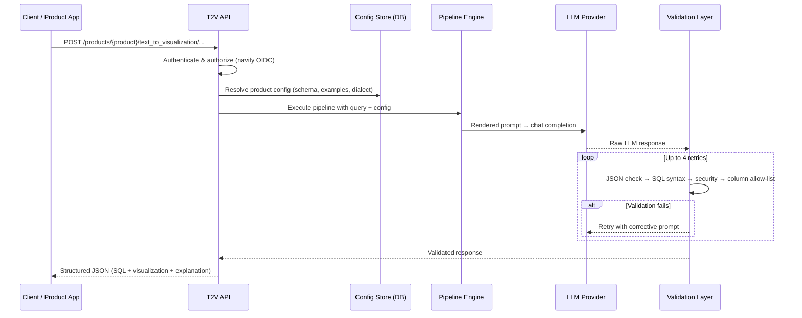
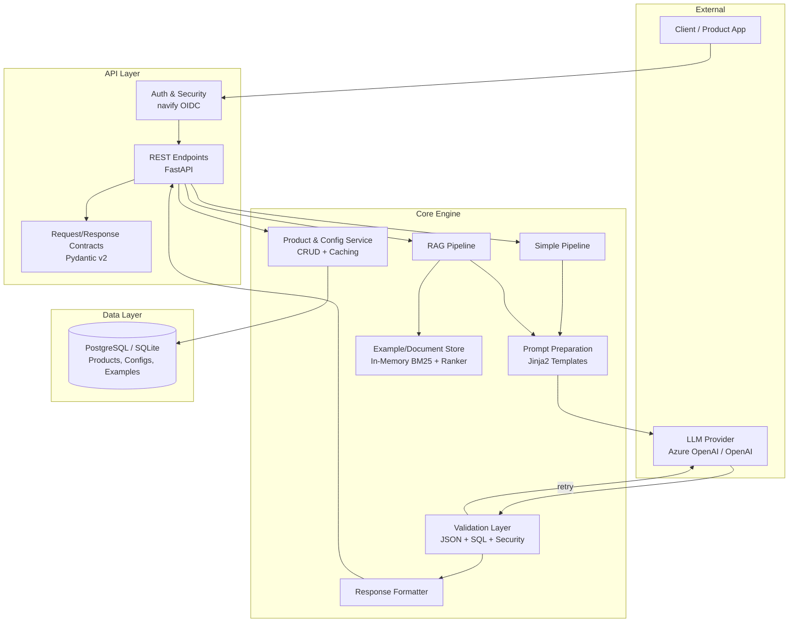
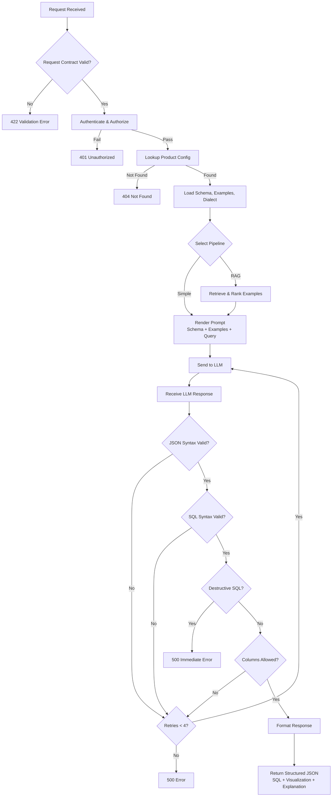

# Assessment of T2V API for Generic Text-to-Artefact Platform Capability

---

## 1. Executive Summary

- **Current capability:** Production-grade Text-to-SQL + basic visualization instruction API with schema grounding, multi-tenant configuration, and a validated retry-loop pipeline.
- **What it does NOT do:** Execute SQL, produce complex/interactive visuals, support non-SQL artefact types, or support multi-turn conversation.
- **Reuse recommendation:** **Extend via phased evolution.** The API is a strong starting point for governed Text-to-SQL/T2V. It should not be positioned as a generic Text-to-Any-Artefact service today.
- **Key risk:** Fixed output contract, SQL-only validation, in-memory RAG, and missing observability limit immediate platform-wide adoption.
- **Conclusion:** Adopt for T2SQL/T2V with targeted operational fixes (Phase 1), evolve toward enhanced visualization contracts (Phase 2), and evaluate type-agnostic artefact generation only after Phase 2 demand is validated (Phase 3).

---

## 2. Current T2V API Capability

The API provides a **secure, structured, API-contract-driven** way to generate:

| Capability | Description |
|------------|-------------|
| SQL generation | Converts natural language → syntactically valid SQL query grounded against a provided schema |
| Visualization instructions | Returns plot type, axes, and grouping metadata (not rendered visuals) |
| Explanation | Natural language explanation of the generated query logic |
| Simple pipeline | Uses predefined config (schema, dialect, examples) baked into the prompt |
| RAG pipeline | Retrieves and ranks relevant examples from an in-memory document store before prompting |
| Configuration-driven execution | Products register schemas, dialects, and examples via CRUD APIs; pipelines execute against stored config |
| Validation loop | Up to 4 retries: JSON extraction → SQL syntax → destructive-statement detection → column allow-list enforcement |

**Does not provide:** free-text responses, complex visualization rendering, non-SQL query formats, multi-turn conversation, or structure-agnostic metadata models.

---

## 3. Client Interaction Lifecycle

1. **Client authenticates** via navify Access Control (OIDC bearer token)
2. **Client sends request** with natural language query to a product-scoped endpoint
3. **API resolves configuration** (schema, examples, dialect) from DB or inline request
4. **Pipeline renders prompt** using Jinja2 templates with schema + examples + query
5. **LLM generates response** (SQL + visualization JSON)
6. **Validator checks response** — retries on failure (up to 4×)
7. **Structured response returned** to client (SQL query + visualization metadata + explanation)

---

## 4. Component and Module Overview

| Component | Role |
|-----------|------|
| API layer | FastAPI endpoints with OIDC auth, request validation, threadpool delegation |
| Contracts | Fixed Pydantic schemas for request (`TextToInsightsRequest`) and response (`TextToVisualizationResponse`) |
| Config store | Product → Config → Examples hierarchy in PostgreSQL with TTL caching |
| Prompt preparation | Jinja2 templates inject SQL schema, dialect, examples, and query into system/user prompts |
| Simple pipeline | Schema + all config examples → LLM → validator |
| RAG pipeline | BM25 retrieval + cross-encoder ranking → top-k examples → LLM → validator |
| Validation layer | JSON parsing, SQL syntax (sqlglot), destructive-statement detection, column allow-list enforcement |
| LLM integration | Config-driven Azure OpenAI / OpenAI-compatible via Haystack ChatGenerator |
| Response formatter | Maps validated LLM output to fixed `TextToVisualizationResponse` contract |

---

## 5. High-Level Architecture

---

## 6. Request Workflow

---

## 7. Suitability for Generic Text-to-Artefact

**Short answer:** Partially suitable as a starting point; not sufficient as-is for generic Text-to-Artefact (T2A).

**What is reusable (~30–40% of codebase):**
- FastAPI framework, auth infrastructure, multi-tenant CRUD + caching
- LLM client factory and Haystack pipeline orchestration pattern
- RAG document store infrastructure and configuration-driven context injection

**What requires modification:**
- Response contract must become versioned and format-selectable
- Validation layer must become pluggable (not hardcoded SQL checks)
- Prompt templates must be selectable/configurable per artefact type
- In-memory document store must be externalized for scale

**What likely needs new design:**
- Artefact type registry and task-type routing
- Caller-defined output schema support
- Multi-turn conversation state management
- Generic metadata/context model beyond SQL schema

**Why current design limits T2A:** Every validator, prompt template, and response schema is tightly coupled to SQL output. ~60% of pipeline code is SQL-specific. There is no plugin interface, no task-type concept, and no caller-selectable output format.

| Area | Current Support | T2A Gap | Recommendation |
|------|----------------|---------|----------------|
| Output contract | Fixed SQL + viz JSON | No format selection or versioning | Add format param + versioned schemas |
| Artefact types | SQL only | No XML, JSON schema, or free-text | Add artefact type registry |
| Validation | SQL-specific (sqlglot AST) | No pluggable validator interface | Abstract to validator plugins |
| Prompt management | Hardcoded "sql" prompt type | Cannot select/configure per artefact | Expose prompt selection via API |
| Context model | SQL schema + dialect + examples | No generic metadata structure | Generalize config schema |
| Conversation | Stateless, single-turn only | No multi-turn memory | Implement conversation state |
| RAG store | In-memory, single-node only | Cannot scale horizontally | Externalize to persistent store |
| Observability | Request UUID + latency logging | No OTel, no metrics, no audit | Add OpenTelemetry |

---

## 8. Key Gaps and Risks

| # | Gap / Risk | Impact | Mitigation Path |
|---|-----------|--------|-----------------|
| 1 | **Fixed output contract** — always returns SQL + basic viz | Cannot serve non-SQL consumers without API change | Phased contract evolution (Phase 2–3) |
| 2 | **SQL-only artefact generation** — all validation is SQL-bound | Cannot validate XML, JSON Schema, or other formats | Pluggable validator abstraction |
| 3 | **Limited visualization schema** — only plot type + x/y/group_by | Cannot support rich visuals (colors, controls, interactivity) | Enhanced visualization contract (Phase 2) |
| 4 | **No artefact type abstraction** — no task-type routing | Adding new artefact types requires parallel vertical slices | Type registry + dynamic pipeline assembly |
| 5 | **Fixed metadata structure** — config schema is SQL-specific | Non-SQL products cannot describe their context naturally | Generalized context injection model |
| 6 | **No multi-turn capability** — stateless request/response | Cannot support follow-up questions on generated insights | Conversation memory service (Phase 1) |
| 7 | **In-memory RAG** — single-node, lost on restart | Prevents horizontal scaling; data loss risk | Externalize document store (Phase 1) |
| 8 | **Missing observability** — no OTel, no metrics, no audit trail | Cannot meet platform SLA or compliance requirements | Add OTel tracing + metrics (Phase 1) |
| 9 | **Operational bugs** — worker count default breaks state; sync auth blocks event loop | Service instability under load | Immediate fixes required |

---

## 9. Recommended Roadmap and Next Steps

### Phased Evolution

| Phase | Focus | Key Changes | Timeline Estimate |
|-------|-------|-------------|-------------------|
| **Phase 1** | SQL-only response with schema grounding + basic multi-turn | Conversation memory, externalize RAG, auth/security updates, OTel observability, configurable model/validation, performance testing, bug fixes | 2–3 months |
| **Phase 2** | SQL-only response with enhanced visualization | New API contracts for richer viz (free-text viz response, open-ended structures), new pipelines for enhanced visualization | 2–3 months |
| **Phase 3** | Type-agnostic response ± schema grounding | Artefact type registry, pluggable validators, new pipelines for XML/JSON/other formats, caller-defined output schemas | 3–4 months |

### 30 / 60 / 90-Day Next Steps

| Timeframe | Actions |
|-----------|---------|
| **30 days** | Fix critical operational bugs (worker count, sync auth). Add basic OTel tracing. Confirm ownership and contribution model with T2V team. |
| **60 days** | Externalize RAG document store. Implement conversation memory MVP. Add pipeline test coverage. Deploy as platform service for T2SQL/T2V. |
| **90 days** | Define enhanced visualization contract (Phase 2 design). Evaluate demand for non-SQL artefacts. Begin Phase 2 implementation if demand validated. |

### Management Decisions Needed

1. **Ownership model** — Will the T2V team maintain the service, or will the platform team fork/adopt?
2. **Scope boundary** — Confirm T2SQL/T2V as Phase 1 scope; defer generic T2A until demand is validated.
3. **Investment level** — Approve ~2–3 months of engineering for Phase 1 stabilization and platform readiness.
4. **Infrastructure** — Approve external document store (e.g., Elasticsearch/OpenSearch) for RAG scalability.
5. **Observability standards** — Confirm OTel + Prometheus as platform observability stack.

### Dependencies and Risks

| Dependency / Risk | Mitigation |
|-------------------|------------|
| T2V team cooperation for contribution model | Early engagement; define clear ownership boundaries |
| LLM provider availability and cost | Multi-provider support already exists; monitor usage |
| In-memory RAG migration complexity | Haystack supports pluggable document stores; migration path exists |
| Demand uncertainty for Phase 2–3 | Gate investment on validated consumer demand |
| Single-worker scaling ceiling | Acceptable for Phase 1 (<10 tenants); externalized RAG resolves for Phase 2+ |

---

## 10. Final Recommendation

| Statement | Detail |
|-----------|--------|
| **Strong starting point** | The API delivers production-grade, governed Text-to-SQL/Text-to-Visualization with schema grounding, multi-tenant isolation, and validated retry-loop safety. Rebuilding this would take significant effort. |
| **Not a generic T2A service today** | ~60% of pipeline code is SQL-specific. No pluggable validators, no artefact type routing, no caller-defined output schemas. Positioning it as generic T2A without modification would fail. |
| **Recommended path** | **Phased evolution:** (1) Stabilize and externalize for platform-grade T2SQL/T2V, (2) Introduce enhanced visualization contracts, (3) Evaluate and implement type-agnostic artefact generation only when demand is validated. |

---

*Document based on source code analysis of `text-to-visualization-backend-service` v0.10.7 and vendored library v0.11.x. All architectural facts derived from repository. Roadmap and recommendations incorporate platform strategy context.*

