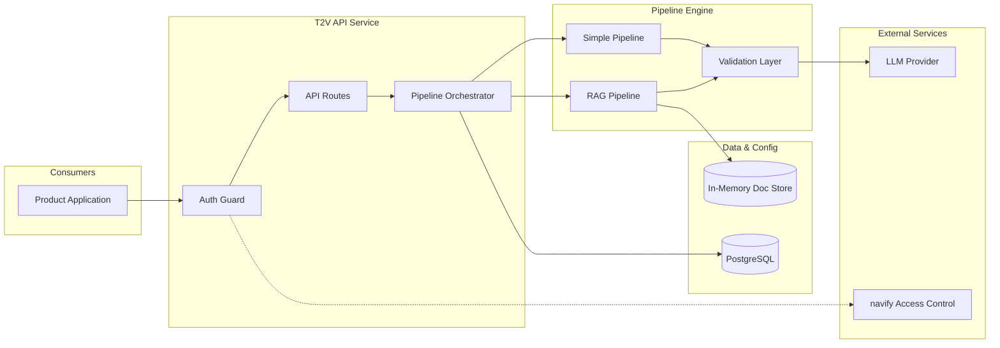
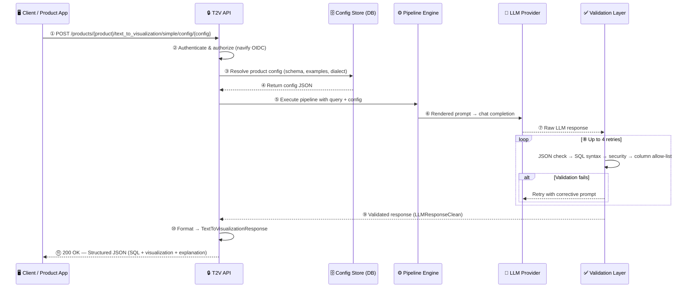
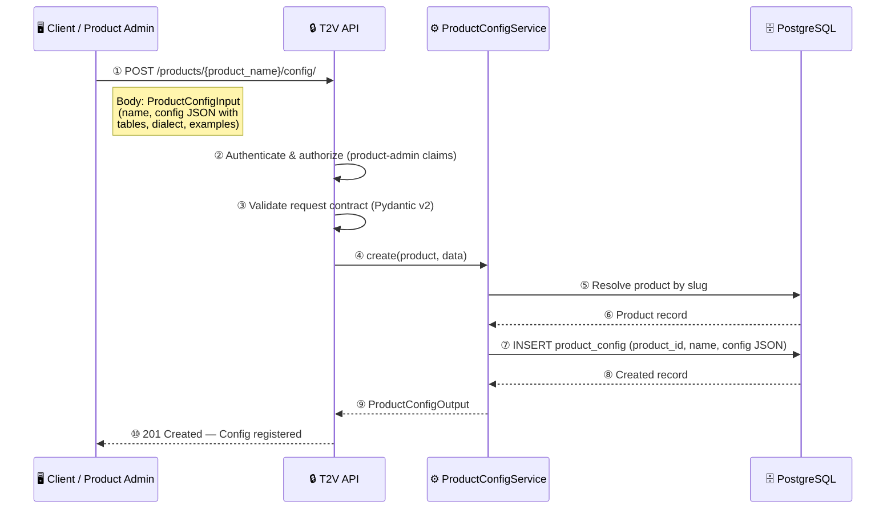
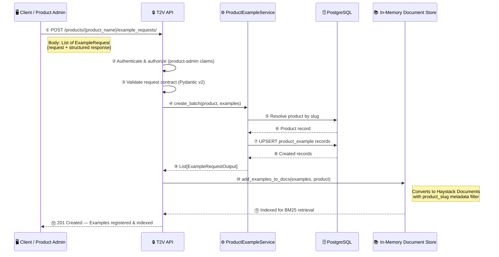
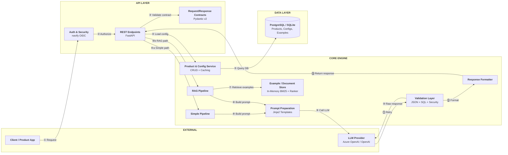
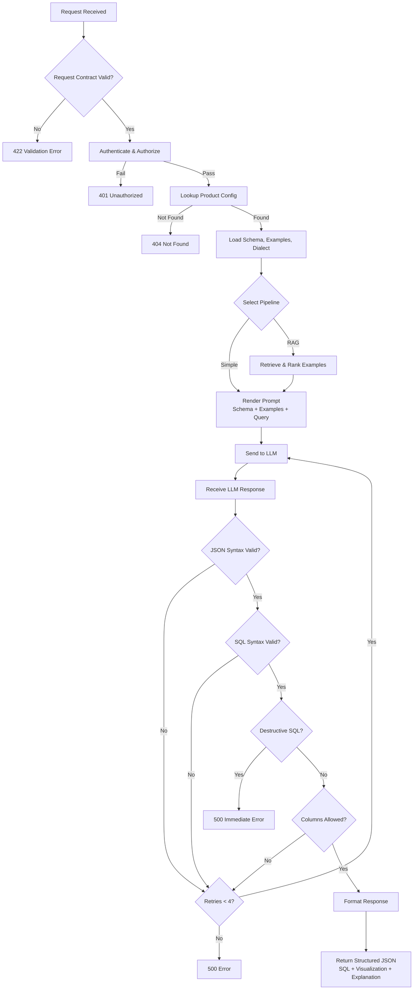
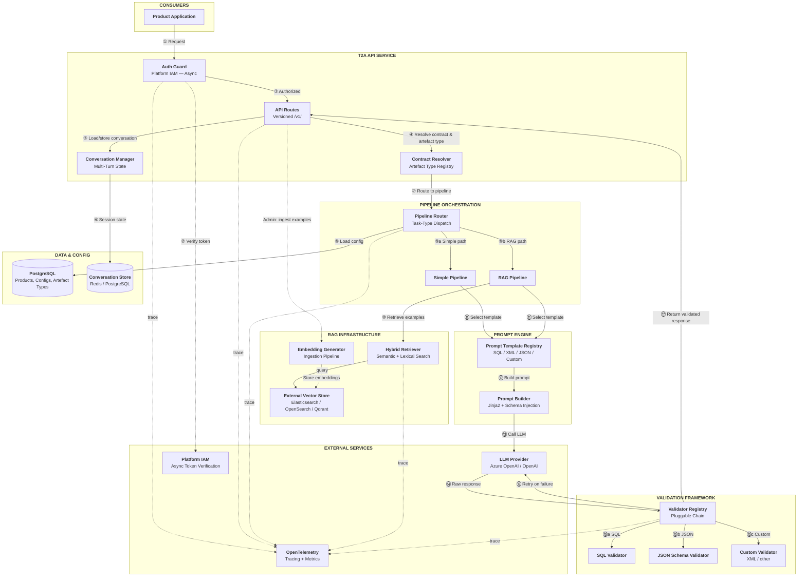

# Assessment of T2V API for Generic Text-to-Artefact Platform Capability

---

## 1. Background

This document assesses whether the existing **Text-to-Visualization (T2V) backend API** — originally built to convert natural language queries into SQL and basic visualization instructions — can be reused or evolved into a **generic Text-to-Artefact (T2A) platform capability** serving multiple product teams across the GenAI platform.

**Context:** The GenAI platform requires a governed, multi-tenant service that converts natural language requests into structured artefacts (SQL queries, visualization specs, XML, JSON schemas, etc.) with validation, schema grounding, and observability. Rather than building from scratch, this assessment evaluates the existing T2V API as a candidate starting point.

**Scope of this assessment:**
- Analyze the current T2V API architecture, capabilities, and limitations
- Determine what is reusable, what needs modification, and what requires new design for generic T2A
- Identify key gaps and risks for platform adoption
- Propose a target architecture and phased evolution roadmap
- Surface technical areas requiring further exploration before implementation

**Out of scope:** Deep implementation planning, sprint-level task breakdown, cost modeling, and vendor selection.

---

## 2. Technology Stack

The following major libraries and technologies underpin the current T2V API:

| Technology | Version | Purpose |
|------------|---------|---------|
| **FastAPI** | 0.116.x | Web framework; async REST API with automatic OpenAPI docs |
| **Pydantic** | 2.11.x | Request/response validation, settings management, schema generation |
| **haystack-ai** | 2.17.x | Pipeline orchestration framework; provides `Pipeline`, `Component`, `Document`, `InMemoryDocumentStore`, `InMemoryBM25Retriever`, `TransformersSimilarityRanker`, `ChatPromptBuilder`, `ChatGenerator` |
| **SQLAlchemy** | 2.0.x | Async ORM for product/config/example persistence |
| **aiosqlite** / **asyncpg** | — | Async DB drivers (SQLite for local dev, PostgreSQL for prod) |
| **sqlglot** | 27.x | SQL parsing, AST analysis, dialect transpilation, and validation in the T2V validator |
| **sentence-transformers** | — | Powers `TransformersSimilarityRanker` cross-encoder reranking in RAG pipeline |
| **Jinja2** | — | Prompt template rendering (SQL schema context + user query → LLM prompt) |
| **aiocache** | 0.12.x | TTL-based caching decorator on service methods (config resolution) |
| **cloudevents** | 1.12.x | Pydantic-based CloudEvent envelope for API responses |
| **uvicorn** | — | ASGI server (single-worker only due to in-memory document store) |
| **PyTorch** | 2.8.x | Runtime dependency for transformer-based ranker model inference |
| **Azure OpenAI SDK** / **OpenAI SDK** | — | LLM provider integration via Haystack's `AzureOpenAIChatGenerator` and `OpenAIChatGenerator` |
| **PostgreSQL** | — | Production database for product, config, and example storage |
| **navify Access Control** | — | OIDC token introspection for authentication and role-based authorization |

---

## 3. Summary

- **Current capability:** Production-grade Text-to-SQL + basic visualization instruction API with schema grounding, multi-tenant configuration, and a validated retry-loop pipeline.
- **What it does NOT do:** Execute SQL, produce complex/interactive visuals, support non-SQL artefact types, or support multi-turn conversation.
- **Reuse recommendation:** **Extend via phased evolution.** The API is a strong starting point for governed Text-to-SQL/T2V. It should not be positioned as a generic Text-to-Any-Artefact service today.
- **Key risk:** Fixed output contract, SQL-only validation, in-memory RAG, and missing observability limit immediate platform-wide adoption.
- **Conclusion:** Adopt for T2SQL/T2V with targeted operational fixes (Phase 1), evolve toward enhanced visualization contracts (Phase 2), and evaluate type-agnostic artefact generation only after Phase 2 demand is validated (Phase 3).

---

## 4. Current T2V API Capability

The API provides a **secure, structured, API-contract-driven** way to generate:

| Capability | Description |
|------------|-------------|
| SQL generation | Converts natural language → syntactically valid SQL query grounded against a provided schema |
| Visualization instructions | Returns plot type, axes, and grouping metadata (not rendered visuals) |
| Explanation | Natural language explanation of the generated query logic |
| Simple pipeline | Uses predefined config (schema, dialect, examples) baked into the prompt |
| RAG pipeline | Retrieves examples using keyword-based BM25 search (not embedding-based), then reranks with a cross-encoder model before prompting. Lacks semantic retrieval. |
| Configuration-driven execution | Products register schemas, dialects, and examples via CRUD APIs; pipelines execute against stored config |
| Validation loop | Up to 4 retries: JSON extraction → SQL syntax → destructive-statement detection → column allow-list enforcement |

**Does not provide:** free-text responses, complex visualization rendering, non-SQL query formats, multi-turn conversation, or structure-agnostic metadata models.

---

## 5. High-Level Architecture

---

## 6. Client Interaction Lifecycle

### 6.1 Pipeline Execution

1. **Client authenticates** via navify Access Control (OIDC bearer token)
2. **Client sends request** with natural language query to a product-scoped endpoint
3. **API resolves configuration** (schema, examples, dialect) from DB or inline request
4. **Pipeline renders prompt** using Jinja2 templates with schema + examples + query
5. **LLM generates response** (SQL + visualization JSON)
6. **Validator checks response** — retries on failure (up to 4×)
7. **Structured response returned** to client (SQL query + visualization metadata + explanation)

### 6.2 Configuration Creation

1. **Client authenticates** with product-admin claims
2. **Client sends config** containing SQL schema, dialect, examples, and plot definitions
3. **API validates** the request contract (Pydantic)
4. **Service resolves product** and persists config to database
5. **Config available** for pipeline execution on subsequent requests

### 6.3 Request Example Creation (for RAG Pipeline)

1. **Client authenticates** with product-admin claims
2. **Client sends batch of examples** (request/response pairs)
3. **API validates** and persists examples to database
4. **Examples are indexed** into the in-memory document store for RAG retrieval
5. **Examples available** for RAG pipeline on subsequent requests

---

## 7. Component and Module Overview

| Component | Role |
|-----------|------|
| **API Layer** | FastAPI endpoints with OIDC auth, request validation, threadpool delegation |
| **Request/Response Contracts** | Fixed Pydantic schemas for request (`TextToInsightsRequest`) and response (`TextToVisualizationResponse`) |
| **Product & Config Service** | Product → Config → Examples hierarchy in PostgreSQL with TTL caching |
| **Prompt Preparation** | Jinja2 templates inject SQL schema, dialect, examples, and query into system/user prompts |
| **Simple Pipeline** | Schema + all config examples → LLM → validator |
| **RAG Pipeline** | BM25 keyword retrieval (top-10) + cross-encoder reranking (top-5) → LLM → validator. No embedding-based ingestion or retrieval — semantically similar but lexically different examples may not be retrieved. |
| **Validation Layer** | JSON parsing, SQL syntax (sqlglot), destructive-statement detection, column allow-list enforcement |
| **LLM Integration** | Config-driven Azure OpenAI / OpenAI-compatible via Haystack ChatGenerator |
| **Response Formatter** | Maps validated LLM output to fixed `TextToVisualizationResponse` contract |

---

## 8. Request Workflow

---

## 9. Suitability for Generic Text-to-Artefact

**Short answer:** Partially suitable as a starting point; not sufficient as-is for generic Text-to-Artefact (T2A).

### What is reusable

The following components are artefact-agnostic and can serve a generic T2A platform without major changes:

- **Web framework and authentication** — The REST API layer, OIDC token introspection, three-tier role-based authorization (admin, product-admin, product-user), and product-audience scoping are entirely independent of SQL or any specific artefact type.
- **Multi-tenant configuration management** — The hierarchical data model (Product → Configuration → Examples), async database repositories, TTL-based caching, and per-key cache invalidation work for any configuration structure regardless of artefact type.
- **LLM client abstraction** — The LLM integration layer is a clean, config-driven factory that supports multiple providers (Azure OpenAI, OpenAI-compatible APIs). It accepts a configuration dictionary and returns a pipeline-ready component with no SQL coupling.
- **Pipeline orchestration pattern** — The pipeline graph structure (prompt assembly → LLM call → validation with retry loop) and the async delegation mechanism for non-blocking execution are reusable for any artefact type.
- **RAG document store abstractions (partial)** — The concept of product-scoped example filtering and the pattern of converting request/response examples into retrievable documents are conceptually reusable. However, the actual implementations are tightly coupled to the in-memory store and plain-text storage — the singleton lifecycle, startup bulk loading, and keyword-only retrieval all require replacement, making this "modify extensively" rather than "reuse as-is."
- **Request middleware** — The global request middleware (unique request ID assignment, latency logging, unhandled error catch-all) is fully generic and artefact-independent.

### What requires modification

- **Response contract** — The API response schema is hardcoded to return exactly one SQL query string plus basic visualization coordinates (plot type, x-axis, y-axis, group-by). A T2A platform needs versioned and format-selectable response schemas where the output structure can vary by artefact type. The pattern of constructing responses from LLM output is reusable, but the fixed field structure must be generalized.
- **Validation layer** — The validator component performs five hardcoded SQL-specific checks in sequence: JSON extraction, visualization field normalization, SQL syntax verification via AST parsing, destructive statement detection, and column allow-list enforcement. Only JSON extraction is generic; the remaining four steps are entirely SQL-specific. There is no validator interface, no registry, and no mechanism to swap validators based on the requested artefact type.
- **Prompt templates** — The prompt builder supports custom message templates through a type parameter, but only one predefined prompt type exists ("sql"). The API never exposes prompt selection to consumers — every route implicitly uses the SQL prompt. The underlying templating mechanism is extensible; the API integration is not.
- **RAG retrieval mechanism** — The retrieval layer performs keyword-only search (BM25 algorithm). Examples are stored as plain text with no vector embeddings. The semantic reranker can only reorder what the keyword search returns, so semantically relevant examples phrased differently from the query are never retrieved. Embedding-based retrieval is needed for quality improvement.
- **RAG service (ingestion + storage + retrieval)** — The entire RAG infrastructure needs restructuring: (1) the in-memory document store must be replaced with an external persistent vector store for horizontal scalability and data durability, (2) a new embedding-based ingestion workflow must be built to generate and store vector embeddings when examples are created, and (3) retrieval must shift from keyword matching to hybrid semantic-plus-lexical search with embedding similarity as the primary signal. The current singleton lifecycle, startup-time bulk loading, and plain-text-only storage all need redesign to support external connectivity, incremental ingestion, and embedding generation workflows.
- **Configuration schema** — The product configuration schema mandates SQL-specific structures (table definitions with column names and types, SQL dialect specification). Non-SQL products cannot describe their context or metadata using this structure, blocking adoption by teams that need different grounding formats.

### What likely needs new design

- **Artefact type registry and task-type routing** — The service currently offers only two pipeline variants (simple and RAG), both producing identical SQL output. There is no concept of artefact type, task type, or routing logic. Adding a new artefact type today requires building an entirely parallel vertical slice — new endpoints, new service logic, new pipeline factory, new validator, and new response schema.
- **Caller-defined output schema** — Consumers can only provide input context (query + configuration). There is no mechanism to specify the expected response structure, output format, or validation rules. The response always conforms to a fixed structure containing SQL query, explanation, plot type, and axis definitions — with no flexibility for alternative formats.
- **Multi-turn conversation state** — Every request is fully stateless. There is no session identifier, no conversation history storage, and no mechanism to reference prior responses. Message history is only maintained within a single request's validation retry loop, not across separate user interactions.
- **Generic metadata/context model** — The system prompt template renders SQL table schemas with column descriptions and asks the LLM to produce SQL output in a fixed JSON format. Both the context template and the request template are SQL-specific and not parameterizable by artefact type. A generic T2A service needs a flexible context injection model that can accept any structured metadata.

### Why current design limits T2A

- **Validator is monolithic and SQL-hardcoded.** The validation component directly calls SQL-specific functions (security checks, syntax validation, column verification, visualization normalization) inline. These are not behind an abstraction or interface — they operate on SQL-specific fields and assume SQL dialect configuration. Replacing them requires rewriting the component, not configuring it.
- **Prompt templates are SQL-locked at the API level.** Although the underlying library supports custom prompt templates, all API routes implicitly use the SQL prompt type. The prompt instructs the LLM to "write a SQL query" and return a fixed JSON output format. No route overrides this, and no consumer-facing parameter exists to select alternative prompt types.
- **Response types are structurally fixed.** The LLM response type requires exactly six fields (SQL query, explanation, plot type, x-axis, y-axis, group-by). The API response schema maps these directly with no polymorphism, no format negotiation, and no content-type selection available to callers.
- **~60% of pipeline code is SQL-specific.** The entire data-fetching module (SQL postprocessing, preprocessing, prompt templates, type definitions), the validator component, visualization normalization logic, and SQL-specific type definitions are not reusable for non-SQL artefacts.
- **No task-type routing exists.** The only pipeline selectors are "simple" and "RAG," both producing identical SQL output. There is no artefact-type parameter in any request schema, no factory that selects different validators or prompts based on artefact type, and no extension point for adding new output types without a full vertical slice.

### Gap Analysis

| # | Area | Current Implementation | T2A Gap | Impact | Recommendation |
|---|------|----------------------|---------|--------|----------------|
| 1 | Output contract | `TextToVisualizationResponse` with fixed `DataFetchingSQL` + `VisualizationInstructionLLM` | No format selection, no versioning, no caller-defined schema | Cannot serve non-SQL consumers without API change | Add artefact-type param, versioned schemas, polymorphic response |
| 2 | Artefact types | `TPipelines = Literal["simple_pipeline", "rag_pipeline"]` — both produce SQL | No XML, JSON schema, free-text, or any non-SQL path | Adding new artefact types requires parallel vertical slices | Add artefact type registry with per-type pipeline factories |
| 3 | Validation | `T2VValidator` with 5 inline SQL checks (`check_valid_sql_statement`, `security_check_sql`, etc.) | No validator interface; cannot swap validation per artefact | Cannot validate XML, JSON Schema, or other formats | Abstract to pluggable validator registry |
| 4 | Visualization schema | Only `plot_type` + `x_axis` / `y_axis` / `group_by` | No colors, controls, interactivity, or open-ended viz structures | Cannot support rich visuals beyond basic chart coordinates | Enhanced visualization contract (Phase 2) |
| 5 | Prompt management | `PREDEFINED_PROMPTS = {"sql": sql_prompt}` — API never exposes prompt selection | Cannot select or configure prompts per artefact type | Prompt changes risk regressions with no evaluation framework | Expose prompt type selection via API; add predefined prompts for new artefact types |
| 6 | Context model | `SQLProductConfig` requires `tables` (DBTable list) + `data_fetching` (sql_dialect) | Non-SQL products cannot provide context in their own format | Fixed metadata structure blocks non-SQL product adoption | Generalize config schema to accept arbitrary metadata structures |
| 7 | Conversation | Stateless; no session ID, no history store, no cross-request context | Cannot support follow-up questions on generated insights | Users cannot refine or iterate on previous results | Implement conversation state manager with external store |
| 8 | RAG retrieval | `InMemoryBM25Retriever` keyword search → `TransformersSimilarityRanker` rerank | No embedding-based semantic retrieval; misses lexically different but relevant examples | Lower quality few-shot examples, reducing LLM accuracy for varied phrasing | Replace with hybrid lexical+embedding retriever and external vector store |
| 9 | RAG storage | `InMemoryDocumentStore` class-level singleton, single-node, lost on restart | Cannot scale horizontally; data lost on process restart | Prevents horizontal scaling; data loss risk on deploy | Externalize to persistent document/vector store |
| 10 | Observability | `GlobalContextMiddleware` with request UUID + latency logging | No OTel tracing, no metrics, no SQL audit trail | Cannot meet platform SLA or compliance requirements | Add OpenTelemetry across all layers |
| 11 | Operational stability | Worker count default > 1 breaks in-memory state; sync auth blocks event loop | Known bugs impact service reliability under load | Service instability under concurrent requests | Immediate fixes required before platform adoption |

---

## 10. Proposed High-Level Architecture for T2A

The diagram below illustrates the target architecture for a generic Text-to-Artefact platform, incorporating the gaps and recommendations identified in this assessment. New or significantly modified components are highlighted.

**Key architectural differences from current T2V:**

| Area | Current T2V | Proposed T2A |
|------|-------------|--------------|
| **Artefact routing** | Hardcoded simple/RAG pipeline, both produce SQL | Pipeline Router dispatches based on artefact type (SQL, JSON, XML, custom) |
| **Prompt management** | Single hardcoded SQL prompt template | Prompt Template Registry allows per-artefact-type and per-product prompt selection |
| **Validation** | Monolithic validator with 5 SQL-specific checks | Pluggable Validator Registry selects the appropriate validator chain per artefact type |
| **Output contract** | Fixed response schema (SQL + basic viz coordinates) | Contract Resolver maps artefact type to versioned response schema; supports caller-defined schemas |
| **Conversation** | Stateless, single-turn only | Conversation Manager maintains multi-turn state in an external store |
| **RAG ingestion** | Examples stored as plain text at startup; no embeddings generated | Embedding Generator produces vector embeddings at ingestion time; stored in external vector store |
| **RAG retrieval** | BM25 keyword-only retrieval from in-memory store (single-node, lost on restart) | Hybrid Retriever combines semantic embedding search + lexical search against persistent external store |
| **Auth** | Synchronous OIDC introspection blocking the event loop | Async platform IAM integration with TTL-based token caching |
| **Observability** | Request UUID + latency logging only | OpenTelemetry tracing and metrics integrated across all layers |
| **Config model** | SQL-specific schema (tables, columns, dialect) | Generic metadata model supporting SQL schemas, XML element definitions, JSON schemas, or free-form context |

---

## 11. Recommended Roadmap and Next Steps

### Phased Evolution

| Phase | Focus | Key Changes |
|-------|-------|-------------|
| **Phase 1** | SQL-only response with schema grounding + basic multi-turn | • Implement conversation memory so T2V becomes stateful for multi-turn interactions • Move the in-memory RAG document store to an external persistent service • Implement vector embedding based ingestion/retrieval along with lexical based • Update authentication and security mechanisms for platform-grade access control • Add OpenTelemetry-based tracing and metrics for observability • Make hardcoded values configurable, including model configuration and SQL validation rules • Conduct performance testing, fix known bugs, and perform code cleanup |
| **Phase 2** | SQL-only response with enhanced visualization | • Introduce new API contracts that support richer visualization responses, including free-text visualization instructions • Support more open-ended visualization structures while retaining schema grounding • Implement new end-to-end simple and RAG-based pipelines tailored for enhanced visualization output |
| **Phase 3** | Type-agnostic response ± schema grounding | • Build an artefact type registry and pluggable validator framework to support non-SQL output types • Implement new end-to-end pipelines for type-agnostic responses such as XML and JavaScript • Enable caller-defined output schemas so products can specify their own response structures • Example use case: a product provides an XML schema with element definitions and optional examples, then resolves generated elements against its own systems |

---

## 12. Areas Requiring Technical Exploration

The following technical areas require targeted evaluation or proof-of-concept before concrete implementation.

| # | Exploration Area | Current State | Investigation Needed | Expected Outcome |
|---|-----------------|---------------|---------------------|------------------|
| 1 | **Multi-turn conversation design** | Stateless; no session ID or history store; retry history only within single request | Session duration policy, context carryover strategy (full history vs. summarized), memory store choice, how prior results feed into subsequent turns | Conversation memory contract and storage design |
| 2 | **Agentic RAG orchestration** | Single-pass static pipeline: keyword retrieval → reranker → fixed prompt; no query decomposition or iterative retrieval | Evaluate agentic orchestration (Haystack Agent, LangGraph, tool-calling loops) for query decomposition, iterative retrieval, and self-correction before final output | Decision: simple embedding swap vs. full agentic orchestration for Phase 1 |
| 3 | **Embedding model selection** | No embeddings; documents stored as plain text; no vector generation at ingestion or query time | Benchmark embedding models (sentence-transformers, OpenAI embeddings, domain-tuned) for retrieval recall; evaluate local vs. API-based generation tradeoffs | Embedding model choice, ingestion pipeline design, retrieval quality baseline |
| 4 | **Streaming LLM responses** | Synchronous full-completion; no SSE/WebSocket; streaming supported by LLM components but not wired | Evaluate streaming compatibility with validation-retry loop; explore partial streaming or streaming-only for non-validated endpoints | Decision on streaming viability given validation requirement |
| 5 | **Validator abstraction interface** | Single monolithic Haystack component; retry signaling via pipeline topology, not explicit interface | Design validator interface supporting: artefact-specific logic, consistent retry signaling, configurable strictness, composable validation chains | Validator interface specification for Phase 2/3 implementations |
| 6 | **Context window budget management** | System prompt renders ALL tables/columns unconditionally; no token counting or prioritization | Evaluate schema pruning (query-relevant selection, token budget allocation, multi-step table identification) | Schema management strategy for large databases |

---

## 13. Final Recommendation

| Statement | Detail                                                                                                                                                                                                                                                       |
|-----------|--------------------------------------------------------------------------------------------------------------------------------------------------------------------------------------------------------------------------------------------------------------|
| **Strong starting point** | The existing API delivers production-grade, governed Text-to-SQL/Text-to-Visualization with schema grounding, multi-tenant isolation, and validated retry-loop safety. Rebuilding this would take significant initial effort.                                |
| **Not a generic T2A service today** | ~60% of pipeline code is SQL-specific. No pluggable validators, no artefact type routing, no caller-defined output schemas.                                                                                                                                  |
| **Recommended path** | **Phased evolution:**  (1) Stabilize and externalize for platform-grade multi-turn conversation T2SQL/T2V  (2) Introduce enhanced visualization contracts  (3) Evaluate and implement type-agnostic artefact generation as per validated demand. |

---

*Document based on source code analysis of `text-to-visualization-backend-service` v0.10.7 and vendored library v0.11.x. All architectural facts derived from repository. Roadmap and recommendations incorporate platform strategy context.*
